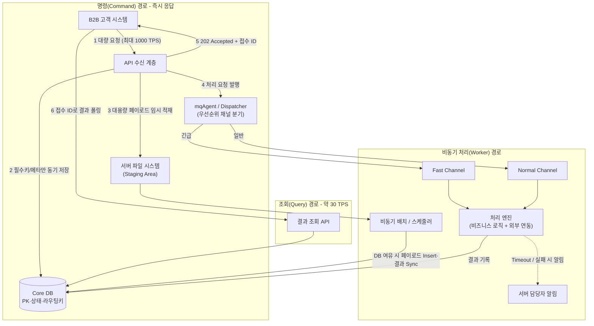
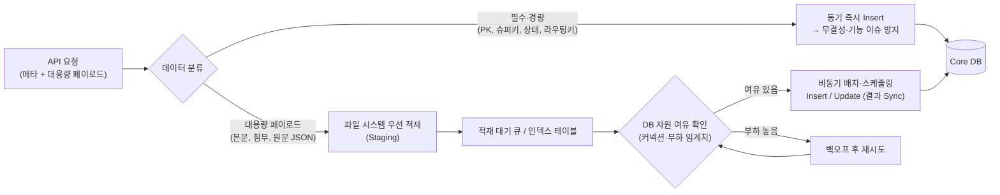
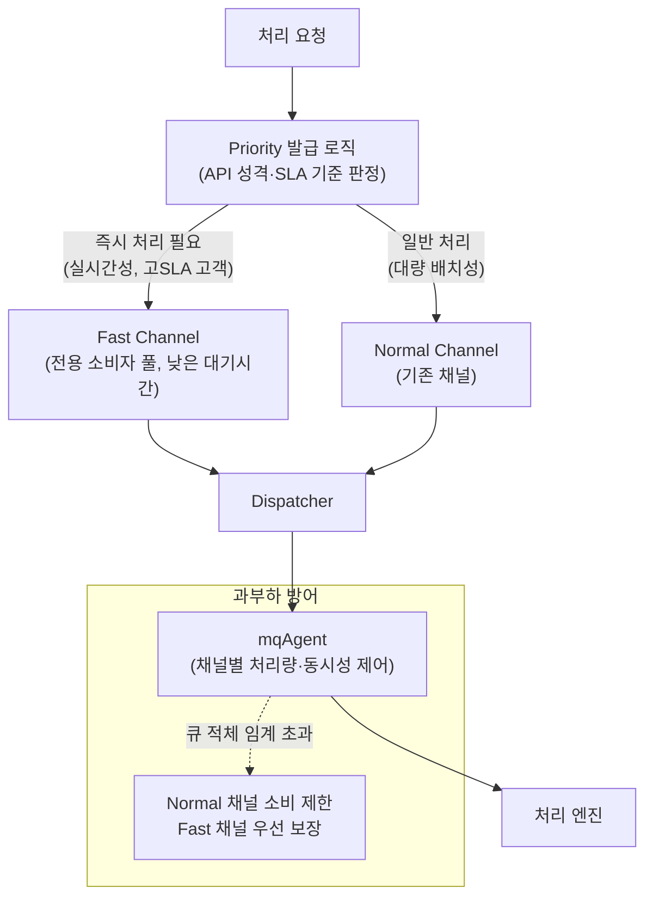
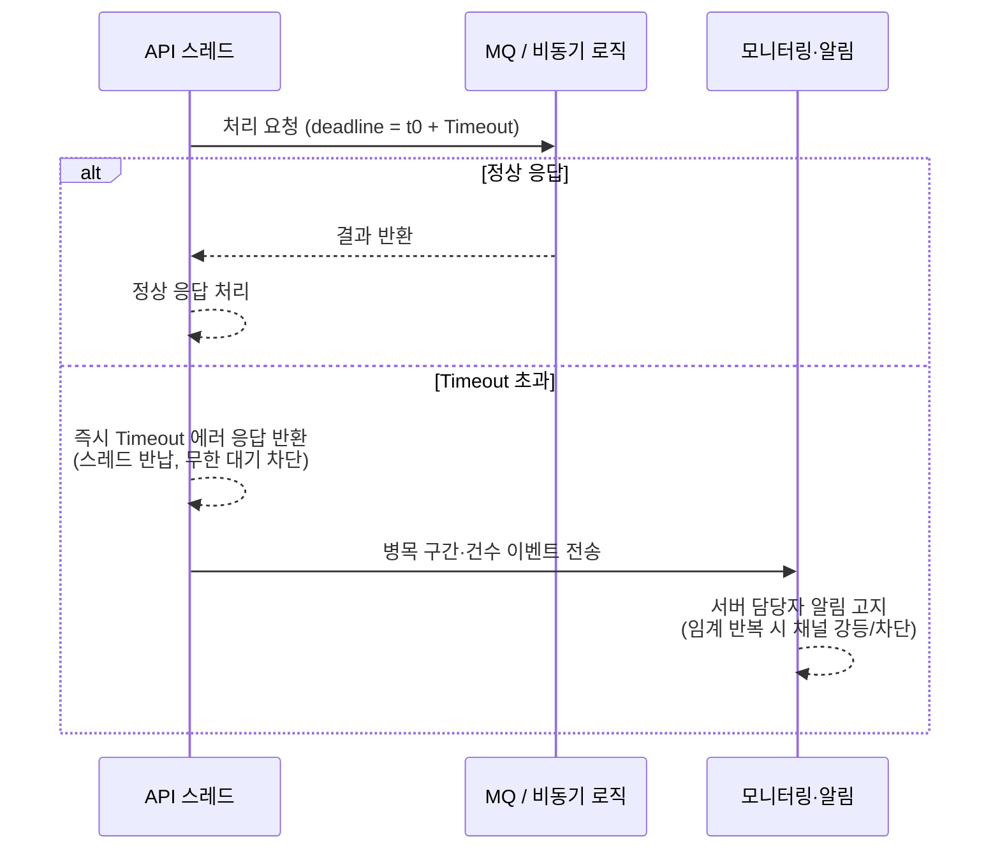

## 목차

- [1. 도입 배경 및 과제 (Background &amp; Problem)](#1-도입-배경-및-과제-background-problem)
  - [관찰된 병목 현상](#관찰된-병목-현상)
  - [트래픽 특성](#트래픽-특성)
  - [핵심 해결 과제](#핵심-해결-과제)
- [2. 전체 API 처리 Flow Diagram](#2-전체-api-처리-flow-diagram)
  - [비동기 처리 아키텍처 흐름](#비동기-처리-아키텍처-흐름)
- [3. 병목 구간별 해결 전략 및 다이어그램](#3-병목-구간별-해결-전략-및-다이어그램)
  - [3.1 DB 병목 현상 해결 (데이터 분할 저장)](#31-db-병목-현상-해결-데이터-분할-저장)
  - [3.2 MQ 통신 병목 해결 (우선순위 기반 채널 분리)](#32-mq-통신-병목-해결-우선순위-기반-채널-분리)
  - [3.3 Timeout 정책 및 방어 로직 (장애 확산 방지)](#33-timeout-정책-및-방어-로직-장애-확산-방지)
- [4. 표준 패턴 관점의 정리 (Result &amp; Design Rationale)](#4-표준-패턴-관점의-정리-result-design-rationale)
  - [4.1 CQRS (명령과 조회의 분리) 관점 적용](#41-cqrs-명령과-조회의-분리-관점-적용)
  - [4.2 Graceful Degradation ( 의도된 성능 저하)](#42-graceful-degradation-의도된-성능-저하)
  - [4.3 Circuit Breaker 패턴의 변형 적용](#43-circuit-breaker-패턴의-변형-적용)
- [5. 결과 (AS-IS / TO-BE)](#5-결과-as-is-to-be)

<a id="1-도입-배경-및-과제-background-problem"></a>

## 1. 도입 배경 및 과제 (Background & Problem)

B2B 고객사를 대상으로 대용량 알림·청구 데이터를 접수받아 처리하는 API 게이트웨이에서, 기존에는 요청 한 건을 <strong>처음부터 끝까지 동기(Synchronous)로 처리</strong>했습니다.


```text
[기존 100% 동기 처리 파이프라인]
API 수신
  → DB 저장 (요청 원문 + 페이로드 전체)
  → 내부 비즈니스 로직 수행
  → MQ 통신 (외부 처리 엔진 호출, 응답 대기)
  → 결과 DB 저장
  → API 결과 응답
```

이 구조에서는 위 6단계가 <strong>하나의 요청 스레드 위에서 순차적으로</strong> 진행되므로, 한 구간이라도 지연되면 그 시간이 그대로 최종 응답 레이턴시에 누적됩니다.

<a id="관찰된-병목-현상"></a>

### 관찰된 병목 현상


<NotionTable>
  <tbody>
    <tr><td>구간</td><td>증상</td><td>원인</td></tr>
    <tr><td><strong>DB 저장</strong></td><td>대용량 페이로드 Insert 시 커넥션 점유 시간 급증, 커넥션 풀 고갈</td><td>수 MB 단위 BLOB/CLOB을 요청 경로에서 동기 Insert</td></tr>
    <tr><td><strong>MQ 통신</strong></td><td>공용 큐 채널에 일반 트래픽과 긴급 트래픽이 섞여 대기열 폭증</td><td>우선순위 구분 없는 단일 채널, 소비자 처리량 한계</td></tr>
    <tr><td><strong>장애 전파</strong></td><td>특정 구간(주로 MQ) 지연이 전체 API 먹통으로 확산</td><td>Timeout 미설정으로 요청 스레드 무한 대기 → 스레드 풀 고갈</td></tr>
  </tbody>
</NotionTable>

<a id="트래픽-특성"></a>

### 트래픽 특성

- <strong>접수(Command)</strong>: 최대 <strong>1,000 TPS</strong> 수준의 버스트성 대량 인입
- <strong>결과 조회(Query)</strong>: <strong>약 30 TPS</strong>, 고객사가 배치성으로 폴링
- 즉 쓰기와 읽기의 부하 편차가 <strong>30배 이상</strong>이며, 동일 파이프라인·동일 자원으로 두 트래픽을 감당하고 있었음
<a id="핵심-해결-과제"></a>

### 핵심 해결 과제

1. <strong>응답 레이턴시 안정화</strong>: 데이터 처리 병목이 API 응답 시간에 직접 전이되지 않도록 접수와 실제 처리를 분리한다.
1. <strong>자원 격리</strong>: DB·MQ에 부하가 몰려도 API 스레드 풀이 고갈되지 않도록 방어선을 만든다.
1. <strong>부분 장애 허용</strong>: 특정 컴포넌트 장애 시 전체 다운이 아니라 부분 지연으로 degrade 되도록 설계한다.

<NotionDivider />

<a id="2-전체-api-처리-flow-diagram"></a>

## 2. 전체 API 처리 Flow Diagram

<a id="비동기-처리-아키텍처-흐름"></a>

### 비동기 처리 아키텍처 흐름

기존 병목을 해결하기 위해, 비동기 기반 아키텍처로 개편했습니다.

B2B 고객의 특성상 즉각적인 최종 결과 응답이 필수가 아니므로, <strong>접수 시점에는 접수 확인(Ack)만 즉시 반환</strong>하고 실제 처리 결과는 <strong>별도 조회 API로 확인</strong>하도록 설계했습니다. (CQRS의 명령/조회 분리 관점 적용)




<strong>설계 포인트</strong>

- <strong>접수 응답 경로 최소화</strong>: 요청 경로에서 하는 일은 "필수키 저장 + 페이로드 staging + 처리요청 발행 + Ack 반환" 4가지로 고정. 무거운 작업은 전부 Worker 경로로 밀어냄.
- <strong>접수 ID 발급</strong>: `202 Accepted`와 함께 접수 ID(트래킹 키)를 반환하여, 고객사가 이후 조회 API로 상태를 추적.
- <strong>읽기/쓰기 자원 분리 지향</strong>: 조회 트래픽은 별도 API·별도 커넥션 풀(필요 시 리드 레플리카)로 분리하여 접수 부하와 간섭하지 않도록 함.

<NotionDivider />

<a id="3-병목-구간별-해결-전략-및-다이어그램"></a>

## 3. 병목 구간별 해결 전략 및 다이어그램

주요 해결 방안은 <strong>① DB 분할 저장</strong>, <strong>② MQ 우선순위 채널 분리</strong>, <strong>③ Timeout 정책 및 방어 로직</strong> 3가지입니다.

<a id="31-db-병목-현상-해결-데이터-분할-저장"></a>

### 3.1 DB 병목 현상 해결 (데이터 분할 저장)

대용량 데이터의 DB Insert로 인한 커넥션 점유·병목을 방지하기 위해, <strong>데이터의 크기·중요도에 따라 저장 시점과 경로를 이원화</strong>했습니다.




<strong>해결 방법</strong>

- <strong>필수·경량 데이터는 동기 즉시 저장</strong>: PK·슈퍼키 역할을 하는 가벼운 필수 데이터(접수 ID, 고객사 ID, 상태값, 라우팅 키)는 요청 경로에서 즉시 저장하여 데이터 무결성과 후속 조회·라우팅 기능을 보장합니다.
- <strong>대용량 페이로드는 파일 시스템에 선(先)적재</strong>: 페이로드가 큰 데이터는 서버 내부 파일 시스템의 Staging 영역에 먼저 기록하고, 위치·해시만 인덱스 테이블에 남깁니다. 요청 경로에서 대용량 Insert가 사라지므로 커넥션 점유 시간이 짧아집니다.
- <strong>DB 여유 상태 기반 비동기 반영</strong>: 커넥션 사용률·부하 지표가 임계치 아래일 때만, 배치/스케줄러가 페이로드를 Insert/Update(결과 Sync)합니다. 부하가 높으면 백오프 후 재시도하여 DB에 대한 <strong>백프레셔(Backpressure)</strong>를 구현합니다.
> ⚠️ <strong>트레이드오프</strong>: 파일 시스템 선적재는 "DB에 아직 없는 구간"을 만들므로, ① 파일 유실 대비(주기적 정합성 점검·재적재), ② 조회 API가 "처리중/적재중" 상태를 명확히 반환하도록 상태 모델을 설계해야 합니다.

<a id="32-mq-통신-병목-해결-우선순위-기반-채널-분리"></a>

### 3.2 MQ 통신 병목 해결 (우선순위 기반 채널 분리)

공용 Queue 채널 하나로 모든 트래픽을 흘려보내면, MQ 서버 병목은 DB보다 더 심각하게(모든 처리의 관문이므로) 나타납니다. 이를 <strong>우선순위 발급 + 채널 분리</strong>로 완화했습니다.




<strong>해결 방법</strong>

- <strong>Priority(우선순위) 발급 기능 추가</strong>: API의 성격(실시간성 여부)과 고객사 SLA를 기준으로 요청마다 우선순위를 부여합니다.
- <strong>`mqAgent`·`Dispatcher` 로직 수정</strong>: 즉시 처리가 필요한 건은 <strong>Fast Channel</strong>로, 일반 대량 처리 건은 기존 <strong>Normal Channel</strong>로 라우팅하여 트래픽을 물리적으로 분산합니다. Fast Channel은 전용 소비자 풀을 두어 일반 트래픽 적체의 영향을 받지 않습니다.
- <strong>과부하 시 등급 강등</strong>: 전체 큐 적체가 임계치를 넘으면 Normal 채널 소비율을 낮추고 Fast 채널 처리량을 우선 보장하여, 중요 트래픽의 지연을 방어합니다.
<a id="33-timeout-정책-및-방어-로직-장애-확산-방지"></a>

### 3.3 Timeout 정책 및 방어 로직 (장애 확산 방지)

시스템 내부 특정 병목이 <strong>전체 API 통신 먹통</strong>으로 이어지지 않도록 하는 안전장치입니다.




<strong>해결 방법</strong>

- <strong>구간별 Timeout 명시</strong>: 각 통신 구간(특히 MQ 통신, 비동기 처리 호출)에 Timeout을 명확히 설정합니다.
- <strong>무한 대기 차단</strong>: 병목 발생 시 즉시 Timeout 에러 응답을 반환하여 API 스레드가 즉시 반납되도록 합니다. 스레드 풀 고갈 → 전체 API 마비로 가는 연쇄를 끊습니다.
- <strong>선제 알림</strong>: 별도 Response 경로로 병목 구간·발생 건수를 모니터링에 전송하고, 서버 담당자에게 알림이 고지되도록 하여 장애 대응 리드타임을 단축합니다.
- <strong>반복 임계 시 자동 조치</strong>: 동일 구간 Timeout이 임계치 이상 반복되면 해당 채널을 일시 강등/차단하여 장애 전파를 막습니다. (아래 Circuit Breaker 변형)

<NotionDivider />

<a id="4-표준-패턴-관점의-정리-result-design-rationale"></a>

## 4. 표준 패턴 관점의 정리 (Result & Design Rationale)

해결책은 단순한 편법이 아니라, 고부하 분산 시스템에서 널리 쓰이는 <strong>표준 패턴을 환경에 맞게 구현</strong>한 것입니다.

<a id="41-cqrs-명령과-조회의-분리-관점-적용"></a>

### 4.1 CQRS (명령과 조회의 분리) 관점 적용

- API 접수(Command)와 결과 조회(Query)를 <strong>분리된 경로·분리된 자원</strong>으로 처리합니다.
- 이를 통해 <strong>1,000 TPS(쓰기) / 30 TPS(읽기)</strong> 라는 30배 이상의 트래픽 편차를 한 파이프라인에서 안정적으로 소화하는 비동기 파이프라인을 구축했습니다.
- 쓰기 경로는 "빠른 Ack"에, 읽기 경로는 "일관된 상태 응답"에 각각 최적화됩니다.
<a id="42-graceful-degradation-의도된-성능-저하"></a>

### 4.2 Graceful Degradation ( 의도된 성능 저하)

- DB·MQ에 부하가 몰려도 시스템 전체가 다운되지 않습니다.
- <strong>파일 시스템 선적재(백프레셔)</strong> + <strong>채널 우선순위 강등</strong> + <strong>Timeout</strong>을 통해, 장애가 "전면 중단"이 아니라 "부분 지연"으로만 나타나도록 설계하여 장애 허용력(Fault Tolerance)을 높였습니다.
<a id="43-circuit-breaker-패턴의-변형-적용"></a>

### 4.3 Circuit Breaker 패턴의 변형 적용

- Timeout 정책으로 무한 대기를 끊고, 동일 구간 실패가 반복되면 채널을 강등/차단하며, 서버 담당자에게 선제 알림을 고지합니다.
- 완전한 상태 기계(Closed/Open/Half-Open) 구현은 아니지만, <strong>장애 구간을 격리하여 전파를 막는다</strong>는 서킷 브레이커의 핵심 효과를 얻어 MSA 환경의 연쇄 장애(Cascading Failure)를 방어합니다.
<a id="5-결과-as-is-to-be"></a>

## 5. 결과 (AS-IS / TO-BE)


<NotionTable>
  <tbody>
    <tr><td>구분</td><td>AS-IS (100% 동기)</td><td>TO-BE (비동기 파이프라인)</td></tr>
    <tr><td><strong>응답 시점</strong></td><td>전체 6단계 완료 후 결과 반환</td><td>접수 즉시 `202 Accepted` + 접수 ID, 결과는 조회 API</td></tr>
    <tr><td><strong>DB 저장</strong></td><td>요청 경로에서 대용량 페이로드 동기 Insert</td><td>필수키만 동기, 페이로드는 파일 선적재 후 여유 시 비동기 반영</td></tr>
    <tr><td><strong>MQ 통신</strong></td><td>공용 단일 채널, 우선순위 없음</td><td>Priority 발급 + Fast/Normal 채널 분리, 과부하 시 강등</td></tr>
    <tr><td><strong>장애 전파</strong></td><td>Timeout 미설정 → 스레드 풀 고갈 → 전체 마비</td><td>구간별 Timeout + 즉시 에러 응답 + 선제 알림 + 채널 차단</td></tr>
    <tr><td><strong>트래픽 수용</strong></td><td>쓰기·읽기 자원 공유로 상호 간섭</td><td>CQRS 분리로 1000 TPS / 30 TPS 편차 안정 소화</td></tr>
  </tbody>
</NotionTable>

