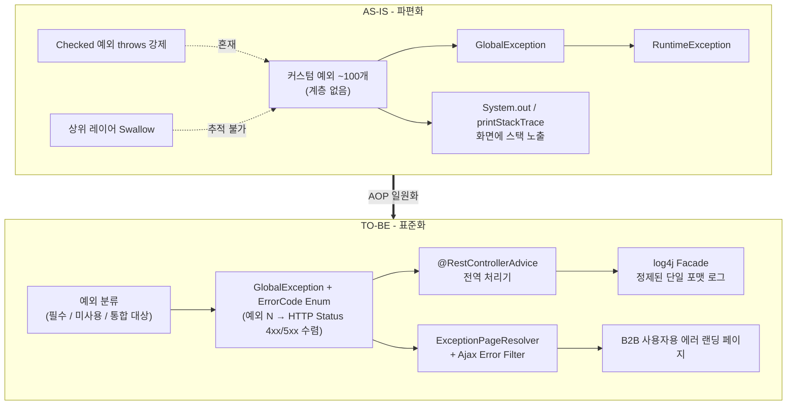
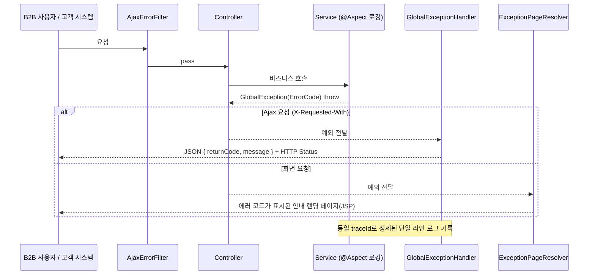

## 목차

- [1. 개요 및 배경 (Background &amp; Problem)](#1-개요-및-배경-background-problem)
  - [핵심 증상](#핵심-증상)
- [2. AS-IS: 파편화된 커스텀 예외 체계 분석](#2-as-is-파편화된-커스텀-예외-체계-분석)
  - [2.1 Checked vs Unchecked Exception 혼재](#21-checked-vs-unchecked-exception-혼재)
  - [2.2 불분명한 상속 구조와 GlobalException](#22-불분명한-상속-구조와-globalexception)
  - [2.3 예외 인벤토리 분류 (미사용 / 필수 / 통합)](#23-예외-인벤토리-분류-미사용-필수-통합)
  - [2.4 "요청은 다양하나 응답 코드는 4xx/5xx로 수렴한다"](#24-요청은-다양하나-응답-코드는-4xx5xx로-수렴한다)
- [3. TO-BE: 개선 방향 및 아키텍처 설계](#3-to-be-개선-방향-및-아키텍처-설계)
  - [3.1 Sysout 로그의 log4j 파사드(Facade) 전환 및 스택 트레이스 간소화](#31-sysout-로그의-log4j-파사드facade-전환-및-스택-트레이스-간소화)
  - [3.2 Global Exception Handler 기반 API 공통 Response 설계](#32-global-exception-handler-기반-api-공통-response-설계)
  - [3.3 Exception Page Resolver 및 Ajax Filter 도입](#33-exception-page-resolver-및-ajax-filter-도입)
  - [3.4 AOP로 로깅·예외 랜딩을 횡단 분리](#34-aop로-로깅예외-랜딩을-횡단-분리)
- [4. 개선 결과 및 기대 성과](#4-개선-결과-및-기대-성과)
  - [4.1 B2B 사용자에게 B2C 수준의 에러 경험 제공](#41-b2b-사용자에게-b2c-수준의-에러-경험-제공)
  - [4.2 웹 로그 기반 모니터링 가속화](#42-웹-로그-기반-모니터링-가속화)
  - [4.3 AS-IS / TO-BE 요약](#43-as-is-to-be-요약)
- [5. 아쉬운 점과 향후 가이드라인](#5-아쉬운-점과-향후-가이드라인)

<a id="1-개요-및-배경-background-problem"></a>

## 1. 개요 및 배경 (Background & Problem)

오래된 B2B 엔터프라이즈 시스템에서는 비즈니스 요건이 추가될 때마다 개발자마다 고유의 커스텀 예외(Custom Exception)를 양산하는 경향이 있습니다.

그 결과 예외 처리 체계가 파편화되고, 불명확한 에러 로그와 정제되지 않은 예외 전파로 인해 <strong>실제 고객 장애 대응(CS) 리소스가 과도하게 낭비</strong>되는 문제가 발생했습니다. 

<a id="핵심-증상"></a>

### 핵심 증상


<NotionTable>
  <tbody>
    <tr><td>증상</td><td>영향</td></tr>
    <tr><td>계층 없는 커스텀 예외 약 100여 개 난립</td><td>예외의 의미·심각도 판별 불가, 신규 개발자 온보딩 지연</td></tr>
    <tr><td>`System.out.println` / `e.printStackTrace()` 하드코딩 산재</td><td>동기 콘솔 I/O 블로킹, 로그 등급·수집 불가, 임시 String 남발</td></tr>
    <tr><td>예외 스택이 그대로 화면 노출</td><td>엔드유저가 원인·문의처를 알 수 없음, 대외 신뢰도 하락</td></tr>
    <tr><td>Ajax 응답에 에러 HTML이 반환</td><td>프론트엔드 파싱 실패로 화면 파손</td></tr>
  </tbody>
</NotionTable>


<NotionDivider />

<a id="2-as-is-파편화된-커스텀-예외-체계-분석"></a>

## 2. AS-IS: 파편화된 커스텀 예외 체계 분석

기존 시스템의 커스텀 예외를 전수 리스트업하고 구조적 한계를 분석하는 사전 조사를 진행했습니다.

<a id="21-checked-vs-unchecked-exception-혼재"></a>

### 2.1 Checked vs Unchecked Exception 혼재

- 소스 전반에 `Exception`, `IOException` 등 <strong>Checked Exception</strong>을 무분별하게 상속받아 시그니처(`throws`)에 전파를 강제하는 코드와, 상단 프레젠테이션 레이어에서 예외를 <strong>먹어버리는(Swallow)</strong> 코드가 뒤섞여 있었습니다.
- 그 결과 예외 전파 경로 추적이 사실상 불가능했습니다. (어디서 던지고 어디서 삼키는지 불명확)
<a id="22-불분명한-상속-구조와-globalexception"></a>

### 2.2 불분명한 상속 구조와 `GlobalException`

- 약 100여 개의 커스텀 예외가 <strong>계층 관계 없이</strong> 정의되어 있었습니다.
- 다만 다행히, 최종적으로는 최상위 `GlobalException` → `RuntimeException`(Unchecked)을 상속하는 <strong>느슨한 공통 조상 구조</strong>는 갖추어져 있었습니다.
- `RuntimeException` 기반이므로 불필요한 컴파일 타임 에러나 명시적 예외 선언에서는 자유로웠고, 호출자에게 에러 정보를 전달하는 후속 처리 메서드(에러 코드·메시지 getter) 자체는 잘 정의되어 있었습니다.
- <strong>판단</strong>: "전면 재설계"가 아니라 <strong>이미 존재하는 `GlobalException` 단일 접점을 활용한 AOP 일원화</strong>가 최소 비용 경로였습니다.



<a id="23-예외-인벤토리-분류-미사용-필수-통합"></a>

### 2.3 예외 인벤토리 분류 (미사용 / 필수 / 통합)

전수 조사 결과를 3가지로 태깅했습니다.


<NotionTable>
  <tbody>
    <tr><td>분류</td><td>정의</td><td>조치</td></tr>
    <tr><td><strong>미사용(Dead)</strong></td><td>어디서도 `throw`되지 않거나 참조 없는 예외 클래스</td><td>즉시 제거 대상으로 마킹 (릴리즈 분리)</td></tr>
    <tr><td><strong>필수(Core)</strong></td><td>비즈니스 규칙·연동 규약상 호출자가 반드시 구분해야 하는 예외<br />(인증 실패, 권한 없음, 정책 위반, 외부 연동 실패 등)</td><td>`ErrorCode` Enum에 고유 코드·HTTP Status·기본 메시지로 등재</td></tr>
    <tr><td><strong>통합(Merge)</strong></td><td>이름만 다르고 처리가 동일한 중복 예외</td><td>대표 예외로 병합, 나머지는 `@Deprecated` 후 점진 제거</td></tr>
  </tbody>
</NotionTable>

> ⚠️ <strong>미사용 예외의 일괄 삭제는 별도 릴리즈로 분리</strong>했습니다. 리플렉션·설정 파일(문자열 FQCN)·직렬화 경로에서 참조될 수 있어, 컴파일러만으로는 "진짜 미사용"을 100% 보장할 수 없기 때문입니다.

<a id="24-요청은-다양하나-응답-코드는-4xx5xx로-수렴한다"></a>

### 2.4 "요청은 다양하나 응답 코드는 4xx/5xx로 수렴한다"

고객사는 비즈니스 상황마다 <strong>고유한 커스텀 예외 신설을 빈번하게 요청</strong>했습니다. 그러나 실제로 그 예외들이 클라이언트에게 내려주는 신호는 대부분 다음 몇 가지로 수렴했습니다.


<NotionTable>
  <tbody>
    <tr><td>실질 성격</td><td>HTTP Status</td><td>대표 사례</td></tr>
    <tr><td>클라이언트 입력·상태 오류</td><td><strong>400 Bad Request</strong></td><td>필수값 누락, 형식 위반, 중복 요청</td></tr>
    <tr><td>인증 실패</td><td><strong>401 Unauthorized</strong></td><td>토큰 만료·부재</td></tr>
    <tr><td>권한 없음</td><td><strong>403 Forbidden</strong></td><td>RBAC 정책 위반</td></tr>
    <tr><td>대상 없음</td><td><strong>404 Not Found</strong></td><td>존재하지 않는 리소스</td></tr>
    <tr><td>비즈니스 규칙 위반</td><td><strong>409 Conflict / 422</strong></td><td>정책 충돌, 상태 전이 불가</td></tr>
    <tr><td>서버·연동 장애</td><td><strong>500 / 502 / 503</strong></td><td>내부 오류, 외부 시스템 실패, 타임아웃</td></tr>
  </tbody>
</NotionTable>

즉 <strong>"커스텀 예외 개수"는 계속 늘어나도 "응답 코드의 종류"는 고정</strong>입니다. 이 괴리를 흡수하려면, 예외 클래스는 자유롭게 늘리되 <strong>HTTP Status로의 매핑을 한 곳에서 규정·통일하는 AOP 관리 지점</strong>이 필요했습니다. (예외 → `ErrorCode` → HTTP Status, N:1 수렴)


<NotionDivider />

<a id="3-to-be-개선-방향-및-아키텍처-설계"></a>

## 3. TO-BE: 개선 방향 및 아키텍처 설계

예외 관리 전략을 <strong>직관적이고 표준화된 AOP 예외 제어 모델</strong>로 일원화하기 위해 4단계를 적용했습니다.

<a id="31-sysout-로그의-log4j-파사드facade-전환-및-스택-트레이스-간소화"></a>

### 3.1 Sysout 로그의 log4j 파사드(Facade) 전환 및 스택 트레이스 간소화

곳곳에 하드코딩된 `System.out.println()` / `e.printStackTrace()`를 걷어내고 프레임워크 표준 로깅과 연동했습니다.

- <strong>문제</strong>: `printStackTrace()`는 (1) 동기 콘솔 I/O로 스레드를 블로킹하고, (2) 로그 레벨·수집기(ELK 등)와 무관하게 표준 에러로 직접 출력되며, (3) 수십 줄의 프레임 전체를 쏟아내 정작 원인 프레임이 묻힙니다.
- <strong>해결</strong>: `LoggingFacade`를 두어 <strong>핵심 원인(Cause)과 최상단 프레임만 정제</strong>한 단일 라인 포맷으로 기록합니다.

```java
// 개선 전: 무분별한 System.out 및 stack trace 직접 출력
try {
    businessService.execute(data);
} catch (GlobalException e) {
    System.out.println("에러 발생: " + e.getMessage());
    e.printStackTrace();
}

// 개선 후: Facade 기반 log4j 구조화 로깅
public class LoggingFacade {
    private static final Logger logger = Logger.getLogger(LoggingFacade.class);

    public static void logError(String contextMessage, Throwable throwable) {
        // 전체 Stack Trace 대신 핵심 원인 메시지 + 최상단 프레임만 정제
        String simplifiedStack = getSimplifiedStackTrace(throwable);
        logger.error(String.format("[%s] Error Message: %s | Stack Message: %s",
            contextMessage, throwable.getMessage(), simplifiedStack));
    }

    private static String getSimplifiedStackTrace(Throwable t) {
        if (t == null) return "No Stack Trace";
        StackTraceElement[] elements = t.getStackTrace();
        if (elements.length > 0) {
            StackTraceElement topFrame = elements[0];
            return String.format("%s.%s(Line:%d)",
                topFrame.getClassName(), topFrame.getMethodName(), topFrame.getLineNumber());
        }
        return t.getMessage();
    }
}
```

> 운영 팁: 간소화 로그는 <strong>평시 모니터링용</strong>입니다. 심층 디버깅을 위해 원본 스택은 `logger.debug("stack", throwable)` 처럼 별도 레벨로 남기고, 로그 설정에서 필요 시에만 활성화합니다.

<a id="32-global-exception-handler-기반-api-공통-response-설계"></a>

### 3.2 Global Exception Handler 기반 API 공통 Response 설계

모든 API 응답을 통일된 JSON 포맷으로 반환하며, <strong>비즈니스 예외 → HTTP Status의 N:1 수렴 매핑</strong>을 자동 수행하는 전역 처리기를 구축했습니다. (2.4의 괴리를 흡수하는 지점 — 예외 클래스는 늘어나도 HTTP Status는 고정)


```java
@RestControllerAdvice
public class GlobalExceptionHandler {

    @ExceptionHandler(GlobalException.class)
    public ResponseEntity<ErrorResponse> handleGlobalException(GlobalException ex) {
        ErrorCode errorCode = ex.getErrorCode(); // 예외에 매핑된 고유 코드 + HTTP Status

        LoggingFacade.logError("API Exception Handler Blocked", ex); // 3.1 간소화 로깅 재사용

        ErrorResponse response = new ErrorResponse(
            errorCode.getReturnCode(),
            ex.getMessage() != null ? ex.getMessage() : errorCode.getDefaultMessage()
        );
        return new ResponseEntity<>(response, HttpStatus.valueOf(errorCode.getHttpStatus()));
    }

    @ExceptionHandler(Exception.class) // 매핑되지 않은 미분류 예외의 안전망
    public ResponseEntity<ErrorResponse> handleUnexpected(Exception ex) {
        LoggingFacade.logError("Unmapped Exception", ex);
        ErrorResponse response = new ErrorResponse(ErrorCode.INTERNAL_ERROR.getReturnCode(),
            ErrorCode.INTERNAL_ERROR.getDefaultMessage());
        return new ResponseEntity<>(response, HttpStatus.INTERNAL_SERVER_ERROR);
    }
}
```


```java
// ErrorCode Enum: 세분화된 returnCode(고객사 요청 흡수)는 자유롭게 늘리되,
//                 httpStatus는 4xx/5xx의 정해진 집합으로만 수렴시킨다.
public enum ErrorCode {
    // returnCode(비즈니스 식별자, N)          httpStatus(전송 신호, 1)  logLevel
    INVALID_PARAMETER("E4001", 400, Level.WARN),
    DUPLICATE_REQUEST ("E4002", 400, Level.WARN),
    POLICY_VIOLATION  ("E4090", 409, Level.WARN),
    AUTH_EXPIRED      ("E4011", 401, Level.INFO),
    NO_PERMISSION     ("E4030", 403, Level.WARN),
    EXTERNAL_TIMEOUT  ("E5020", 502, Level.ERROR),
    INTERNAL_ERROR    ("E5000", 500, Level.ERROR);
    // ... 고객사별 커스텀 예외는 여기에 returnCode만 추가, httpStatus는 위 집합 재사용
}
```

- `ErrorCode`는 <strong>Enum</strong>으로 관리하여 "returnCode ↔ HTTP Status ↔ 기본 메시지 ↔ 로그 레벨"을 한 곳에서 규정합니다.
- <strong>고객사가 새 커스텀 예외를 요청</strong>하면 → 예외 클래스 + `ErrorCode` 한 줄만 추가하고, <strong>HTTP Status는 기존 4xx/5xx 집합을 재사용</strong>합니다. 클라이언트 계약(상태 코드 기반 분기)은 흔들리지 않고, 세부 식별은 `returnCode`와 메시지로 전달됩니다.
- 컨트롤러·서비스에서 `try-catch`로 응답을 조립하던 중복 코드가 사라집니다. (횡단 관심사의 AOP 분리)
<a id="33-exception-page-resolver-및-ajax-filter-도입"></a>

### 3.3 Exception Page Resolver 및 Ajax Filter 도입

B2B 서비스는 <strong>화면(Full-page) 요청과 비동기 Ajax 요청이 공존</strong>하므로, 요청 유형에 따른 지능형 예외 분기가 필요합니다.

<strong>① Tomcat `web.xml` + `ExceptionPageResolver` 연동</strong> — 상태 코드/예외 타입별로 컨테이너 수준에서 안내 페이지로 포워딩합니다.


```xml
<error-page>
    <error-code>404</error-code>
    <location>/WEB-INF/views/error/404.jsp</location>
</error-page>
<error-page>
    <error-code>500</error-code>
    <location>/WEB-INF/views/error/500.jsp</location>
</error-page>
<error-page>
    <exception-type>com.enterprise.exception.GlobalException</exception-type>
    <location>/WEB-INF/views/error/globalError.jsp</location>
</error-page>
```

<strong>② Ajax 비동기용 에러 필터</strong> — Ajax 요청에 렌더링된 에러 HTML이 반환되어 프론트엔드가 파손되는 것을 막습니다. `X-Requested-With: XMLHttpRequest` 헤더를 분석하여 페이지 리졸빙에서 제외하고 <strong>순수 JSON 에러만</strong> 전달합니다.


```java
public class AjaxErrorFilter implements Filter {
    @Override
    public void doFilter(ServletRequest request, ServletResponse response, FilterChain chain)
            throws IOException, ServletException {
        HttpServletRequest httpRequest = (HttpServletRequest) request;
        HttpServletResponse httpResponse = (HttpServletResponse) response;
        try {
            chain.doFilter(request, response);
        } catch (Exception ex) {
            if ("XMLHttpRequest".equals(httpRequest.getHeader("X-Requested-With"))) {
                httpResponse.setContentType("application/json;charset=UTF-8");
                httpResponse.setStatus(HttpServletResponse.SC_INTERNAL_SERVER_ERROR);
                httpResponse.getWriter().write(
                    String.format("{\"success\":false,\"message\":\"%s\"}", ex.getMessage()));
            } else {
                throw ex; // 일반 브라우저 요청은 컨테이너 예외 처리기로 재전파 → 에러 페이지
            }
        }
    }
}
```

<a id="34-aop로-로깅예외-랜딩을-횡단-분리"></a>

### 3.4 AOP로 로깅·예외 랜딩을 횡단 분리

- <strong>정책</strong>: 비즈니스 코드는 의미 있는 `GlobalException`만 던지고 끝낸다. <strong>로깅·응답 포맷·페이지 분기는 전부 경계(Advice/Filter/Resolver)에서 처리</strong>한다.
- 서비스 계층에 `@Aspect`로 실행 시간·주요 파라미터·예외 발생 지점을 표준 포맷으로 남겨, `GlobalExceptionHandler`의 간소화 로그와 <strong>동일한 상관관계 키(traceId)</strong>로 묶습니다.




<NotionDivider />

<a id="4-개선-결과-및-기대-성과"></a>

## 4. 개선 결과 및 기대 성과

<a id="41-b2b-사용자에게-b2c-수준의-에러-경험-제공"></a>

### 4.1 B2B 사용자에게 B2C 수준의 에러 경험 제공

- 예외 스택이 그대로 노출되던 화면 대신, <strong>사전 정의된 깔끔한 에러 랜딩 페이지</strong>가 작동합니다.
- 페이지에는 <strong>에러 코드 + 사람이 읽을 수 있는 안내 + 문의 경로</strong>가 표기되어, 엔드유저가 코드만 담당 관리자에게 전달하면 즉시 원인 식별이 됩니다.
- B2B 내부 사용자도 소비자 서비스(B2C) 수준의 정돈된 오류 화면을 경험하게 되어 체감 품질과 신뢰도가 상승했습니다.
<a id="42-웹-로그-기반-모니터링-가속화"></a>

### 4.2 웹 로그 기반 모니터링 가속화

- 인프라 관리자는 정형화된 단일 포맷 로그와 로그 레벨만으로, <strong>DB 계열 오류(Connection Timeout, Deadlock)인지 일반 비즈니스 룰 예외인지를 즉시 구분</strong>하여 대응할 수 있습니다.
- `printStackTrace` 노이즈 제거로 로그 수집량·검색 비용이 줄었습니다.
<a id="43-as-is-to-be-요약"></a>

### 4.3 AS-IS / TO-BE 요약


<NotionTable>
  <tbody>
    <tr><td>구분</td><td>AS-IS</td><td>TO-BE</td></tr>
    <tr><td>예외 정의</td><td>계층 없는 ~100개, Checked/Unchecked 혼재</td><td>`GlobalException` + `ErrorCode` Enum, 필수만 선별</td></tr>
    <tr><td>예외 ↔ 응답 코드</td><td>매핑 규칙 없음, 핸들러마다 제각각</td><td>예외 N개 → HTTP Status(4xx/5xx) 집합으로 수렴, Enum이 단일 규정</td></tr>
    <tr><td>로깅</td><td>`System.out` / `printStackTrace` 산재</td><td>`LoggingFacade` 단일 포맷 + 레벨 분기</td></tr>
    <tr><td>API 응답</td><td>컨트롤러별 제각각 조립</td><td>`@RestControllerAdvice` 공통 JSON, 코드 1:1 매핑</td></tr>
    <tr><td>화면/Ajax</td><td>에러 HTML이 Ajax에도 반환 → 파손</td><td>Filter가 요청 유형 분기, Ajax는 순수 JSON</td></tr>
    <tr><td>엔드유저</td><td>스택 트레이스 노출</td><td>에러 코드·안내가 있는 랜딩 페이지</td></tr>
    <tr><td>CS 대응</td><td>로그 해독에 다수 인력·시간</td><td>코드/포맷으로 즉시 식별, CS 리소스 최소화</td></tr>
  </tbody>
</NotionTable>


<NotionDivider />

<a id="5-아쉬운-점과-향후-가이드라인"></a>

## 5. 아쉬운 점과 향후 가이드라인

- log4j 정제 로깅까지는 개선했으나, <strong>미사용 예외 클래스 일괄 정리</strong>와 <strong>비즈니스 성격에 맞는 예외 카테고리 간소화</strong>는 지속 과제로 남습니다. (리플렉션·문자열 참조 검증 후 릴리즈 단위로 제거)
- 직관적·정형화된 <strong>Exception/Message Handler 패키지를 사내 공통 프레임워크로 표준화</strong>하고, 
공식 저장소를 통해 버전업 배포할 계획입니다.
- 이를 통해 타 부서 B2B 신규 프로젝트에서도 초기부터 표준 예외·로깅 체계를 상속받아 <strong>CS 대응 리소스를 최소화</strong>하도록 최적화합니다.

