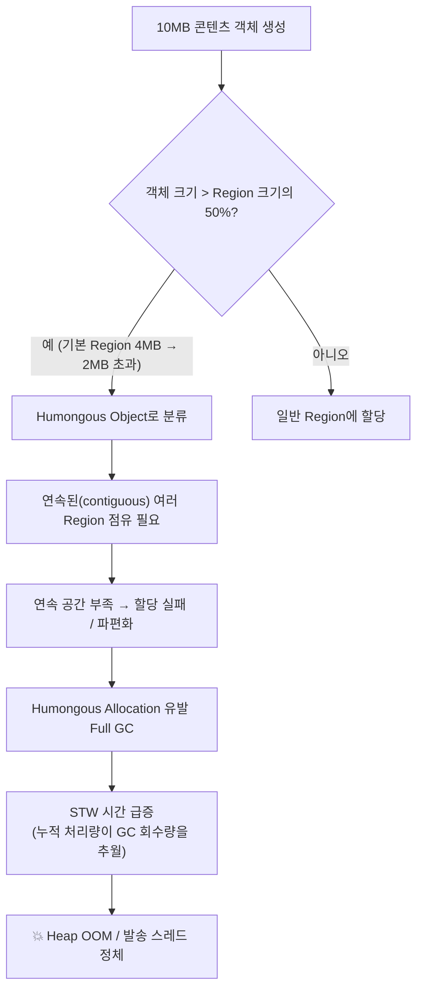

## 목차

- [1. 개요 및 배경 (Background &amp; Problem)](#1-개요-및-배경-background-problem)
  - [제약 조건](#제약-조건)
- [2. 문제의 시작: 거대 객체(Humongous Object)와 G1GC의 한계](#2-문제의-시작-거대-객체humongous-object와-g1gc의-한계)
  - [2.1 원인 분석: G1GC의 Region 메커니즘](#21-원인-분석-g1gc의-region-메커니즘)
- [3. 코드 레벨 최적화: 메모리 폭탄(Memory Bomb) 방지](#3-코드-레벨-최적화-메모리-폭탄memory-bomb-방지)
  - [3.1 Scope 제한 및 static 사용 최소화](#31-scope-제한-및-static-사용-최소화)
  - [3.2 Deep Clear 전략](#32-deep-clear-전략)
- [4. JVM 튜닝: 최적 Region Size 도출과 백프레셔](#4-jvm-튜닝-최적-region-size-도출과-백프레셔)
  - [4.1 G1HeapRegionSize 조정](#41-g1heapregionsize-조정)
  - [4.2 Backpressure(압박 제어) 로직](#42-backpressure압박-제어-로직)
  - [4.3 결과](#43-결과)
- [5. JVM 버전업의 필요성과 비용 산정](#5-jvm-버전업의-필요성과-비용-산정)
  - [5.1 Java 17+ / ZGC·GraalVM의 기대 효과](#51-java-17-zgcgraalvm의-기대-효과)
  - [5.2 버전업 비용 산정 체크리스트](#52-버전업-비용-산정-체크리스트)
  - [5.3 판단 결과](#53-판단-결과)
- [6. 결론](#6-결론)

<a id="1-개요-및-배경-background-problem"></a>

## 1. 개요 및 배경 (Background & Problem)

대규모 메시징 서비스에서 콘텐츠 생성 시 발생하는 <strong>10MB 단위의 거대 객체</strong>는 JVM 메모리 관리의 가장 큰 적입니다.

일반적인 문자(SMS)나 메신저 메시지가 수백 바이트 단위인 것과 달리, 이 서비스는 이례적으로 큰 데이터를 <strong>병렬로 대량 처리</strong>하며, 그 과정에서 메모리 부족(OOM)과 GC 지연이 반복적으로 발생했습니다.

<a id="제약-조건"></a>

### 제약 조건


<NotionTable>
  <tbody>
    <tr><td>항목</td><td>상황</td></tr>
    <tr><td><strong>런타임</strong></td><td>Java 1.8 고정. 남은 서비스 계약 기간(Service Term)으로 메이저 버전 업그레이드 불가</td></tr>
    <tr><td><strong>레거시 로직</strong></td><td>대용량 페이로드를 컬렉션에 통째로 적재하는 오래된 배치·발송 코드 혼재</td></tr>
    <tr><td><strong>인프라</strong></td><td>물리 증설은 비용 대비 효율이 낮고, 승인 리드타임이 김</td></tr>
    <tr><td><strong>목표</strong></td><td>코드 레벨 + JVM 옵션 튜닝만으로 발송 실패율과 메모리 점유율을 안정화</td></tr>
  </tbody>
</NotionTable>


<NotionDivider />

<a id="2-문제의-시작-거대-객체humongous-object와-g1gc의-한계"></a>

## 2. 문제의 시작: 거대 객체(Humongous Object)와 G1GC의 한계

기존 Java 1.8 환경에서 <strong>Parallel GC</strong>를 사용하던 중, 대량 발송 시 메모리 사용량이 급증하며 시스템이 멈추는(Stop-The-World 장기화) 현상이 발생했습니다.

단순히 <strong>G1GC로 전환</strong>했음에도 성능 저하는 여전했습니다. 원인은 G1GC의 Region 메커니즘에 있었습니다.

<a id="21-원인-분석-g1gc의-region-메커니즘"></a>

### 2.1 원인 분석: G1GC의 Region 메커니즘

G1GC는 전체 힙을 <strong>Region(영역)</strong> 이라는 균일한 단위로 나누어 관리합니다. 이때 <strong>객체 크기가 Region 크기의 50%를 초과하면 거대 객체(Humongous Object)</strong> 로 간주됩니다.




<strong>문제점</strong>

- 거대 객체는 <strong>연속된 Region</strong>을 점유해야 하므로, 힙에 여유 공간이 있어도 "연속"이 아니면 할당에 실패합니다.
- 거대 객체 할당·해제는 G1GC의 최적화 경로(증분 수집)를 우회하여 <strong>Full GC</strong> 를 유발하고 STW 시간을 기하급수적으로 늘립니다.
- Java 8의 G1GC는 거대 객체 회수 최적화(eager reclaim 등)가 최신 JDK 대비 미흡합니다.
<strong>실험 결과</strong>

테스트 데이터를 1MB → 32MB까지 2배수로 늘려가며 10만 건을 시뮬레이션한 결과, <strong>데이터 크기가 4MB를 넘는 시점부터 GC 회수 속도가 객체 누적 속도를 따라잡지 못하는 가속화(runaway) 현상</strong>을 확인했습니다.


<NotionDivider />

<a id="3-코드-레벨-최적화-메모리-폭탄memory-bomb-방지"></a>

## 3. 코드 레벨 최적화: 메모리 폭탄(Memory Bomb) 방지

인프라 증설에 앞서, 소스 코드에서 불필요한 참조부터 제거했습니다.

<a id="31-scope-제한-및-static-사용-최소화"></a>

### 3.1 Scope 제한 및 `static` 사용 최소화

클래스 단위 `static` 변수는 클래스 언로드 전까지 GC 대상에서 제외되어 메모리 누수의 주범이 됩니다. 이를 <strong>메서드 지역 객체로 전환</strong>하여 작업 완료 직후 GC 대상이 되도록 스코프를 좁혔습니다.


```java
// ❌ AS-IS: static 캐시가 대용량 페이로드를 계속 상주시킴
public class ContentBuilder {
    private static final Map<String, byte[]> RENDER_CACHE = new HashMap<>();

    public byte[] build(Content c) {
        byte[] payload = render(c);        // 약 10MB
        RENDER_CACHE.put(c.getId(), payload); // 해제 시점 없음 → Old 영역 잠식
        return payload;
    }
}

// ⭕ TO-BE: 메서드 스코프로 한정, 반환 후 즉시 수거 가능
public class ContentBuilder {
    public byte[] build(Content c) {
        byte[] payload = render(c);
        return payload; // 참조가 호출부 지역 변수로만 유지 → 작업 종료 시 Young GC 대상
    }
}
```

<a id="32-deep-clear-전략"></a>

### 3.2 Deep Clear 전략

`List<Object>` 같은 대규모 참조 데이터는 작업 종료 후 <strong>명시적으로 참조를 끊고 내부를 비워</strong> GC가 더 빨리 회수하도록 유도했습니다.


```java
List<byte[]> batch = loadBatch();
try {
    process(batch);
} finally {
    batch.clear();  // 내부 요소 참조 해제
    batch = null;   // 컬렉션 자체 참조 해제
}
```

> 참고: `null` 대입이 항상 필요한 것은 아니지만, <strong>루프 밖까지 스코프가 유지되는 장수(long-lived) 지역 변수</strong>나 대용량 청크 처리 구간에서는 다음 GC 사이클 전에 회수 힌트를 주는 효과가 있습니다.


<NotionDivider />

<a id="4-jvm-튜닝-최적-region-size-도출과-백프레셔"></a>

## 4. JVM 튜닝: 최적 Region Size 도출과 백프레셔

<a id="41-g1heapregionsize-조정"></a>

### 4.1 `G1HeapRegionSize` 조정

G1GC의 Region 크기는 힙 크기에 따라 자동 산정(1~32MB, 2의 거듭제곱)되며, 기본값에서 10MB 객체는 대부분 Humongous로 분류됩니다. 시뮬레이션(1MB~32MB × 10만 건)을 통해 <strong>10MB 객체가 일반 Region에 수용되도록</strong> Region 크기를 명시했습니다.


```bash
# 예시: Region을 32MB로 고정 → 16MB 이하 객체는 일반 Region에 수용, Humongous 회피
-XX:+UseG1GC
-XX:G1HeapRegionSize=32m
-XX:InitiatingHeapOccupancyPercent=35   # Mixed GC를 앞당겨 Old 적체 예방
-XX:+ParallelRefProcEnabled
-Xlog:gc*,gc+heap=info:file=gc.log:time,uptime,level,tags
```


<NotionTable>
  <tbody>
    <tr><td>항목</td><td>AS-IS</td><td>TO-BE</td><td>효과</td></tr>
    <tr><td>GC 알고리즘</td><td>Parallel GC</td><td>G1GC + Region 튜닝</td><td>STW 예측 가능성 확보</td></tr>
    <tr><td>Region Size</td><td>자동(≈4MB)</td><td>명시(예: 32MB)</td><td>10MB 객체의 Humongous 분류 회피 → 파편화·Full GC 감소</td></tr>
    <tr><td>Old 적체 대응</td><td>사후 Full GC</td><td>IHOP 하향으로 Mixed GC 조기 개입</td><td>Full GC 빈도 감소</td></tr>
  </tbody>
</NotionTable>

> ⚠️ Region을 키우면 Humongous는 줄지만, Region 단위 회수 granularity가 커지고 소형 객체가 많은 워크로드에서는 잔여 공간(내부 파편화)이 늘 수 있습니다. <strong>반드시 실제 객체 크기 분포와 GC 로그로 검증</strong>해야 합니다.

<a id="42-backpressure압박-제어-로직"></a>

### 4.2 Backpressure(압박 제어) 로직

로직 내부에 <strong>Memory Threshold 체크</strong>를 도입했습니다. 전체 Heap 사용량이 80%를 넘거나 현재 복사 중인 객체 덩어리가 임계치를 초과하면, 작업에 의도적 지연을 주어 GC가 메모리를 확보할 시간을 벌었습니다.


```java
private void applyBackpressureIfNeeded() {
    MemoryUsage heap = ManagementFactory.getMemoryMXBean().getHeapMemoryUsage();
    double usedRatio = (double) heap.getUsed() / heap.getMax();
    if (usedRatio > 0.80) {
        long backoff = Math.min(500L, (long) ((usedRatio - 0.80) * 10_000));
        try { Thread.sleep(backoff); } catch (InterruptedException e) { Thread.currentThread().interrupt(); }
    }
}
```

<a id="43-결과"></a>

### 4.3 결과


<NotionTable>
  <tbody>
    <tr><td>지표</td><td>개선 전</td><td>개선 후</td></tr>
    <tr><td>발송 실패율</td><td>20~30%</td><td><strong>1% 미만</strong></td></tr>
    <tr><td>메모리 점유율</td><td>90% 상회</td><td><strong>20~30%대 안정화</strong></td></tr>
    <tr><td>Full GC</td><td>대량 발송 시 빈발</td><td>정상 부하에서 관측되지 않음</td></tr>
  </tbody>
</NotionTable>


<NotionDivider />

<a id="5-jvm-버전업의-필요성과-비용-산정"></a>

## 5. JVM 버전업의 필요성과 비용 산정

이번 대응으로 <strong>JVM 버전이 곧 처리 가능 리소스의 상한을 결정한다</strong>는 점을 확인했습니다. 다만 버전업은 기술 판단만이 아니라 <strong>비용·계약 판단</strong>이 필요합니다.

<a id="51-java-17-zgcgraalvm의-기대-효과"></a>

### 5.1 Java 17+ / ZGC·GraalVM의 기대 효과


<NotionTable>
  <tbody>
    <tr><td>기술</td><td>거대 객체 관점의 이점</td></tr>
    <tr><td><strong>ZGC (가변 페이지, ZPages)</strong></td><td>고정 Region 크기에 얽매이지 않고 객체 크기에 맞춰 메모리를 할당 → 거대 객체 파편화 이슈에서 자유로움. STW가 객체 수·힙 크기와 무관하게 수 ms 이내</td></tr>
    <tr><td><strong>G1GC 개선 (JDK 11+)</strong></td><td>Humongous 객체 eager reclaim, Old 영역 병렬 처리 개선으로 Java 8 대비 회수 효율 상승</td></tr>
    <tr><td><strong>GraalVM</strong></td><td>최적화된 JIT / Native Image로 메모리 사용 효율 상승, 웜업·다운타임 축소</td></tr>
  </tbody>
</NotionTable>

<a id="52-버전업-비용-산정-체크리스트"></a>

### 5.2 버전업 비용 산정 체크리스트


```text
[비용 항목]
1. 호환성 리스크
   - 레거시 로직: 제거된 API(javax → jakarta), 내부 sun.* 의존, 리플렉션 캡슐화(JPMS)
   - 서드파티 라이브러리: JDK 17/21 미지원 버전 → 업그레이드 연쇄, 유료 지원 여부
   - 빌드 체인: 컴파일러 타깃, 바이트코드 검증기 강화로 인한 빌드 실패
2. 검증 공수
   - 전 기능 회귀 테스트, 대용량 부하 재현 테스트, GC 로그 재튜닝
   - 고객사 UAT(엔터프라이즈 계약 시 필수) 일정 확보
3. 운영·계약 제약
   - 남은 Service Term 내 재개발 비용 회수 가능성
   - 고객사 승인(변경 관리), 롤백 계획, EOS/EOL 일정과의 정합
4. 대안 비용
   - "튜닝으로 버티기"의 유지보수 누적 비용 vs "버전업"의 일시 비용
```

<a id="53-판단-결과"></a>

### 5.3 판단 결과

- <strong>단기</strong>: 계약 기간·검증 공수를 고려해 <strong>Java 8 유지 + G1GC 튜닝 + 백프레셔</strong>로 안정화(본 사례).
- <strong>중기</strong>: 신규 계약·리뉴얼 시점에 맞춰 Java 17/21 + G1GC(또는 ZGC) 전환을 <strong>영업·기술 공동 안건</strong>으로 상정하고, 이번에 확보한 시뮬레이션 하니스를 검증 자산으로 재사용.

<NotionDivider />

<a id="6-결론"></a>

## 6. 결론

- 로직 효율성뿐 아니라 <strong>사용 중인 JVM의 버전과 옵션이 처리 가능한 리소스의 상한을 결정</strong>합니다.
- 특히 64비트 시스템에서 힙을 무작정 키우면 <strong>Compressed OOPs 임계점(약 32GB)</strong> 을 넘으며 오히려 객체 참조 비용이 늘어 성능이 급락할 수 있으므로, `Xmx`는 32GB 미만 유지가 유리합니다.
- 레거시·고정 런타임 제약 아래에서도 <strong>GC 메커니즘의 이해 → 코드 스코프 축소 → Region 튜닝 → 백프레셔</strong>의 순서로 접근하면 버전업 없이 수명을 연장할 수 있습니다.
- 다만 이는 <strong>유예</strong>이지 해결이 아니며, 버전 팔로우업과 GC 로그 분석을 통해 인프라와 소프트웨어가 조화를 이루는 최적점을 지속적으로 찾아야 합니다.

