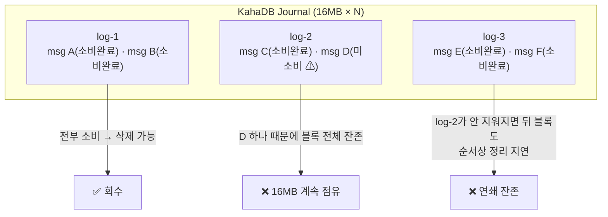

## 목차

- [1. 개요 및 배경 (Background &amp; Problem)](#1-개요-및-배경-background-problem)
- [2. 현상: 처리량은 유지되는데 디스크가 Full 차는 이유](#2-현상-처리량은-유지되는데-디스크가-full-차는-이유)
  - [2.1 원인 분석 — KahaDB의 16MB 로그 블록](#21-원인-분석-kahadb의-16mb-로그-블록)
  - [2.2 병목 진단 — Enqueue &gt; Dequeue 불균형](#22-병목-진단-enqueue-dequeue-불균형)
- [3. 해결 전략: 단계별 최적화](#3-해결-전략-단계별-최적화)
  - [3.1 Threshold 기반 Backpressure(역압) 도입](#31-threshold-기반-backpressure역압-도입)
  - [3.2 통신 구간별 타임아웃 세밀화](#32-통신-구간별-타임아웃-세밀화)
- [4. 최종 결과 (물리 증설 없음)](#4-최종-결과-물리-증설-없음)
- [5. 결론](#5-결론)

<a id="1-개요-및-배경-background-problem"></a>

## 1. 개요 및 배경 (Background & Problem)

대용량 메시징 시스템에서 영속성(Persistence)을 위해 <strong>파일 기반 저장 방식</strong>을 채택할 때, 예상치 못한 <strong>디스크 사용량 급증</strong>을 겪을 수 있습니다.

대용량 콘텐츠(최대 10MB)를 포함한 이메일 발송 시, 수신 서버와의 레이턴시 차이로 디스크 공간이 빠르게 부족해지고 결국 브로커가 셧다운되는 현상이 발생했습니다. ActiveMQ의 <strong>KahaDB 블록 관리 메커니즘</strong>을 진단하고, <strong>Throttling(백프레셔) + Timeout 최적화</strong>로 물리 증설 없이 해결한 과정입니다.


<NotionDivider />

<a id="2-현상-처리량은-유지되는데-디스크가-full-차는-이유"></a>

## 2. 현상: 처리량은 유지되는데 디스크가 Full 차는 이유

<a id="21-원인-분석-kahadb의-16mb-로그-블록"></a>

### 2.1 원인 분석 — KahaDB의 16MB 로그 블록

- KahaDB는 메시지를 <strong>16MB 단위 Data Log File</strong>(journal)에 순차 기록합니다.
- <strong>특정 로그 파일 안의 메시지가 단 하나라도 소비(Dequeue)되지 않고 남아 있으면, 그 16MB 블록 전체가 삭제되지 않고 디스크에 계속 머뭅니다.</strong> (journal은 파일 단위로만 회수)
- 대용량 메시지가 여러 블록에 흩어져 쌓이면서, <strong>실제 대기 메시지 양보다 훨씬 큰 디스크 공간을 점유</strong>하는 "임시 데이터 누적"이 발생했습니다.



> [블로그 전용 시각화: KahaDBBlockDiagram]

<a id="22-병목-진단-enqueue-dequeue-불균형"></a>

### 2.2 병목 진단 — Enqueue > Dequeue 불균형


<NotionTable>
  <tbody>
    <tr><td>구간</td><td>관찰</td><td>원인</td></tr>
    <tr><td><strong>속도 불균형</strong></td><td>Queue 적재량이 소비 속도를 압도</td><td>시간당 20만 건 목표로 과도하게 밀어넣음 + 수신 서버 응답 지연으로 소비가 못 따라감</td></tr>
    <tr><td><strong>네트워크 타임아웃</strong></td><td>통신이 사실상 끊긴 세션이 자원을 계속 점유</td><td>일부 수신 서버가 <strong>최대 5분</strong> 대기하도록 설정 → MQ 컨슈머 스레드·커넥션이 그동안 묶임</td></tr>
  </tbody>
</NotionTable>

즉, 미소비 메시지가 줄지 않으니 16MB 블록이 회수되지 않고, 디스크가 `storeUsage` 한계에 도달하면 브로커가 <strong>Producer를 블로킹하거나 셧다운</strong>됩니다.


<NotionDivider />

<a id="3-해결-전략-단계별-최적화"></a>

## 3. 해결 전략: 단계별 최적화

<a id="31-threshold-기반-backpressure역압-도입"></a>

### 3.1 Threshold 기반 Backpressure(역압) 도입

시스템 자체 다운을 막기 위해 <strong>Pusher(Producer) 측에 임계치 제어</strong>를 추가했습니다.

- 관리자 페이지의 Queue 카운트를 실시간 모니터링.
- 적재된 메시지 수가 <strong>임계값(20,000건)</strong> 을 초과하면 Pusher 작업을 지정 시간 동안 지연.
- 소비가 따라잡아 임계값 아래로 내려오면 재개.

```text
[Pusher 루프]
while (hasWork):
    pending = adminApi.getQueueSize("mail.send")
    if pending > 20_000:
        sleep(backoffMillis)      # 유입 억제 → Dequeue가 블록을 비울 시간 확보
        continue
    push(nextBatch)
```

> ActiveMQ 자체의 `PendingMessageLimitStrategy`, `producerFlowControl`, `systemUsage/storeUsage` 설정과 병행하면 브로커·애플리케이션 양쪽에서 역압이 걸립니다. 애플리케이션 임계치는 "브로커가 막기 전에 미리 늦추는" 1차 방어선입니다.

<a id="32-통신-구간별-타임아웃-세밀화"></a>

### 3.2 통신 구간별 타임아웃 세밀화

수신 서버와의 불필요한 대기를 줄이기 위해 <strong>단계별 타임아웃을 재설정</strong>했습니다.


<NotionTable>
  <tbody>
    <tr><td>구간</td><td>조치</td></tr>
    <tr><td>연결(connect)</td><td>짧게 (수 초) — 죽은 대상 빠르게 포기</td></tr>
    <tr><td>응답(read)</td><td>수신 서버의 실제 처리 시간 P99 기준으로 하향 (기존 5분 → 현실값)</td></tr>
    <tr><td>컨슈머 작업 데드라인</td><td>초과 시 메시지를 DLQ 또는 재시도 큐로 이동, 스레드 즉시 반납</td></tr>
  </tbody>
</NotionTable>

<strong>효과</strong>: 비정상 세션을 빠르게 정리 → Dequeue 처리 효율 상승 → 16MB 블록이 제때 비워져 journal GC가 정상 동작.


<NotionDivider />

<a id="4-최종-결과-물리-증설-없음"></a>

## 4. 최종 결과 (물리 증설 없음)


<NotionTable>
  <tbody>
    <tr><td>항목</td><td>설정 / 결과</td></tr>
    <tr><td>목표 처리량</td><td>시간당 200,000건 (달성)</td></tr>
    <tr><td>인프라 구성</td><td>35 TCP × 2 Pushers / 100GB Disk</td></tr>
    <tr><td>관리 임계치</td><td>20,000 MQ (Threshold)</td></tr>
    <tr><td>안정성</td><td>리소스 부족으로 인한 셧다운 제거</td></tr>
  </tbody>
</NotionTable>


<NotionDivider />

<a id="5-결론"></a>

## 5. 결론

- <strong>리소스 증설은 최후의 수단</strong>입니다.
- ① 데이터 크기·생성 속도 제어(백프레셔), ② MQ 저장 방식의 특성 이해(KahaDB 16MB 블록은 파일 단위로만 회수), ③ 네트워크 통신 최적화(타임아웃) — 세 관점에서 순차적으로 병목을 해소하면 비용 효율적 해결이 가능합니다.
- 파일 기반 영속 큐를 쓸 때는 "미소비 메시지 1건이 블록 전체를 잡는다"는 전제로, <strong>소비 지연 자체를 상시 모니터링</strong>해야 합니다.

