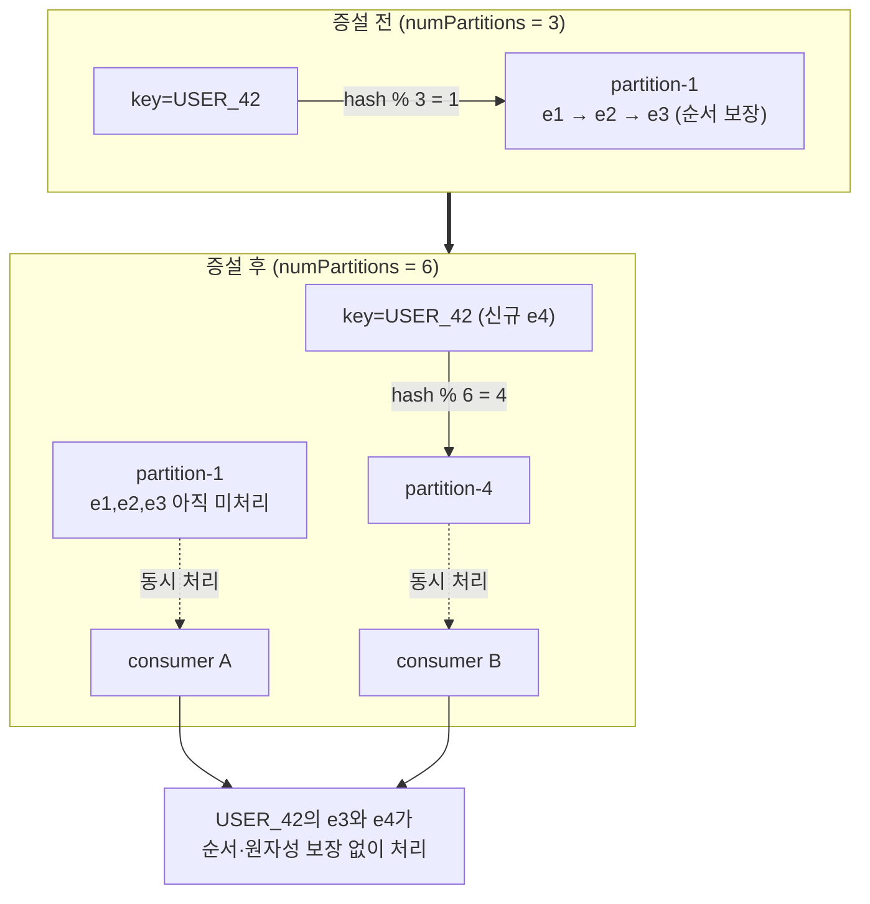

## 목차

- [1. 개요 및 배경 (Background &amp; Problem)](#1-개요-및-배경-background-problem)
- [2. 원인 분석](#2-원인-분석)
  - [2.1 파티션 = 순서 보장의 단위](#21-파티션-순서-보장의-단위)
  - [2.2 리밸런싱 비용](#22-리밸런싱-비용)
  - [2.3 동시성은 늘었지만 병목은 뒤로 이동](#23-동시성은-늘었지만-병목은-뒤로-이동)
- [3. 해결 전략](#3-해결-전략)
  - [3.1 파티션 수는 처음부터 넉넉히, 이후엔 바꾸지 않는다](#31-파티션-수는-처음부터-넉넉히-이후엔-바꾸지-않는다)
  - [3.2 연속성이 필요한 메시징: 파티션 고정 + 발행 전 순차성 확인](#32-연속성이-필요한-메시징-파티션-고정-발행-전-순차성-확인)
  - [3.3 순서가 필요하면 "키 단위 처리 멱등성 + 버전 가드"](#33-순서가-필요하면-키-단위-처리-멱등성-버전-가드)
  - [3.4 리밸런스 영향 최소화 (부차적 안전장치)](#34-리밸런스-영향-최소화-부차적-안전장치)
  - [3.5 다운스트림 동시성 상한](#35-다운스트림-동시성-상한)
- [4. 결론](#4-결론)

<a id="1-개요-및-배경-background-problem"></a>

## 1. 개요 및 배경 (Background & Problem)

처리량이 부족해 <strong>토픽의 파티션 수를 늘리면</strong>(예: 12 → 24), 컨슈머 병렬도가 올라가 처리량은 개선됩니다. 그러나 다음과 같은 부작용이 동시에 나타납니다.


<NotionTable>
  <tbody>
    <tr><td>증상</td><td>원인</td></tr>
    <tr><td><strong>같은 키의 메시지 순서 역전</strong></td><td>파티션 수가 바뀌면 `hash(key) % numPartitions` 결과가 달라져 <strong>동일 키가 다른 파티션으로 이동</strong></td></tr>
    <tr><td><strong>일시적 중복·경합 처리</strong></td><td>증설 시점에 이전 파티션의 미처리분과 새 파티션의 신규분이 <strong>서로 다른 컨슈머 스레드에서 동시에</strong> 처리</td></tr>
    <tr><td><strong>리밸런스 폭풍(Rebalance Storm)</strong></td><td>파티션 재할당 중 `Stop-The-World`로 컨슈머 그룹 전체가 잠시 멈춤, 반복되면 지연 누적</td></tr>
    <tr><td><strong>다운스트림 경합 심화</strong></td><td>컨슈머(=파티션) 수가 늘면 공유 DB·외부 API에 대한 동시 요청이 비례 증가</td></tr>
  </tbody>
</NotionTable>


<NotionDivider />

<a id="2-원인-분석"></a>

## 2. 원인 분석

<a id="21-파티션-순서-보장의-단위"></a>

### 2.1 파티션 = 순서 보장의 단위

- Kafka는 <strong>파티션 내부에서만 순서를 보장</strong>합니다. 토픽 전체 순서는 보장하지 않습니다.
- 기본 파티셔너는 `partition = hash(key) % numPartitions`. <strong>`numPartitions`가 바뀌면 대부분의 키가 다른 파티션으로 재매핑</strong>됩니다.



<a id="22-리밸런싱-비용"></a>

### 2.2 리밸런싱 비용

- 파티션 수 변경, 컨슈머 추가/이탈 시 그룹 코디네이터가 <strong>파티션을 재할당</strong>합니다.
- 기본 `RangeAssignor`/`RoundRobin`은 <strong>Eager(전체 취소 후 재할당)</strong> → 재할당 동안 전 컨슈머가 소비 중단.
- 커밋되지 않은 오프셋이 있으면 재할당 후 <strong>다른 컨슈머가 같은 메시지를 다시 소비</strong>(at-least-once).
<a id="23-동시성은-늘었지만-병목은-뒤로-이동"></a>

### 2.3 동시성은 늘었지만 병목은 뒤로 이동

파티션 24개 = 최대 24개 컨슈머 동시 소비. 그러나 이들이 같은 DB/외부 API를 때리면 <strong>커넥션 풀·락 경합·rate limit</strong>이 새 병목이 됩니다. (스레드 수만 늘린 것과 동일한 함정)


<NotionDivider />

<a id="3-해결-전략"></a>

## 3. 해결 전략

<a id="31-파티션-수는-처음부터-넉넉히-이후엔-바꾸지-않는다"></a>

### 3.1 파티션 수는 처음부터 넉넉히, 이후엔 바꾸지 않는다

- 순서가 중요한 토픽은 <strong>증설 대신 초기 오버프로비저닝</strong>. (파티션은 늘릴 수만 있고 줄일 수 없음)
- 꼭 늘려야 하면, <strong>새 토픽을 만들고 컨슈머를 전환(dual-write / replay)</strong> 하여 키 매핑 불연속을 통제된 시점에 처리.
<a id="32-연속성이-필요한-메시징-파티션-고정-발행-전-순차성-확인"></a>

### 3.2 연속성이 필요한 메시징: 파티션 고정 + 발행 전 순차성 확인

연속성이 연계되는 작업(같은 그룹의 메시지가 반드시 순서대로 처리되어야 하는 발송 시나리오)에서는, <strong>리밸런싱 튜닝에 기대기보다 "애초에 흐트러지지 않게" 강제</strong>하는 편이 안전합니다.

<strong>① 파티션 ID 고정 — 같은 그룹은 같은 파티션으로 순차 인입</strong>


```java
// groupId를 파티션에 직접 매핑 (파티션 수가 바뀌어도 매핑이 흔들리지 않도록 명시적 고정)
int partition = partitionRegistry.resolve(msg.getGroupId()); // 그룹→파티션 고정 테이블
kafkaTemplate.send(new ProducerRecord<>("mail-send", partition, msg.getGroupId(), payload));
```

- 기본 파티셔너의 `hash(key) % N`에 맡기지 않고, <strong>그룹 → 파티션 매핑을 레지스트리로 고정</strong>합니다. 파티션 증설이 있어도 기존 그룹의 순서 경로는 유지됩니다.
- 같은 파티션에 순서대로 넣으면 <strong>컨슈머는 그 파티션을 단일 스레드로 소비</strong>하므로 순서가 자연히 보장됩니다. (그룹당 in-flight 1건 유지)
<strong>② 발행 전(Publish 전) 그룹 순차성 선확인</strong>

MQ로 publish 하기 전에, <strong>해당 `groupId`의 직전 메시지가 순차적으로 처리 완료되었는지 먼저 확인</strong>하고 다음 메시지를 보냅니다.


```java
public void publishNext(GroupMessage msg) {
    GroupProgress p = progressRepo.get(msg.getGroupId());
    // 직전 시퀀스가 '처리 완료' 상태일 때만 다음 메시지 발행 (아니면 대기/재시도 큐)
    if (p.getLastAckedSeq() + 1 != msg.getSeq()) {
        pendingRepo.hold(msg);        // 아직 차례 아님 → 보류
        return;
    }
    kafkaTemplate.send(record(msg));
    progressRepo.markInFlight(msg.getGroupId(), msg.getSeq());
}
// 컨슈머가 처리 완료 후 ack → progressRepo.markAcked(groupId, seq) → 보류분 재평가
```

- 브로커에 <strong>한 그룹의 메시지가 여러 건 동시에 떠 있는 상황 자체를 만들지 않습니다.</strong> (생산 측 흐름 제어)
- 처리 완료 신호(ack)를 받아야 다음 건을 흘리므로, 파티션 이동·리밸런스·컨슈머 장애가 있어도 <strong>순서·원자성이 생산 측 상태 기계로 보장</strong>됩니다.
- 트레이드오프: 그룹 단위 처리량이 "직렬"로 제한됨 → 그룹 수가 많아야 전체 병렬도가 나옴. 그룹 간에는 완전 병렬.
<strong>③ 더 나은 방식에 대한 고민</strong>


<NotionTable>
  <tbody>
    <tr><td>방식</td><td>적합 상황</td><td>유의점</td></tr>
    <tr><td>그룹→파티션 고정 + 단일 소비</td><td>그룹 수 ≫ 파티션 수, 그룹별 트래픽 균등</td><td>특정 그룹 폭주 시 해당 파티션만 지연(hot partition)</td></tr>
    <tr><td>발행 전 순차성 확인(생산 측 상태 기계)</td><td>순서·완결성이 매우 중요, 그룹당 저빈도</td><td>진행 상태 저장소(Redis/DB)가 SPOF·경합 지점</td></tr>
    <tr><td>소비 측 버전 가드(§3.3)</td><td>순서 역전을 사후 흡수해도 되는 경우</td><td>"최종 상태"만 맞음 — 중간 이벤트 부수효과는 별도 처리</td></tr>
    <tr><td>Kafka 트랜잭션 + `read_committed`</td><td>원자적 다건 발행/소비</td><td>지연·복잡도 증가, 순서 자체를 대체하진 않음</td></tr>
    <tr><td>단일 파티션 토픽</td><td>전역 순서가 필요한 소규모 스트림</td><td>처리량 상한이 파티션 1개로 고정</td></tr>
  </tbody>
</NotionTable>

> 실무 선택: <strong>①+②를 함께</strong> 적용하는 경우가 많습니다. 파티션 고정으로 "경로"를 고정하고, 발행 전 확인으로 "그룹당 동시 in-flight 1건"을 강제하면, 리밸런싱 세부 튜닝은 부차적 문제가 됩니다.

<a id="33-순서가-필요하면-키-단위-처리-멱등성-버전-가드"></a>

### 3.3 순서가 필요하면 "키 단위 처리 멱등성 + 버전 가드"

파티션 이동으로 순서가 깨질 수 있음을 전제로, <strong>소비 측에서 순서 역전을 흡수</strong>합니다.


```java
// 이벤트에 단조 증가 버전(또는 발생 시각) 포함 → 과거 이벤트는 무시
@KafkaListener(topics = "user-events", concurrency = "6")
public void onEvent(UserEvent e) {
    int applied = stateRepo.getVersion(e.getUserId());   // 현재 반영된 버전
    if (e.getVersion() <= applied) return;               // stale → 스킵 (멱등)
    stateRepo.applyIfVersionMatches(e.getUserId(), e.getVersion(), applied); // CAS 업데이트
}
```

- <strong>멱등 키</strong>(businessKey + version)로 중복·재처리를 무해화.
- DB는 `WHERE version = :expected` 조건부 업데이트(CAS)로 <strong>동시 처리 시 한쪽만 성공</strong>하게 함.
<a id="34-리밸런스-영향-최소화-부차적-안전장치"></a>

### 3.4 리밸런스 영향 최소화 (부차적 안전장치)

3.2에서 그룹당 in-flight를 1건으로 강제하면 리밸런스로 인한 순서 붕괴 위험은 크게 줄어듭니다. 아래는 처리량·중복을 줄이기 위한 보조 튜닝입니다.


<NotionTable>
  <tbody>
    <tr><td>설정</td><td>값/방향</td><td>효과</td></tr>
    <tr><td>`partition.assignment.strategy`</td><td>`CooperativeStickyAssignor`</td><td>증분 리밸런스 — 영향받지 않는 파티션은 계속 소비</td></tr>
    <tr><td>`max.poll.records` / `max.poll.interval.ms`</td><td>처리 시간에 맞춰 조정</td><td>처리 지연으로 인한 강제 이탈(→리밸런스) 방지</td></tr>
    <tr><td>오프셋 커밋</td><td>처리 완료 후 수동 커밋</td><td>재처리 범위 최소화</td></tr>
    <tr><td>static membership (`group.instance.id`)</td><td>지정</td><td>재배포 시 불필요한 리밸런스 억제</td></tr>
  </tbody>
</NotionTable>

<a id="35-다운스트림-동시성-상한"></a>

### 3.5 다운스트림 동시성 상한

- 컨슈머 `concurrency`(파티션 병렬도)와 별개로, <strong>DB/외부 호출부를 `Semaphore`·bounded pool로 감싸</strong> 동시 요청 수를 제한.
- 대용량 payload는 Kafka에 직접 싣지 않고 <strong>Claim Check</strong>(본문은 오브젝트 스토리지, 메시지에는 참조만).

<NotionDivider />

<a id="4-결론"></a>

## 4. 결론

- <strong>파티션 증설은 "처리량 스위치"가 아니라 "키 재분배 이벤트"</strong> 입니다. `hash(key) % N`의 N을 바꾸는 순간 대부분의 키가 이동하고, 그 경계에서 순서·원자성 가정이 깨집니다.
- <strong>연속성이 중요한 메시징은 리밸런싱 튜닝보다 앞단에서 강제</strong>합니다: ① 그룹→파티션 <strong>고정 매핑</strong>으로 순차 인입 경로를 못 박고, ② <strong>발행 전에 해당 그룹의 직전 시퀀스가 처리 완료됐는지 확인</strong>하여 그룹당 in-flight를 1건으로 유지합니다.
- 이렇게 하면 리밸런스·컨슈머 장애가 있어도 <strong>순서·완결성이 생산 측 상태 기계로 보장</strong>되며, `CooperativeStickyAssignor`·수동 커밋·static membership은 부차적 안전장치가 됩니다.
- 순서 역전을 사후 흡수해도 되는 경우에만 소비 측 멱등성 + 버전 가드를 씁니다.
- 파티션을 늘려도 <strong>다운스트림 공유 자원의 동시성 상한</strong>은 여전히 별도로 관리해야 합니다.

