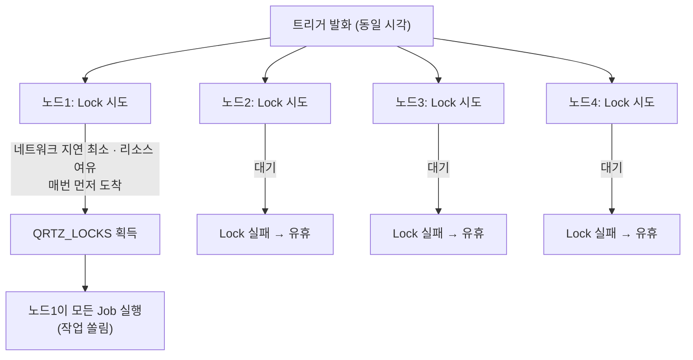
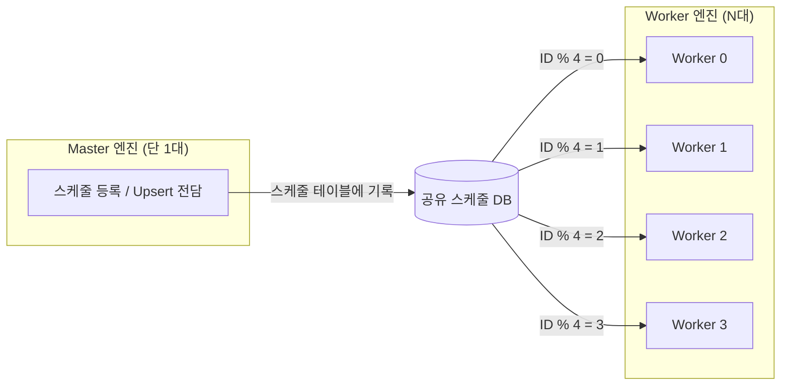

## 목차

- [1. 개요 및 배경 (Background &amp; Problem)](#1-개요-및-배경-background-problem)
- [2. 메커니즘 비교: Spring Scheduler vs Quartz](#2-메커니즘-비교-spring-scheduler-vs-quartz)
- [3. Quartz 고가용성(HA) 클러스터링 구조의 한계](#3-quartz-고가용성ha-클러스터링-구조의-한계)
  - [3.1 HA 원리](#31-ha-원리)
  - [3.2 문제점 — Greedy Locking (선착순 독식)](#32-문제점-greedy-locking-선착순-독식)
- [4. 문제 해결: 역할 분리와 쿼리 샤딩](#4-문제-해결-역할-분리와-쿼리-샤딩)
  - [4.1 등록/실행 역할 분리 (Master-Worker)](#41-등록실행-역할-분리-master-worker)
  - [4.2 Modulo 연산 기반 샤딩](#42-modulo-연산-기반-샤딩)
  - [4.3 규칙적 재샤딩과 백프레셔 조건 조절](#43-규칙적-재샤딩과-백프레셔-조건-조절)
- [5. 인사이트: HA와 LB는 별개의 문제](#5-인사이트-ha와-lb는-별개의-문제)
  - [5.1 Time-based의 한계](#51-time-based의-한계)
  - [5.2 HA ≠ LB](#52-ha-lb)
  - [5.3 실무 적용 결과](#53-실무-적용-결과)
- [6. 결론](#6-결론)

<a id="1-개요-및-배경-background-problem"></a>

## 1. 개요 및 배경 (Background & Problem)

고가용성(HA)과 유사 무중단을 요구하는 고객사 환경에 맞춰 <strong>복합 이중화 클러스터링 엔진</strong>을 설치했습니다.

그 결과 두 가지 증상이 <strong>동시에</strong> 발생했습니다.


<NotionTable>
  <tbody>
    <tr><td>증상</td><td>내용</td></tr>
    <tr><td><strong>스케줄 중복 등록·실행</strong></td><td>동일 시각에 여러 노드가 깨어나 같은 Job을 등록·실행 → 중복 발송, 데이터 정합성 훼손</td></tr>
    <tr><td><strong>특정 노드로의 작업 쏠림</strong></td><td>클러스터인데도 한 노드가 대부분의 작업을 처리, 나머지는 유휴</td></tr>
  </tbody>
</NotionTable>

기존 엔진에는 <strong>단순 반복 작업은 Spring Scheduler</strong>, <strong>DB 영속성이 필요한 작업은 Quartz</strong>가 혼용되어 있었습니다. 두 스케줄러의 메커니즘을 면밀히 분석하고, <strong>역할(등록/실행) 분리 + 쿼리 기반 균등 분배</strong>로 해결한 과정을 공유합니다.

> 용어: 이 글에서 각 노드가 처리할 데이터 범위를 <strong>키(예: `id`)로 강제로 잘라 나눠 갖는 방식</strong>은 DB의 물리적 파티셔닝(테이블을 조각으로 저장)이 아니라 <strong>애플리케이션 레벨 샤딩(shard 키로 처리 주체를 나눔)</strong>에 가깝습니다. 본문은 이 의미로 "샤딩"을 사용합니다.


<NotionDivider />

<a id="2-메커니즘-비교-spring-scheduler-vs-quartz"></a>

## 2. 메커니즘 비교: Spring Scheduler vs Quartz

두 스케줄러 모두 시간 기반(Time-based)이지만, <strong>트리거를 관리·실행하는 주체</strong>가 근본적으로 다릅니다.


<NotionTable>
  <tbody>
    <tr><td>구분</td><td>Spring Scheduler (`@Scheduled`)</td><td>Quartz (JDBC JobStore)</td></tr>
    <tr><td>트리거 상태 저장</td><td>애플리케이션 <strong>메모리(RAM)</strong></td><td>공유 <strong>DB</strong> (`QRTZ_*` 테이블)</td></tr>
    <tr><td>무게</td><td>가볍고 빠름, 설정 간단</td><td>무겁고 설정 복잡, 영속성 보장</td></tr>
    <tr><td>서버 재시작</td><td>상태 유실 (다음 주기부터 재개)</td><td>미실행 트리거 복구(misfire)</td></tr>
    <tr><td><strong>이중화 시 동작</strong></td><td><strong>각 노드가 독립 실행 → 중복</strong></td><td>DB Lock 기반 단일 실행(클러스터 모드)</td></tr>
  </tbody>
</NotionTable>

- <strong>문제가 발생한 기능은 Spring Scheduler 방식</strong>이었습니다. 이중화하면 각 노드의 스케줄러가 서로를 모른 채 독립적으로 돌아 중복이 필연적입니다.
- Quartz는 영속성·클러스터 모드가 있지만, <strong>기본 클러스터링 방식 자체에 부하 분산 한계</strong>가 있었습니다.
> ⚠️ <strong>핵심</strong>: Spring의 `@Scheduled`는 태생이 <strong>단일 노드 time-based</strong> 작업입니다. 다중화 HA를 이 방식으로 달성하려는 시도 자체가 어렵고, "동시에 깨어나는 노드들"을 전제로 재설계해야 합니다.


<NotionDivider />

<a id="3-quartz-고가용성ha-클러스터링-구조의-한계"></a>

## 3. Quartz 고가용성(HA) 클러스터링 구조의 한계

<a id="31-ha-원리"></a>

### 3.1 HA 원리

- 모든 노드가 동일한 `QRTZ_LOCKS`, `QRTZ_TRIGGERS` 테이블을 공유합니다.
- 트리거 발화 시각이 되면 각 노드가 <strong>DB Row Lock</strong>(`SELECT ... FOR UPDATE`)을 시도하고, <strong>가장 먼저 Lock을 획득한 노드만</strong> 해당 Job을 실행합니다.
- <strong>Fail-over</strong>: Lock 보유 노드가 죽으면 다른 노드가 자동으로 인계 → 이것이 Quartz가 제공하는 기본 가용성.
<a id="32-문제점-greedy-locking-선착순-독식"></a>

### 3.2 문제점 — Greedy Locking (선착순 독식)




- 실제 운영에서는 <strong>네트워크 지연이 적고 리소스가 여유로운 특정 노드가 매번 Lock을 선점</strong>했습니다.
- 나머지 노드는 사실상 유휴 상태로 전락 → <strong>클러스터링의 의미 퇴색</strong>.
- Quartz 클러스터 모드는 "동시에 하나만 실행"(가용성)은 보장하지만 "고르게 나눠 실행"(부하 분산)은 보장하지 않습니다.

<NotionDivider />

<a id="4-문제-해결-역할-분리와-쿼리-샤딩"></a>

## 4. 문제 해결: 역할 분리와 쿼리 샤딩

기본 클러스터링의 한계를 <strong>애플리케이션 레벨 샤딩(shard 키로 처리 주체를 강제 분할) 전략</strong>으로 극복했습니다.


<NotionTable>
  <tbody>
    <tr><td>구분</td><td>파티셔닝(Partitioning)</td><td>샤딩(Sharding) — 이 사례</td></tr>
    <tr><td>주 목적</td><td>한 노드 안에서 큰 테이블을 관리 단위로 쪼갬(가지치기, 보관주기)</td><td>여러 노드가 데이터를 <strong>나눠 소유·처리</strong></td></tr>
    <tr><td>나누는 기준</td><td>range/list/hash 파티션 키</td><td>shard 키(`MOD(id, N)` 등)로 처리 주체 결정</td></tr>
    <tr><td>여기서의 의미</td><td>(해당 없음)</td><td>각 Worker가 `MOD(id,N)=shardIndex` 조건으로 자기 몫만 실행</td></tr>
  </tbody>
</NotionTable>

<a id="41-등록실행-역할-분리-master-worker"></a>

### 4.1 등록/실행 역할 분리 (Master-Worker)




- <strong>스케줄 등록(Upsert)은 단일 Master 엔진에서만</strong> 수행하도록 분리.
- 여러 노드가 동시에 같은 스케줄을 등록하려다 발생하는 <strong>Race Condition(Read–Update 충돌)을 근본 차단</strong>.
- Master 선출은 리더 선출(예: DB 리더 락, ZooKeeper/etcd, 또는 배포 시 지정 프로파일)로 처리하고, Master 장애 시 Worker 중 하나가 승격되도록 구성.
<a id="42-modulo-연산-기반-샤딩"></a>

### 4.2 Modulo 연산 기반 샤딩

Quartz의 Lock 경쟁 대신, <strong>각 Worker가 shard 키 조건으로 자기 몫만 조회·실행</strong>합니다.


```sql
-- Worker 0 (전체의 25%)
SELECT * FROM job_schedule
 WHERE status = 'READY'
   AND MOD(id, 4) = 0        -- 노드별 shard 번호 주입
   AND next_fire_time <= :now
 FOR UPDATE SKIP LOCKED;     -- 잠긴 행은 건너뛰어 Worker 간 대기 제거
```


```java
@Value("${scheduler.shard.index}")   // 0..3, 배포 시 노드별 주입
private int shardIndex;

@Value("${scheduler.shard.total}")   // 4
private int shardTotal;

@Scheduled(fixedDelay = 1000)
public void pollAndRun() {
    List<Job> jobs = jobRepository.findDueJobsForShard(shardIndex, shardTotal, Instant.now());
    jobs.forEach(this::execute);
}
```

- 4대 Worker면 `MOD(id,4) = 0..3` 으로 각 노드가 <strong>정확히 25%씩</strong> 처리.
- <strong>대안</strong>: 등록 시 특정 `name`/키로 인덱싱하고 <strong>분배 통계 테이블</strong>을 만들어, 실측 처리량 기반으로 shard를 재조정하는 방법도 사용 가능.
<a id="43-규칙적-재샤딩과-백프레셔-조건-조절"></a>

### 4.3 규칙적 재샤딩과 백프레셔 조건 조절

정적 modulo는 <strong>노드 수 변경(3→4대)이나 작업량 편중</strong>에 취약합니다. 운영 중에는 다음을 <strong>주기적으로</strong> 조정해야 합니다.


<NotionTable>
  <tbody>
    <tr><td>대상</td><td>신호</td><td>조치</td></tr>
    <tr><td><strong>샤드 매핑</strong></td><td>노드 증설/감축, 특정 shard의 누적 지연</td><td>shard 총 개수·매핑 테이블 갱신, 필요 시 consistent hashing으로 이동량 최소화</td></tr>
    <tr><td><strong>poll 배치 크기</strong></td><td>큐 적체(due job 수) 증가</td><td>한 번에 가져오는 행 수를 늘리되 상한 고정</td></tr>
    <tr><td><strong>백프레셔</strong></td><td>Worker의 CPU·힙·DB 커넥션 사용률 임계 초과</td><td>poll 주기를 늘리거나 배치 크기를 줄여 유입 억제, `SKIP LOCKED`로 잠긴 작업은 다른 노드로 자연 이전</td></tr>
    <tr><td><strong>misfire 정책</strong></td><td>발화 시각을 놓친 트리거 누적</td><td>즉시 1회 실행 vs 다음 주기로 스킵을 작업 성격에 맞게 설정</td></tr>
  </tbody>
</NotionTable>

> 원칙: <strong>분산 스케줄링은 "한 번 나누고 끝"이 아니라, 처리량·리소스 지표를 보고 샤드와 백프레셔를 지속적으로 튜닝하는 제어 루프</strong>로 운영합니다.


<NotionDivider />

<a id="5-인사이트-ha와-lb는-별개의-문제"></a>

## 5. 인사이트: HA와 LB는 별개의 문제

<a id="51-time-based의-한계"></a>

### 5.1 Time-based의 한계

동일 시각에 다수 노드가 깨어나는 환경에서는 <strong>단순 상태 체크(내가 실행할 차례인가?) 로직이 통하지 않습니다.</strong> Read–Check–Act 사이에 다른 노드가 끼어들기 때문입니다. 분산이라면 처음부터 <strong>'동시 접근'을 전제</strong>로 설계해야 합니다.

<a id="52-ha-lb"></a>

### 5.2 HA ≠ LB


<NotionTable>
  <tbody>
    <tr><td>목적</td><td>적합한 수단</td></tr>
    <tr><td><strong>가용성(Availability)</strong> — 한 노드가 죽어도 서비스 지속</td><td>Quartz 클러스터 모드(Lock + Fail-over)</td></tr>
    <tr><td><strong>부하 분산(Load Balancing)</strong> — 작업을 고르게 나눔</td><td><strong>데이터 레이어 샤딩</strong>(등록/실행 역할 분리 + shard 키 쿼리 분할)</td></tr>
  </tbody>
</NotionTable>

Quartz 기본 클러스터링은 <strong>가용성에 집중</strong>되어 있어, 균등 부하 분산까지 기대하면 Greedy Locking에 부딪힙니다.

<a id="53-실무-적용-결과"></a>

### 5.3 실무 적용 결과


<NotionTable>
  <tbody>
    <tr><td>지표</td><td>개선 전</td><td>개선 후</td></tr>
    <tr><td>스케줄 중복 실행</td><td>이중화 시 상시 발생</td><td><strong>100% 제거</strong></td></tr>
    <tr><td>4대 노드 CPU 사용률 편차</td><td>70% 이상</td><td><strong>5% 이내로 평준화</strong></td></tr>
  </tbody>
</NotionTable>


<NotionDivider />

<a id="6-결론"></a>

## 6. 결론

- 이중화 인프라를 구성하는 것만으로 <strong>'고가용성'과 '부하 분산'이 동시에 달성되지는 않습니다.</strong>
- Quartz 기본 클러스터링은 Fail-over 가용성에는 탁월하지만 균등 부하 분산은 보장하지 않습니다.
- Spring `@Scheduled`(time-based)로 다중화 HA를 시도하는 것은 태생적으로 어렵습니다. <strong>비동기 병렬 스레드·Quartz·배치를 다중 노드에서 쓰려면, 규칙적인 샤딩과 백프레셔 조건 조절을 전제</strong>해야 합니다.
- 프레임워크 기능을 맹신하기보다 <strong>실제 동작 메커니즘을 이해하고 애플리케이션 레벨에서 능동적으로 보완</strong>하는 것이 핵심입니다.

