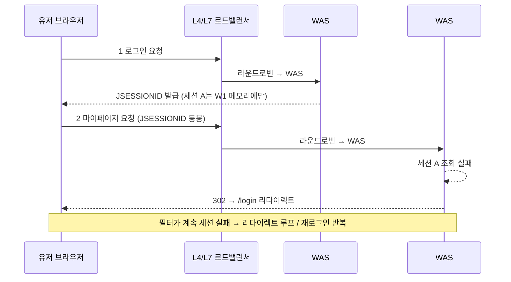

## 목차

- [1. 개요 및 배경 (Background &amp; Problem)](#1-개요-및-배경-background-problem)
  - [1.1 문제 정의: WAS 이중화와 세션 불일치 (Session Inconsistency)](#11-문제-정의-was-이중화와-세션-불일치-session-inconsistency)
  - [1.2 세 가지 수준의 해결 축](#12-세-가지-수준의-해결-축)
- [2. 인프라 레벨: 스티키 세션 (Sticky Session)](#2-인프라-레벨-스티키-세션-sticky-session)
  - [2.1 Apache + Tomcat (mod_jk)](#21-apache-tomcat-modjk)
  - [2.2 Nginx](#22-nginx)
  - [2.3 장단점](#23-장단점)
- [3. WAS 레벨: 톰캣 세션 클러스터링 (Tomcat Membership)](#3-was-레벨-톰캣-세션-클러스터링-tomcat-membership)
  - [3.1 장단점](#31-장단점)
- [4. 애플리케이션 레벨 (Java / Spring Boot)](#4-애플리케이션-레벨-java-spring-boot)
  - [4.1 방법 A: 공유 세션 저장소 (Spring Session + Redis / RDBMS)](#41-방법-a-공유-세션-저장소-spring-session-redis-rdbms)
  - [4.2 방법 B: JWT 도입을 통한 무상태(Stateless) 인증](#42-방법-b-jwt-도입을-통한-무상태stateless-인증)
- [5. 해결 방법별 비교](#5-해결-방법별-비교)
- [6. 결론 및 인사이트 (비용 · 기회비용 판단)](#6-결론-및-인사이트-비용-기회비용-판단)

<a id="1-개요-및-배경-background-problem"></a>

## 1. 개요 및 배경 (Background & Problem)

서비스의 가용성과 트래픽 분산을 위해 WAS(Tomcat 기반)를 <strong>이중화 또는 다중화</strong>하여 구성하는 경우가 많습니다.

이때 L4/L7 로드밸런서의 분산 규칙에 따라 유저의 요청이 서로 다른 WAS 프로세스로 번갈아 유입될 수 있으며, <strong>WAS 간에 인증/인가 세션 데이터가 공유되지 않으면</strong> 크리티컬한 장애로 이어집니다.

<a id="11-문제-정의-was-이중화와-세션-불일치-session-inconsistency"></a>

### 1.1 문제 정의: WAS 이중화와 세션 불일치 (Session Inconsistency)

단일 서버 환경과 달리, 이중화된 WAS 간에 세션 데이터가 공유되지 않으면 다음이 발생합니다.

- <strong>중복 로그인 및 재인증 요구</strong>: 유저가 페이지를 이동하거나 API를 호출할 때마다 로그인을 다시 요구받는 최악의 UX.
- <strong>인증 로직 무한 루프</strong>: 보안 필터·인터셉터에서 세션 확인 실패 → 로그인 페이지 리다이렉트가 반복되며 비즈니스 로직이 무한 루프에 빠져 서버 자원(스레드·커넥션)을 고갈시킬 수 있음.



<a id="12-세-가지-수준의-해결-축"></a>

### 1.2 세 가지 수준의 해결 축


<NotionTable>
  <tbody>
    <tr><td>레벨</td><td>접근</td><td>대표 수단</td></tr>
    <tr><td><strong>인프라</strong></td><td>같은 유저를 같은 WAS로 고정</td><td>스티키 세션 (`mod_jk` sticky, Nginx `ip_hash`/`sticky cookie`)</td></tr>
    <tr><td><strong>WAS</strong></td><td>서버 간 세션을 실시간 복제</td><td>Tomcat `<Cluster>` + `DeltaManager`/`BackupManager`</td></tr>
    <tr><td><strong>애플리케이션</strong></td><td>세션을 외부로 빼거나 아예 없앰</td><td>Spring Session + Redis/RDBMS, JWT(Stateless)</td></tr>
  </tbody>
</NotionTable>


<NotionDivider />

<a id="2-인프라-레벨-스티키-세션-sticky-session"></a>

## 2. 인프라 레벨: 스티키 세션 (Sticky Session)

로드밸런서(L4/L7) 설정으로 <strong>최초 접속한 유저의 요청이 항상 동일한 WAS로만 전달</strong>되도록 고정합니다.

> ⚠️ <strong>핵심 인식</strong>: 스티키 세션은 <em>세션을 공유하는 것이 아니라, 동일한 연결(WAS)을 유지해 주는 역할</em>입니다. 해당 WAS가 죽으면 그 서버에 묶여 있던 유저의 세션은 그대로 유실됩니다.

<a id="21-apache-tomcat-modjk"></a>

### 2.1 Apache + Tomcat (`mod_jk`)

Tomcat의 `jvmRoute` 값과 Apache `workers.properties`의 워커 이름을 일치시키는 것이 핵심입니다. Apache가 `JSESSIONID` 뒤에 붙은 서버 ID(`.node1`)를 확인해 해당 서버로 요청을 고정합니다.


```xml
<!-- Tomcat server.xml : 인스턴스마다 고유 jvmRoute -->
<Engine name="Catalina" defaultHost="localhost" jvmRoute="node1">
<!-- 다른 인스턴스 -->
<Engine name="Catalina" defaultHost="localhost" jvmRoute="node2">
```


```text
# Apache workers.properties
worker.list=balancer,jkstatus

worker.node1.port=8009
worker.node1.host=192.168.0.10
worker.node1.type=ajp13
worker.node1.lbfactor=1

worker.node2.port=8009
worker.node2.host=192.168.0.11
worker.node2.type=ajp13
worker.node2.lbfactor=1

worker.balancer.type=lb
worker.balancer.balance_workers=node1,node2
worker.balancer.sticky_session=1
# 세션 쿠키 없는 첫 요청 실패 시 다른 서버로 넘길지 여부
worker.balancer.sticky_session_force=0
```

<a id="22-nginx"></a>

### 2.2 Nginx

<strong>방법 A: `ip_hash` (오픈소스 기본 제공)</strong> — 클라이언트 IP를 해싱하여 특정 WAS로 매핑. 모듈 설치 불필요.


```text
http {
    upstream backend_servers {
        ip_hash;
        server 192.168.0.10:8080 max_fails=3 fail_timeout=10s;
        server 192.168.0.11:8080 max_fails=3 fail_timeout=10s;
    }
    server {
        listen 80;
        server_name example.com;
        location / {
            proxy_pass http://backend_servers;
            proxy_set_header Host $host;
            proxy_set_header X-Real-IP $remote_addr;
            proxy_set_header X-Forwarded-For $proxy_add_x_forwarded_for;
        }
    }
}
```

> 주의: 동일 사설 IP·프록시(NAT) 뒤의 대규모 사내 유저는 `ip_hash` 적용 시 특정 WAS 한 곳으로 쏠려 병목이 생길 수 있습니다.

<strong>방법 B: `sticky cookie` (Nginx Plus 또는 서드파티 모듈)</strong> — Nginx가 쿠키를 생성·주입하고 추적. `mod_jk`와 유사하며 분산이 가장 정교합니다.


```text
http {
    upstream backend_servers {
        sticky cookie route_cookie expires=1h domain=.example.com path=/;
        server 192.168.0.10:8080;
        server 192.168.0.11:8080;
    }
    server {
        listen 80;
        server_name example.com;
        location / { proxy_pass http://backend_servers; }
    }
}
```

<a id="23-장단점"></a>

### 2.3 장단점


<NotionTable>
  <tbody>
    <tr><td>구분</td><td>내용</td></tr>
    <tr><td><strong>장점</strong></td><td>백엔드 코드·WAS 설정을 건드리지 않아 소규모 서비스에서 효율적. 빠른 안정화.</td></tr>
    <tr><td><strong>단점</strong></td><td>특정 WAS 장애 시 그 서버에 묶인 유저는 세션이 유실되어 인증을 처음부터 다시 태워야 함. 부하 분산 균형이 깨질 수 있음. <strong>세션 공유가 아님.</strong></td></tr>
  </tbody>
</NotionTable>


<NotionDivider />

<a id="3-was-레벨-톰캣-세션-클러스터링-tomcat-membership"></a>

## 3. WAS 레벨: 톰캣 세션 클러스터링 (Tomcat Membership)

WAS 자체 기능으로 서버 간 세션을 실시간 복제·동기화합니다. `<Cluster>` + `DeltaManager`(전체 델타 복제) 또는 `BackupManager`(1:1 백업)를 사용하고, <strong>멀티캐스트</strong> 또는 <strong>정적 멤버십</strong>으로 멤버를 구성합니다.


```xml
<!-- server.xml -->
<Cluster className="org.apache.catalina.ha.tcp.SimpleTcpCluster">
    <Manager className="org.apache.catalina.ha.session.DeltaManager"
             expireSessionsOnShutdown="false"
             notifyListenersOnReplication="true"/>
    <Channel className="org.apache.catalina.tribes.group.GroupChannel">
        <Membership className="org.apache.catalina.tribes.membership.McastService"
                    address="228.0.0.4" port="45564" frequency="500" dropTime="3000"/>
        <Receiver className="org.apache.catalina.tribes.transport.nio.NioReceiver"
                  address="auto" port="4000" autoBind="100" selectorTimeout="5000" maxThreads="6"/>
        <Sender className="org.apache.catalina.tribes.transport.ReplicationTransmitter">
            <Transport className="org.apache.catalina.tribes.transport.nio.PooledParallelSender"/>
        </Sender>
    </Channel>
    <Valve className="org.apache.catalina.ha.tcp.ReplicationValve" filter=""/>
    <Valve className="org.apache.catalina.ha.session.JvmRouteBinderValve"/>
    <ClusterListener className="org.apache.catalina.ha.session.ClusterSessionListener"/>
</Cluster>
```

세션에 저장되는 <strong>모든 VO/DTO는 `Serializable` 구현 + `serialVersionUID` 명시 고정</strong>이 필수입니다. (클래스 변경 시 역직렬화 실패 방지)


```java
public class UserSessionInfo implements Serializable {
    private static final long serialVersionUID = 1L;
    private String userId;
    private String role;
}
```

<a id="31-장단점"></a>

### 3.1 장단점


<NotionTable>
  <tbody>
    <tr><td>구분</td><td>내용</td></tr>
    <tr><td><strong>장점</strong></td><td>인프라·애플리케이션을 크게 손대지 않고 WAS 설정만으로 세션 영속성 확보. 한 서버가 다운돼도 복제본이 있어 유저 단절 없음.</td></tr>
    <tr><td><strong>단점</strong></td><td>서버 대수가 늘수록 복제 트래픽(`DeltaManager`는 사실상 All-to-All)과 메모리 오버헤드가 급증. 멀티캐스트 불가 망(클라우드·보안망)에서는 정적 멤버십을 일일이 관리해야 함. 대규모 트래픽에서 성능 저하 원인.</td></tr>
  </tbody>
</NotionTable>

> <strong>실무 판단</strong>: "톰캣 클러스터링이면 간단히 된다"고 보기 쉽지만, 멀티캐스트 허용·노드 간 4000번대 포트 개방·정적 멤버십 유지·직렬화 호환 관리가 모두 필요합니다. 클라우드/보안망에서는 오히려 손이 더 갑니다.


<NotionDivider />

<a id="4-애플리케이션-레벨-java-spring-boot"></a>

## 4. 애플리케이션 레벨 (Java / Spring Boot)

WAS 메모리에 세션을 두지 않고, <strong>외부 저장소로 분리</strong>하거나 <strong>상태를 아예 유지하지 않는(Stateless)</strong> 구조로 근본 해결합니다. 최근 엔터프라이즈에서 가장 선호되는 방향입니다.

<a id="41-방법-a-공유-세션-저장소-spring-session-redis-rdbms"></a>

### 4.1 방법 A: 공유 세션 저장소 (Spring Session + Redis / RDBMS)

WAS 메모리에 있던 세션을 별도 저장소로 이관합니다. Spring Boot에서는 `Spring Session`으로 코드 변경을 최소화하며 적용됩니다.

<strong>구현 프로세스</strong>

1. 세션 테이블 생성(RDBMS) 또는 인메모리 스토어 세팅(Redis)
1. `Spring Session` 의존성 추가 후 세션 스토어 지정
1. 공통 인증/인가(Filter/Interceptor)에서 세션 Key/Value를 조회해 유효성 검증

```xml
<dependency>
    <groupId>org.springframework.session</groupId>
    <artifactId>spring-session-data-redis</artifactId>
</dependency>
<dependency>
    <groupId>org.springframework.boot</groupId>
    <artifactId>spring-boot-starter-data-redis</artifactId>
</dependency>
```


```yaml
# application.yml
spring:
  session:
    store-type: redis
    timeout: 30m
  data:
    redis:
      host: redis-host
      port: 6379
```


```java
@EnableRedisHttpSession
@Configuration
public class SessionConfig { }   // 직렬화/역직렬화는 Spring Session이 처리
```

메모리 기반 Redis는 고성능 Key-Value 조회가 가능해, 디스크 I/O 부담 없이 대용량 세션을 안정적으로 처리합니다. 다만 <strong>Redis 자체가 SPOF가 되지 않도록 Sentinel/Cluster 이중화</strong>가 함께 필요합니다.

<a id="42-방법-b-jwt-도입을-통한-무상태stateless-인증"></a>

### 4.2 방법 B: JWT 도입을 통한 무상태(Stateless) 인증

서버에 세션을 저장하지 않고, 인증 정보를 서명된 토큰으로 <strong>클라이언트가 직접 보유</strong>합니다.

- <strong>선택 이유</strong>: 만료 시간(Expiration)·시간 기반 키를 엄격히 세팅할 수 있고, 서버 저장소에 의존하지 않으므로 WAS를 몇 대로 늘려도 인증 상태 유지에 제약이 없습니다.
- <strong>보안 보완 – 토큰 이원화</strong>: 탈취 위험을 줄이기 위해 생명주기를 나눕니다.

<NotionTable>
  <tbody>
    <tr><td>토큰</td><td>유효시간</td><td>역할</td></tr>
    <tr><td><strong>Access Token</strong></td><td>짧음 (예: 30분)</td><td>실제 API 인가에 사용</td></tr>
    <tr><td><strong>Refresh Token</strong></td><td>김 (예: 2주)</td><td>Access 만료 시 재발급용, <strong>Redis 등 서버 저장소에 보관</strong></td></tr>
  </tbody>
</NotionTable>


```java
@Component
public class JwtAuthenticationFilter extends OncePerRequestFilter {
    @Override
    protected void doFilterInternal(HttpServletRequest request, HttpServletResponse response,
                                    FilterChain filterChain) throws ServletException, IOException {
        String token = resolveToken(request);
        if (token != null && jwtTokenProvider.validateToken(token)) {
            Authentication auth = jwtTokenProvider.getAuthentication(token);
            SecurityContextHolder.getContext().setAuthentication(auth);
        }
        filterChain.doFilter(request, response);
    }
    private String resolveToken(HttpServletRequest request) {
        String bearer = request.getHeader("Authorization");
        if (StringUtils.hasText(bearer) && bearer.startsWith("Bearer ")) return bearer.substring(7);
        return null;
    }
}
```

> ⚠️ JWT도 "무비용"이 아닙니다. <strong>로그아웃·강제 만료(블랙리스트), Refresh Token 회전·저장</strong>을 위해 결국 <strong>서버 측 메모리/저장소(Redis 등)가 필요</strong>합니다. 상태를 클라이언트로 옮겼을 뿐, 완전히 없앤 것은 아닙니다.


<NotionDivider />

<a id="5-해결-방법별-비교"></a>

## 5. 해결 방법별 비교


<NotionTable>
  <tbody>
    <tr><td>해결 방법</td><td>레벨</td><td>확장성</td><td>구현 난이도</td><td>장애 내성</td><td>세션 실제 공유</td></tr>
    <tr><td>스티키 세션</td><td>인프라</td><td>낮음</td><td>쉬움</td><td>낮음 (서버 다운 시 세션 유실)</td><td>❌ (연결 고정일 뿐)</td></tr>
    <tr><td>Tomcat 클러스터링</td><td>WAS</td><td>중간</td><td>중간</td><td>중간 (복제 오버헤드)</td><td>⭕ (복제)</td></tr>
    <tr><td>Spring Session + Redis</td><td>애플리케이션</td><td>높음</td><td>중간</td><td>높음 (Redis 이중화 전제)</td><td>⭕ (외부 저장)</td></tr>
    <tr><td>JWT (Stateless)</td><td>애플리케이션</td><td>매우 높음</td><td>높음</td><td>매우 높음 (Refresh 저장소 전제)</td><td>— (상태를 클라이언트로 이전)</td></tr>
  </tbody>
</NotionTable>


<NotionDivider />

<a id="6-결론-및-인사이트-비용-기회비용-판단"></a>

## 6. 결론 및 인사이트 (비용 · 기회비용 판단)

- 이상적 방향은 <strong>애플리케이션 단에서 제어 가능하고 확장성이 좋은 JWT 또는 외부 세션 스토어(Redis)</strong> 도입입니다. 인프라와 애플리케이션이 분리되어 향후 아키텍처 변경에 유연합니다.
- 그러나 <strong>Tomcat 클러스터링을 위한 멀티캐스트/포트 개방/정적 멤버십</strong>, <strong>Redis를 위한 공유 네트워크·이중화 구성</strong>이 어려운 환경도 많습니다. 이때는 <strong>프록시 + 내부 토큰</strong>이나 <strong>스티키 세션</strong>으로 이중화 경험을 유사하게라도 확보할 수 있습니다.
- 단, <strong>스티키 세션은 실제 세션 공유가 아니라 "동일 연결 유지" 수준</strong>임을 항상 전제해야 합니다. 서버 장애 = 세션 유실입니다.

- <strong>JWT는 클라이언트에게 책임을 전가</strong>하는 방식이지만, 이를 공유·무효화하기 위한 <strong>메모리(저장 공간)가 여전히 필요</strong>합니다.
- <strong>어느 하나도 간단하지 않습니다.</strong> 시스템 규모·동시 접속자 수·개발 공수·유지보수 비용, 즉 <strong>소모 비용과 기회비용</strong>을 함께 따져 선택하는 것이 핵심입니다. 엔드유저 규모가 작고 빠른 안정화가 필요하면 스티키 세션도 충분히 좋은 선택지입니다.

