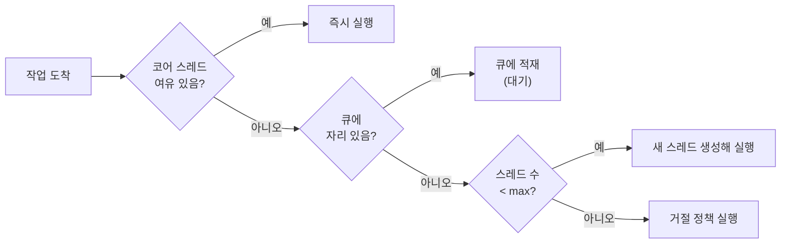

## 목차

- [0. 스코핑 경계 (Scoping Boundary)](#0-스코핑-경계-scoping-boundary)
- [1. "풀(Pool)"이란 무엇인가 — 단어부터 정의](#1-풀pool이란-무엇인가-단어부터-정의)
- [2. 수동 관리의 한계 — 왜 매번 손대면 안 되는가](#2-수동-관리의-한계-왜-매번-손대면-안-되는가)
  - [2.1 new Thread() 반복의 비용](#21-new-thread-반복의-비용)
  - [2.2 사람이 개수를 계속 조정할 수 없다](#22-사람이-개수를-계속-조정할-수-없다)
- [3. 풀에서 미리 "정해야 하는 값" (정책 = 계약)](#3-풀에서-미리-정해야-하는-값-정책-계약)
- [4. 자동 스케일링 메커니즘 (이 노트의 핵심)](#4-자동-스케일링-메커니즘-이-노트의-핵심)
  - [4.1 확장 순서 — core → queue → max](#41-확장-순서-core-queue-max)
  - [4.2 축소 — keepAlive](#42-축소-keepalive)
  - [4.3 큐 선택이 스케일링 "성격"을 결정한다 ⚠](#43-큐-선택이-스케일링-성격을-결정한다)
  - [4.4 거절 정책과 백프레셔](#44-거절-정책과-백프레셔)
- [5. "직접 만들지 말라" — 안전한 생성 경로](#5-직접-만들지-말라-안전한-생성-경로)
- [6. 풀 크기의 출발점 (정답이 아니라 시작점)](#6-풀-크기의-출발점-정답이-아니라-시작점)
- [7. 풀을 "덜 신경 써도 되는" 방향](#7-풀을-덜-신경-써도-되는-방향)
- [8. 안티패턴 체크리스트](#8-안티패턴-체크리스트)

스레드 풀을 쓰는 이유를 한 문장으로: <strong>스레드를 매번 만들고 없애며 개수를 사람이 조정하는 대신, `core / max / queue / keepAlive / 거절 정책`을 한 번 계약으로 정해 두면 풀이 부하에 따라 스레드를 자동으로 늘리고 줄이기 때문.</strong>


<NotionDivider />

<a id="0-스코핑-경계-scoping-boundary"></a>

## 0. 스코핑 경계 (Scoping Boundary)


<NotionTable>
  <tbody>
    <tr><td>계층</td><td>무엇</td><td>이 노트의 관심</td></tr>
    <tr><td><strong>OS 스레드</strong></td><td>커널이 스케줄링하는 실행 단위, 생성 시 시스템 콜</td><td>비용의 근원(배경)</td></tr>
    <tr><td><strong>JVM 플랫폼 스레드</strong></td><td>`java.lang.Thread` 1개 ↔ OS 스레드 1개 매핑(HotSpot)</td><td>풀이 재사용하는 대상</td></tr>
    <tr><td><strong>스레드 풀(관리 추상화)</strong></td><td>재사용 스레드 + 작업 큐 + 스케일링/거절 정책</td><td><strong>← 이 노트</strong></td></tr>
    <tr><td><strong>가상 스레드(Java 21)</strong></td><td>다수의 가상 스레드가 소수 캐리어 위에서 실행</td><td>7장에서 경계만 언급</td></tr>
  </tbody>
</NotionTable>

이 노트는 <strong>플랫폼 스레드를 관리하는 풀(`ThreadPoolExecutor`)</strong> 을 다룹니다.


<NotionDivider />

<a id="1-풀pool이란-무엇인가-단어부터-정의"></a>

## 1. "풀(Pool)"이란 무엇인가 — 단어부터 정의

- <strong>사전적 의미</strong>: 재사용 가능한 자원을 미리 확보해 둔 저수지(reservoir).
- <strong>스레드 풀의 구성 = 세 부분</strong>:

```text
스레드 풀 = [재사용 스레드 집합]  +  [대기 작업 큐]  +  [스케일링·거절 정책]
             └ 빌려 쓰고 반납        └ 처리 못한 작업     └ 언제 늘리고 줄이고 거절할지
```

- 커넥션 풀(HikariCP), 객체 풀과 같은 계열입니다: <strong>비싼 자원을 "생성/소멸의 대상"이 아니라 "빌리고 돌려주는 대상"으로 취급</strong>.
- 따라서 스레드 풀을 이해한다는 것은 곧 <strong>위 세 부분의 파라미터를 이해하는 것</strong>입니다(3장).

<NotionDivider />

<a id="2-수동-관리의-한계-왜-매번-손대면-안-되는가"></a>

## 2. 수동 관리의 한계 — 왜 매번 손대면 안 되는가

<a id="21-new-thread-반복의-비용"></a>

### 2.1 `new Thread()` 반복의 비용

- <strong>생성·소멸</strong>: OS 시스템 콜, 스레드 스택 메모리 할당(`Xss` 기본 512KB~1MB).
- <strong>컨텍스트 스위칭</strong>: 스레드가 많아질수록 스케줄러 오버헤드가 처리량을 잠식.
- <strong>무제한 생성</strong>: `OutOfMemoryError: unable to create new native thread` 또는 시스템 전체 불안정.
<a id="22-사람이-개수를-계속-조정할-수-없다"></a>

### 2.2 사람이 개수를 계속 조정할 수 없다

- 트래픽은 초 단위로 변합니다. "지금 몇 개가 적정인가"를 매번 판단·반영하는 것은 불가능.
- <strong>해결의 방향</strong>: 개수를 직접 정하지 않고 <strong>규칙(정책)을 위임</strong>한다 → 풀.




<NotionDivider />

<a id="3-풀에서-미리-정해야-하는-값-정책-계약"></a>

## 3. 풀에서 미리 "정해야 하는 값" (정책 = 계약)

`ThreadPoolExecutor`의 생성자 파라미터가 곧 계약서입니다.


<NotionTable>
  <tbody>
    <tr><td>파라미터</td><td>의미</td><td>정하는 관점</td></tr>
    <tr><td>`corePoolSize`</td><td>평상시 상주 스레드(하한)</td><td>상시 부하를 감당할 최소치</td></tr>
    <tr><td>`maximumPoolSize`</td><td>폭주 시 허용 상한</td><td>자원 보호선(넘으면 거절)</td></tr>
    <tr><td>`workQueue` + 용량</td><td>코어가 찼을 때 쌓이는 곳</td><td><strong>무제한 금지</strong>(4장)</td></tr>
    <tr><td>`keepAliveTime`</td><td>한가할 때 초과 스레드를 언제 반납할지</td><td>축소 속도</td></tr>
    <tr><td>`RejectedExecutionHandler`</td><td>큐·풀 모두 포화 시 동작</td><td>실패를 어떻게 표현할지</td></tr>
    <tr><td>`ThreadFactory`</td><td>이름·데몬 여부·우선순위</td><td>관측·디버깅 편의</td></tr>
  </tbody>
</NotionTable>

> 이 값들을 <strong>한 번</strong> 정하면, 이후 스레드 증감은 풀이 알아서 합니다.


```java
ThreadPoolExecutor pool = new ThreadPoolExecutor(
    10,                       // corePoolSize
    50,                       // maximumPoolSize
    60L, TimeUnit.SECONDS,    // keepAliveTime: 유휴 60초 후 초과분 반납
    new ArrayBlockingQueue<>(1_000),   // 유한 큐
    namedFactory("worker-"),
    new ThreadPoolExecutor.CallerRunsPolicy()  // 포화 시 제출 스레드가 직접 실행
);
```


<NotionDivider />

<a id="4-자동-스케일링-메커니즘-이-노트의-핵심"></a>

## 4. 자동 스케일링 메커니즘 (이 노트의 핵심)

<a id="41-확장-순서-core-queue-max"></a>

### 4.1 확장 순서 — core → queue → max

1. 스레드 수 &lt; `corePoolSize` → <strong>새 코어 스레드 생성</strong>해 즉시 실행.
1. 코어가 다 참 → <strong>큐에 적재</strong>(대기).
1. 큐도 다 참 & 스레드 수 &lt; `maximumPoolSize` → <strong>임시 스레드 생성</strong>해 실행.
1. 큐도 차고 스레드도 max → <strong>거절 정책</strong> 실행.
<a id="42-축소-keepalive"></a>

### 4.2 축소 — keepAlive

- 부하가 줄면, `maximumPoolSize`까지 늘었던 <strong>초과 스레드가 `keepAliveTime` 동안 놀면 회수</strong>됩니다(코어까지 축소).
- `allowCoreThreadTimeOut(true)` 를 켜면 코어 스레드도 유휴 시 반납되어 0까지 축소 가능.
<a id="43-큐-선택이-스케일링-성격을-결정한다"></a>

### 4.3 큐 선택이 스케일링 "성격"을 결정한다 ⚠


<NotionTable>
  <tbody>
    <tr><td>큐 종류</td><td>동작</td><td>스케일링 결과</td></tr>
    <tr><td>`LinkedBlockingQueue`(용량 미지정)</td><td>사실상 무한 적재</td><td>3번 단계에 도달하지 않음 → <strong>`maximumPoolSize`가 무의미, 사실상 고정 크기 풀</strong></td></tr>
    <tr><td>`SynchronousQueue`</td><td>적재 안 함(핸드오프만)</td><td>즉시 3번으로 → 스레드가 빠르게 max까지 확장(캐시형)</td></tr>
    <tr><td>`ArrayBlockingQueue`(유한)</td><td>정해진 용량까지 적재</td><td><strong>큐 → 확장 → 거절의 3단계가 의도대로 동작</strong></td></tr>
  </tbody>
</NotionTable>

- `Executors.newFixedThreadPool()` = 무제한 `LinkedBlockingQueue` → 큐가 힙을 잠식하다 지연된 OOM.
- `Executors.newCachedThreadPool()` = `SynchronousQueue` + `Integer.MAX_VALUE` max → 스레드 폭증 위험.
<a id="44-거절-정책과-백프레셔"></a>

### 4.4 거절 정책과 백프레셔


<NotionTable>
  <tbody>
    <tr><td>정책</td><td>동작</td></tr>
    <tr><td>`AbortPolicy`(기본)</td><td>`RejectedExecutionException` 발생</td></tr>
    <tr><td>`CallerRunsPolicy`</td><td><strong>제출한 스레드가 직접 실행</strong> → 제출 속도가 자연히 느려짐(자연 백프레셔)</td></tr>
    <tr><td>`DiscardPolicy` / `DiscardOldestPolicy`</td><td>조용히 버림(유실 허용 시)</td></tr>
  </tbody>
</NotionTable>


<NotionDivider />

<a id="5-직접-만들지-말라-안전한-생성-경로"></a>

## 5. "직접 만들지 말라" — 안전한 생성 경로

- `Executors.*` 팩토리 메서드는 <strong>숨은 무제한</strong>(큐 또는 스레드)이 있으므로 운영 코드에서 지양.
- `ThreadPoolExecutor`를 직접 구성하거나, Spring의 `ThreadPoolTaskExecutor`에 값을 명시.
- <strong>관측 지표</strong>: `getActiveCount()`, `getQueue().size()`, `getCompletedTaskCount()`, 거절 카운트 → 대시보드/알람 연결.

<NotionDivider />

<a id="6-풀-크기의-출발점-정답이-아니라-시작점"></a>

## 6. 풀 크기의 출발점 (정답이 아니라 시작점)

- <strong>CPU 바운드</strong>: 대략 코어 수(또는 코어 수 + 1).
- <strong>I/O 바운드</strong>: 대략 `코어 수 × (1 + 대기시간/서비스시간)`.
- 리틀의 법칙 관점에서 추정하되, <strong>부하 테스트로 붕괴 지점을 찾아 그보다 낮게</strong> 설정합니다. 고정 수치는 권고하지 않습니다.
- <strong>다운스트림 정합</strong>: 워커 풀 크기가 DB 커넥션 풀(`maximumPoolSize`)보다 크면, 초과 워커는 커넥션 대기로 묶입니다. 두 상한을 함께 봅니다. → [Java - 대용량 트래픽·비동기 병렬 환경의 메모리·리소스 한계 관리](https://app.notion.com/p/Java%20-%20%EB%8C%80%EC%9A%A9%EB%9F%89%20%ED%8A%B8%EB%9E%98%ED%94%BD%C2%B7%EB%B9%84%EB%8F%99%EA%B8%B0%20%EB%B3%91%EB%A0%AC%20%ED%99%98%EA%B2%BD%EC%9D%98%20%EB%A9%94%EB%AA%A8%EB%A6%AC%C2%B7%EB%A6%AC%EC%86%8C%EC%8A%A4%20%ED%95%9C%EA%B3%84%20%EA%B4%80%EB%A6%AC)

<NotionDivider />

<a id="7-풀을-덜-신경-써도-되는-방향"></a>

## 7. 풀을 "덜 신경 써도 되는" 방향

- <strong>가상 스레드(Java 21, `newVirtualThreadPerTaskExecutor()`)</strong>: 스레드가 매우 가벼워 "스레드 수 상한"이라는 관리 항목 자체가 사라집니다.
- 그러나 <strong>다운스트림 동시성 제한(`Semaphore` 등)은 여전히 필요</strong> — 백만 개의 가상 스레드가 커넥션 풀에 몰리면 그대로 병목입니다. → [Java Virtual Threads - Pinning 현상과 해결 방안](https://app.notion.com/p/Java%20Virtual%20Threads%20-%20Pinning%20%ED%98%84%EC%83%81%EA%B3%BC%20%ED%95%B4%EA%B2%B0%20%EB%B0%A9%EC%95%88)

- <strong>`ForkJoinPool.commonPool()`</strong>: `parallelStream`이 공유하므로, 여기서 블로킹 작업을 하면 전역 영향. CPU 바운드 계산에 한정.
- <strong>Bulkhead</strong>: 기능별로 풀을 분리해, 한 기능의 폭주가 전체를 죽이지 않도록 격벽.

<NotionDivider />

<a id="8-안티패턴-체크리스트"></a>

## 8. 안티패턴 체크리스트

- 무제한 큐(`new LinkedBlockingQueue<>()`), `newFixedThreadPool`/`newCachedThreadPool` 무비판 사용
- `maximumPoolSize`만 키우고 큐는 무제한 → max가 동작하지 않음
- 요청마다 새 `Executor` 생성(풀의 의미 상실) 후 `shutdown()` 누락
- 풀 안의 작업이 <strong>같은 풀의 다른 작업 결과를 대기</strong>(스레드 고갈 데드락)
- 풀링된 스레드에서 `ThreadLocal` 사용 후 `remove()` 누락 → 누수
- CPU 코어 수와 무관하게 관행적 수치(200 등) 복붙

