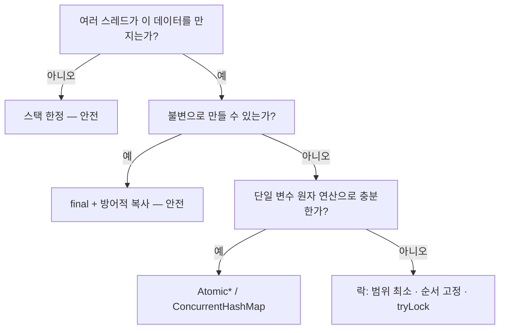

## 목차

- [0. 스코핑 경계 (Scoping Boundary)](#0-스코핑-경계-scoping-boundary)
- [1. 데이터가 더럽혀진다 (Corruption) — 가장 눈에 띄는 증상](#1-데이터가-더럽혀진다-corruption-가장-눈에-띄는-증상)
  - [1.1 갱신 유실 (Lost Update)](#11-갱신-유실-lost-update)
  - [1.2 찢어진 상태 (Torn Read) / 불변식 붕괴](#12-찢어진-상태-torn-read-불변식-붕괴)
  - [1.3 자료구조 자체 파손](#13-자료구조-자체-파손)
  - [1.4 더티 리드 (Dirty Read)](#14-더티-리드-dirty-read)
- [2. 변경이 보이지 않는다 (Visibility) — 재현 안 되는 버그의 정체](#2-변경이-보이지-않는다-visibility-재현-안-되는-버그의-정체)
- [3. 순서가 뒤바뀐다 (Reordering)](#3-순서가-뒤바뀐다-reordering)
- [4. Lock으로 막을 때 생기는 새로운 문제들](#4-lock으로-막을-때-생기는-새로운-문제들)
  - [4.1 경합(Contention) — 병렬성이 사라진다](#41-경합contention-병렬성이-사라진다)
  - [4.2 데드락(Deadlock)](#42-데드락deadlock)
  - [4.3 라이브락 / 기아(Starvation)](#43-라이브락-기아starvation)
  - [4.4 락 범위 오류](#44-락-범위-오류)
  - [4.5 잘못된 락 객체](#45-잘못된-락-객체)
  - [4.6 임계 구역 안에서 외부(alien) 메서드 호출](#46-임계-구역-안에서-외부alien-메서드-호출)
- [5. Java 메모리 모델(JMM)이 보장하는 것 / 안 하는 것](#5-java-메모리-모델jmm이-보장하는-것-안-하는-것)
- [6. 증상 → 원인 매핑표 (진단용)](#6-증상-원인-매핑표-진단용)
- [7. 해결의 우선순위](#7-해결의-우선순위)

한 문장 요약: <strong>"공유 + 가변 + 최소 1개의 쓰기"가 겹치면 데이터가 더럽혀지고(원자성), 변경이 안 보이며(가시성), 순서가 뒤바뀐다(재정렬). 이를 Lock으로 막으면 이번엔 경합·데드락·기아라는 새 문제가 생긴다.</strong>


<NotionDivider />

<a id="0-스코핑-경계-scoping-boundary"></a>

## 0. 스코핑 경계 (Scoping Boundary)

문제가 성립하는 <strong>조건 세 가지가 동시에</strong> 만족될 때만 스레드 안전 문제가 발생합니다.


<NotionTable>
  <tbody>
    <tr><td>조건</td><td>없으면</td></tr>
    <tr><td><strong>공유(Shared)</strong></td><td>스택 한정·`ThreadLocal`이면 각자 별도 복사본 → 문제 없음</td></tr>
    <tr><td><strong>가변(Mutable)</strong></td><td>불변 객체(`final` + 방어적 복사)면 읽기만 가능 → 문제 없음</td></tr>
    <tr><td><strong>쓰기 ≥ 1</strong></td><td>전부 읽기만 하면 경쟁 없음</td></tr>
  </tbody>
</NotionTable>

> 그래서 해결의 1순위는 항상 <strong>"셋 중 하나를 없애기"</strong>(주로 공유를 줄이거나 불변으로 만들기)입니다. Lock은 셋 다 못 없앨 때의 수단입니다(6장).

이 노트는 <strong>JVM 메모리 모델(JMM) 계층</strong>을 다룹니다. DB 트랜잭션 격리 수준의 "dirty read"와 용어가 겹치지만 계층이 다릅니다.


<NotionDivider />

<a id="1-데이터가-더럽혀진다-corruption-가장-눈에-띄는-증상"></a>

## 1. 데이터가 더럽혀진다 (Corruption) — 가장 눈에 띄는 증상

원인은 공통적으로 <strong>"한 번에 끝나야 할 연산이 원자적이지 않다"</strong> 입니다.

<a id="11-갱신-유실-lost-update"></a>

### 1.1 갱신 유실 (Lost Update)


```java
class Counter {
    private int count = 0;
    void increment() { count++; }   // 실제로는 read → +1 → write 3단계
}
```

- 스레드 A와 B가 동시에 `count=10`을 읽고, 각자 11을 써서 <strong>한 번의 증가가 사라짐</strong>.
- 10,000번씩 2스레드 → 기대 20,000이지만 실제로는 그보다 작은 값.
<a id="12-찢어진-상태-torn-read-불변식-붕괴"></a>

### 1.2 찢어진 상태 (Torn Read) / 불변식 붕괴


```java
class Range {
    private int lower, upper;   // 불변식: lower <= upper
    void set(int l, int u) { this.lower = l; this.upper = u; }  // 두 줄 사이가 노출
}
```

- A가 `set(5, 10)` 도중 `lower=5`만 반영된 순간, B가 읽으면 `(5, 이전 upper=3)` → <strong>불변식이 깨진 객체</strong>를 사용.
<a id="13-자료구조-자체-파손"></a>

### 1.3 자료구조 자체 파손

- `HashMap`을 여러 스레드가 동시에 `put` → 리사이즈(rehash) 중 링크가 꼬여 <strong>조회가 무한 루프</strong>(Java 7), `size`가 실제와 불일치, 엔트리 유실.
- `ArrayList` 동시 `add` → `ArrayIndexOutOfBoundsException` 또는 `null` 슬롯.
<a id="14-더티-리드-dirty-read"></a>

### 1.4 더티 리드 (Dirty Read)

- 롤백될 수도 있는 중간 값을 다른 스레드가 읽어 그대로 사용 → 존재한 적 없는 상태를 기반으로 후속 처리.

<NotionDivider />

<a id="2-변경이-보이지-않는다-visibility-재현-안-되는-버그의-정체"></a>

## 2. 변경이 보이지 않는다 (Visibility) — 재현 안 되는 버그의 정체

한 스레드의 쓰기가 다른 스레드에 <strong>영원히 반영되지 않을 수 있습니다.</strong>


```java
class Worker {
    private boolean running = true;      // 일반 필드
    void run()  { while (running) { /* ... */ } }   // 멈추지 않을 수 있음
    void stop() { running = false; }                 // 다른 스레드가 호출
}
```

- 원인: <strong>CPU 캐시 / 레지스터 상주 / 컴파일러 최적화(호이스팅)</strong>. `running`을 매번 메인 메모리에서 읽으리란 보장이 없음.
- `volatile boolean running` → 읽기/쓰기가 메인 메모리를 거치도록 강제(가시성 확보).
- <strong>주의</strong>: `volatile`은 가시성만 준다. `count++` 같은 복합 연산의 <strong>원자성은 여전히 미보장</strong>.

<NotionDivider />

<a id="3-순서가-뒤바뀐다-reordering"></a>

## 3. 순서가 뒤바뀐다 (Reordering)

- 컴파일러·CPU·캐시는 <strong>단일 스레드 결과가 같기만 하면</strong> 명령 순서를 바꿀 수 있습니다.
- 다른 스레드에서 관측하면 <strong>코드에 쓴 순서와 실행 관측 순서가 다릅니다.</strong>
- 고전 사례 — 이중 검사 잠금(Double-Checked Locking):

```java
if (instance == null) {                 // 1차 검사
    synchronized (lock) {
        if (instance == null)
            instance = new Singleton();  // 객체 참조 대입이 생성자 완료보다 먼저 보일 수 있음
    }
}
return instance;   // 다른 스레드가 "생성 덜 된" 인스턴스를 받을 위험
```

- 해결: `instance`를 `volatile`로 선언(재정렬 차단) 또는 정적 홀더 클래스(Initialization-on-demand holder) 사용.

<NotionDivider />

<a id="4-lock으로-막을-때-생기는-새로운-문제들"></a>

## 4. Lock으로 막을 때 생기는 새로운 문제들

동기화는 1~3장을 해결하지만, <strong>"락을 걸어서" 생기는 문제</strong>가 별도로 존재합니다.

<a id="41-경합contention-병렬성이-사라진다"></a>

### 4.1 경합(Contention) — 병렬성이 사라진다

- 임계 구역이 넓으면 스레드들이 락을 기다리며 <strong>사실상 직렬 실행</strong>.
- 스레드를 늘려도 처리량이 오르지 않음(<strong>암달의 법칙</strong>: 직렬 구간이 전체 상한을 지배).
- 스레드 덤프에서 `BLOCKED` 상태 비율로 확인.
<a id="42-데드락deadlock"></a>

### 4.2 데드락(Deadlock)


```java
// 스레드1: transfer(a, b)  →  lock(a) 후 lock(b) 대기
// 스레드2: transfer(b, a)  →  lock(b) 후 lock(a) 대기  → 서로 영구 대기
```

- 원인: <strong>락 획득 순서 불일치</strong>.
- 해결: 모든 코드가 <strong>동일한 순서로 락 획득</strong>(예: 계정 ID 오름차순), `tryLock(timeout)`으로 포기 경로 마련.
- 진단: `jstack` → `Found one Java-level deadlock`.
<a id="43-라이브락-기아starvation"></a>

### 4.3 라이브락 / 기아(Starvation)

- <strong>라이브락</strong>: 충돌을 피하려 서로 계속 양보하다 아무도 진행 못 함.
- <strong>기아</strong>: 우선순위·불공정 락 때문에 특정 스레드가 락을 계속 못 얻음. `ReentrantLock(true)`(공정 모드)로 완화(처리량은 하락).
<a id="44-락-범위-오류"></a>

### 4.4 락 범위 오류


<NotionTable>
  <tbody>
    <tr><td>실수</td><td>결과</td></tr>
    <tr><td>범위가 너무 넓음</td><td>병렬성 상실(4.1)</td></tr>
    <tr><td>범위가 너무 좁음</td><td>복합 연산이 쪼개져 원자성 상실(1장으로 회귀)</td></tr>
    <tr><td>서로 다른 락으로 같은 데이터 보호</td><td>사실상 보호 안 됨</td></tr>
  </tbody>
</NotionTable>

<a id="45-잘못된-락-객체"></a>

### 4.5 잘못된 락 객체

- `synchronized(this)` — 외부에서 이 객체로 락을 걸면 간섭.
- `String` 리터럴·`Integer`(−128~127 캐시)로 락 → 의도치 않게 <strong>다른 코드와 같은 락 객체 공유</strong>.
- 매번 `new Object()` 를 락으로 → <strong>매번 다른 락</strong> → 보호 실패.
- 권장: `private final Object lock = new Object();`
<a id="46-임계-구역-안에서-외부alien-메서드-호출"></a>

### 4.6 임계 구역 안에서 외부(alien) 메서드 호출

- 락을 쥔 채 콜백·오버라이드 가능 메서드·다른 컴포넌트를 호출하면, 그쪽에서 또 락을 잡아 <strong>재진입/데드락</strong>.

<NotionDivider />

<a id="5-java-메모리-모델jmm이-보장하는-것-안-하는-것"></a>

## 5. Java 메모리 모델(JMM)이 보장하는 것 / 안 하는 것

동기화 수단은 <strong>happens-before</strong> 관계를 만들어, "앞의 쓰기가 뒤의 읽기에 보인다"를 보장합니다.


<NotionTable>
  <tbody>
    <tr><td>happens-before를 만드는 것</td><td>의미</td></tr>
    <tr><td>모니터 `unlock` → 이후 같은 모니터 `lock`</td><td>`synchronized` 블록 전후</td></tr>
    <tr><td>`volatile` 쓰기 → 이후 같은 변수 읽기</td><td>가시성 + 재정렬 차단</td></tr>
    <tr><td>`Thread.start()` → 시작된 스레드의 첫 동작</td><td>시작 전 상태가 보임</td></tr>
    <tr><td>스레드의 마지막 동작 → 다른 스레드의 `join()` 반환</td><td>종료 결과가 보임</td></tr>
    <tr><td>`final` 필드: 생성자 완료 → 다른 스레드의 참조</td><td>안전 초기화(참조가 유출되지 않은 경우)</td></tr>
  </tbody>
</NotionTable>

> <strong>핵심</strong>: 동기화(`synchronized` / `volatile` / `java.util.concurrent`)가 <strong>하나도 없으면 아무것도 보장되지 않습니다.</strong> "지금까지 잘 돌았다"는 우연입니다.


<NotionDivider />

<a id="6-증상-원인-매핑표-진단용"></a>

## 6. 증상 → 원인 매핑표 (진단용)


<NotionTable>
  <tbody>
    <tr><td>증상</td><td>1차 의심</td><td>확인법</td></tr>
    <tr><td>값이 간헐적으로 틀리거나 유실됨</td><td>원자성(race)</td><td>단일 스레드로는 재현 안 됨 / `AtomicInteger`로 치환 시 사라짐</td></tr>
    <tr><td>특정 서버·JDK·부하에서만 루프·멈춤</td><td>가시성</td><td>`volatile`/`synchronized` 추가 시 사라지는가</td></tr>
    <tr><td>스레드를 늘려도 처리량이 안 오름</td><td>락 경합</td><td>스레드 덤프의 `BLOCKED` 비율, 임계 구역 범위</td></tr>
    <tr><td>완전히 멈추고 CPU 0%</td><td>데드락</td><td>`jstack`의 deadlock 리포트</td></tr>
    <tr><td>컬렉션이 깨짐(무한 루프·size 이상)</td><td>비동시성 컬렉션 공유</td><td>`ConcurrentHashMap`/`CopyOnWriteArrayList`로 치환</td></tr>
  </tbody>
</NotionTable>


<NotionDivider />

<a id="7-해결의-우선순위"></a>

## 7. 해결의 우선순위

1. <strong>공유를 없앤다</strong> — 불변 객체(`final` + 방어적 복사), `ThreadLocal`, 지역 변수(스택 한정), 스레드 간 전달은 불변 메시지로.
1. <strong>못 없애면 원자 도구</strong> — `AtomicInteger`/`LongAdder`(CAS), `ConcurrentHashMap`, `BlockingQueue`. 락보다 경합에 강함.
1. <strong>그래도 안 되면 락</strong> — 임계 구역 최소화, 락 획득 순서 전역 고정, `tryLock(timeout)`, `ReadWriteLock`(읽기 多), 전용 `private final` 락 객체.



