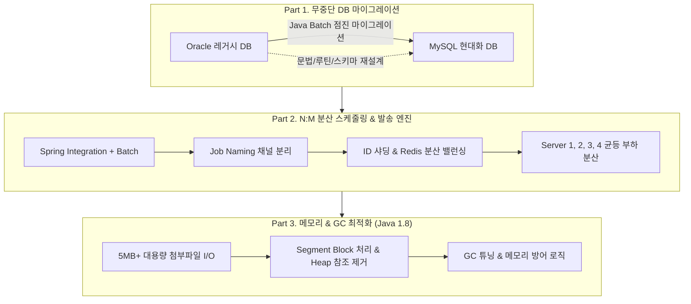
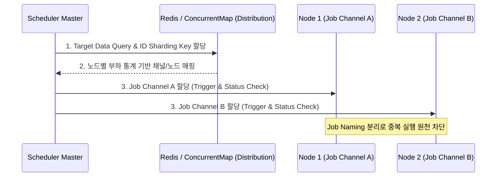

## 목차

- [1. 개요 및 프로젝트 목표 (Overview)](#1-개요-및-프로젝트-목표-overview)
  - [🎯 핵심 해결 과제](#핵심-해결-과제)
- [2. Part 1: Oracle ➔ MySQL 무중단 점진적 데이터 마이그레이션](#2-part-1-oracle-mysql-무중단-점진적-데이터-마이그레이션)
  - [① DDL/스키마 및 DB 루틴 재설계](#1-ddl스키마-및-db-루틴-재설계)
  - [② Java Batch 기반의 점진적(Phased) 무중단 이관](#2-java-batch-기반의-점진적phased-무중단-이관)
- [3. Part 2: N:M 다중화 분산 스케줄링 & 부하 분산 아키텍처](#3-part-2-nm-다중화-분산-스케줄링-부하-분산-아키텍처)
  - [🚨 직면했던 2가지 다중화 병목과 해결책](#직면했던-2가지-다중화-병목과-해결책)
- [4. Part 3: Java 1.8 환경에서의 5MB+ 첨부파일 I/O 및 GC 최적화](#4-part-3-java-18-환경에서의-5mb-첨부파일-io-및-gc-최적화)
  - [① Segment Block 기반 I/O 및 정적 참조 제거](#1-segment-block-기반-io-및-정적-참조-제거)
  - [② Java 1.8 GC 정책 튜닝 & 부하 테스트](#2-java-18-gc-정책-튜닝-부하-테스트)
- [5. 최종 성과 및 비즈니스 가치 (Result & Benefit)](#5-최종-성과-및-비즈니스-가치-result-benefit)

<a id="1-개요-및-프로젝트-목표-overview"></a>

## 1. 개요 및 프로젝트 목표 (Overview)

금융·통신·유통 등 엔터프라이즈 환경에서 **월 수천만 건에 달하는 청구서 및 결재 내역 이메일**을 대량 발송하는 핵심 발송 엔진의 **Major 버전 업그레이드 및 커스텀 고도화 프로젝트**입니다.




<a id="핵심-해결-과제"></a>

### 🎯 핵심 해결 과제

1. **DB 엔진 전면 교체(Oracle ➔ MySQL) 및 무중단 데이터 이관**:
- 문법 및 내장 루틴(Function, Trigger 등) 차이를 해소하고, 서비스 가동 상태에서 무결성을 유지하며 대용량 이력 데이터 이관.

1. **단일 1:1 시스템에서 N:M 분산 다중화 아키텍처로의 전환**:
- Spring Integration + Spring Batch 도입 시 발생하는 **Quartz 중복 트리거(Race Condition)** 및 **특정 노드 쏠림(Hotspotting) 현상** 해결.

1. **Java 1.8 환경에서의 대용량 첨부파일(5MB+) 메모리 폭탄 방어**:
- 최신 ZGC를 사용할 수 없는 Java 8 환경에서 힙 메모리 고갈과 Stop-The-World를 방어하는 세그먼트 블록화 및 GC 튜닝.


<NotionDivider />

<a id="2-part-1-oracle-mysql-무중단-점진적-데이터-마이그레이션"></a>

## 2. Part 1: Oracle ➔ MySQL 무중단 점진적 데이터 마이그레이션

<a id="1-ddl스키마-및-db-루틴-재설계"></a>

### ① DDL/스키마 및 DB 루틴 재설계

- **데이터 타입 및 예약어 맵핑**: Oracle의 `VARCHAR2`, `NUMBER`, `CLOB`, `BLOB`, `DATE` 등을 MySQL의 `VARCHAR`, `BIGINT/DECIMAL`, `TEXT`, `LONGBLOB`, `DATETIME`으로 최적 맵핑.
- **Routines(Function/Trigger/Sequence) 전환**: Oracle의 시퀀스(`Sequence.NEXTVAL`)를 MySQL의 `AUTO_INCREMENT` 또는 분산 ID 생성 전략으로 대체하고, PL/SQL 프로시저와 트리거의 비즈니스 로직을 애플리케이션 계층(Java Service)으로 흡수하여 DB 의존성 분리.

<NotionDivider />

<a id="2-java-batch-기반의-점진적phased-무중단-이관"></a>

### ② Java Batch 기반의 점진적(Phased) 무중단 이관

단순 SQL 덤프 방식은 운영 중인 DB에 과도한 락(Table/Row Lock)과 I/O 부하를 유발하므로, **보안 인가 계정 기반의 커스텀 Java Batch 프로그램**을 구축하여 이관을 수행했습니다.


```text
[데이터 이관 파이프라인 단계]
1단계: 과거 분기/연도별 콜드(Cold) 데이터 사전 이관
2단계: 최근 기간별/월별 웜(Warm) 데이터 점진 동기화
3단계: 일자별/시간별 핫(Hot) 데이터 트래픽 최저점(새벽 시간대) 동기화
4단계: Major 버전 베타 검증 (데이터 정합성 및 누락 검증)
```

- **저트래픽 시간대 쓰로틀링(Throttling)**: 운영 시스템의 실시간 트랜잭션에 영향을 주지 않도록 페이징 단위(`Chunk Size`)와 Sleep 텀을 적용하여 점진적 Fetch 실행.
- **검증 및 롤백 안전망**: 마이그레이션 종료 시점에 Major 버전 엔진을 병행 기동(Beta Test)하여 기존 발송 내역과의 데이터 무결성 및 에러율 교차 검증 완료.

<NotionDivider />

<a id="3-part-2-nm-다중화-분산-스케줄링-부하-분산-아키텍처"></a>

## 3. Part 2: N:M 다중화 분산 스케줄링 & 부하 분산 아키텍처

기존 단일 1:1 메일 발송 구조를 탈피하고, 다중 서버(`Server 1, 2, 3, 4...`)가 협력하여 대량의 청구서를 병렬 처리하도록 **Spring Integration + Spring Batch + Quartz** 기반 분산 환경을 설계했습니다.




<a id="직면했던-2가지-다중화-병목과-해결책"></a>

### 🚨 직면했던 2가지 다중화 병목과 해결책

<a id="문제-1-db-기반-상태-체크의-레이스-컨디션-중복-스케줄링"></a>

#### 문제 1: DB 기반 상태 체크의 레이스 컨디션 (중복 스케줄링)

- **원인**: Quartz 트리거가 DB 기반으로 실행될 때, 앞선 Job이 `START/RUNNING`으로 상태를 업데이트하는 속도보다 다른 노드의 트리거 확인 시점이 빨라 **동일한 메일 발송 건이 중복 스케줄링**되는 이슈 발생.
- **해결책**:
- **Job Naming 채널 분리**: 대상 발송 그룹 및 성격에 따라 Job Name을 유니크하게 분리하여 채널 간 간섭 차단.
- **Trigger & Status Check 이중 안전장치**: 실행 직전 Redis/DB 락과 Status를 수시로 재검증하는 사전 체크 스케줄러를 배치하여 동시성 레이스 컨디션 제거.


```java
// ⭕ 채널 격리 및 실행 직전 Status 이중 검증 로직
@Service
public class DistributedJobDispatcher {
    @Autowired
    private RedisTemplate<String, String> redisTemplate;

    public void dispatchJob(String baseJobName, Long targetBatchId) {
        // 1. Sharding 기반 유니크 Job Naming 생성으로 채널 격리
        String jobChannelKey = String.format("%s_SHARD_%d", baseJobName, targetBatchId % TOTAL_SHARDS);

        // 2. 분산 Lock을 통한 상태 선점 (중복 Trigger 방어)
        Boolean acquired = redisTemplate.opsForValue()
            .setIfAbsent("LOCK:" + jobChannelKey, "RUNNING", Duration.ofMinutes(5));

        if (Boolean.TRUE.equals(acquired)) {
            try {
                // 이중 검증 후 Batch Job 실행
                executeSpringBatchJob(jobChannelKey, targetBatchId);
            } finally {
                redisTemplate.delete("LOCK:" + jobChannelKey);
            }
        }
    }
}
```


<NotionDivider />

<a id="문제-2-다중-노드-증설-시-특정-서버로의-부하-쏠림-hotspotting"></a>

#### 문제 2: 다중 노드 증설 시 특정 서버로의 부하 쏠림 (Hotspotting)

- **원인**: 단순 Time-based 스케줄링을 사용할 경우, 서버 4대를 기동해도 특정 서버가 먼저 작업을 다수 선점하여 CPU/메모리가 과열되고 나머지 서버는 유휴 상태가 되는 불균형 발생.
- **해결책**:
- **ID 샤딩(Sharding) 분배 알고리즘**: 발송 대상 데이터의 PK/Batch ID에 해시 샤딩을 적용.
- **Redis / ConcurrentMap 기반의 노드별 작업 분배 관리자**: 각 노드가 현재 소화 중인 작업 통계를 실시간 수집하고, 가용 리소스가 균등해지도록 ID 범위에 따라 작업을 라운드로빈/가중치 분배하여 전 서버 부하 평준화 달성.


<NotionDivider />

<a id="4-part-3-java-18-환경에서의-5mb-첨부파일-io-및-gc-최적화"></a>

## 4. Part 3: Java 1.8 환경에서의 5MB+ 첨부파일 I/O 및 GC 최적화

청구서 PDF/보안문서 등 **5MB~10MB급 첨부파일이 수만 건 몰릴 때 발생하는 메모리 스파이크**를 해결하기 위한 최적화 기법이다. (Java 15+의 ZGC를 쓸 수 없는 Java 1.8 환경에 맞춘 특화 튜닝)


```text
[첨부파일 처리 최적화 전략]
1. Heap 메모리 직접 적재 ➔ Java Segment Block(버퍼 스트림) 분할 처리
2. Global / Static 참조 제거 ➔ 메서드 스코프 지역 참조로 변경하여 Young GC 대상화
3. OOM 방어 인터셉터 ➔ 임계치(예: Heap 85%) 도달 시 자동 큐 지연(Backpressure) 인가
```

<a id="1-segment-block-기반-io-및-정적-참조-제거"></a>

### ① Segment Block 기반 I/O 및 정적 참조 제거

- 대용량 파일을 통째로 `byte[]`나 `String`으로 Heap에 적재하지 않고, **Segment 단위(Buffer Chunk)로 쪼개어 Mail Sender로 스트리밍 전송**.
- 메일 템플릿과 첨부파일 가공 과정에서 관습적으로 쓰이던 `static/global` 캐시 변수를 전면 제거하여 메서드 종료 즉시 메모리가 수거되도록 리팩토링.
<a id="2-java-18-gc-정책-튜닝-부하-테스트"></a>

### ② Java 1.8 GC 정책 튜닝 & 부하 테스트

- **G1GC 파라미터 최적화**: 대용량 청구 메일 생성 시 잦은 Full GC(Stop-The-World)를 방지하기 위해 G1GC의 Region 크기와 초기 힙 점유율(`InitiatingHeapOccupancyPercent`)을 튜닝.
- **메모리 방어 로직(Circuit Breaker)**: JVM 힙 사용량을 실시간 체크하여 임계치 초과 시 발송 큐의 처리 속도를 조절하는 방어 로직을 적용해 서버 다운타임(Shutdown) 원천 차단.
- **더미(Dummy) 데이터 생성 테스터 모듈 개발**: 100만 건 단위의 대용량 발송 시뮬레이션 및 사전 부하 테스트 자동화 모듈을 구축하여 릴리즈 전 안정성 검증 체계 확립.

<NotionDivider />

<a id="5-최종-성과-및-비즈니스-가치-result-benefit"></a>

## 5. 최종 성과 및 비즈니스 가치 (Result & Benefit)


<NotionTable>
  <tbody>
    <tr><td>구분</td><td>AS-IS (기존 레거시)</td><td>TO-BE (개선 후 아키텍처)</td><td>개선 효과</td></tr>
    <tr><td>**데이터베이스**</td><td>Oracle (높은 라이선스 비용 & PL/SQL 종속)</td><td>MySQL (표준 스키마 & 애플리케이션 분리)</td><td>DB TCO 절감 및 현대적 데이터 파이프라인 확보</td></tr>
    <tr><td>**발송 아키텍처**</td><td>단일 1:1 서버 (확장 불가)</td><td>N:M 분산 다중화 (Spring Batch + Integration)</td><td>수평적 확장(Scale-out)이 가능한 구조로 전환</td></tr>
    <tr><td>**스케줄링 안정성**</td><td>Race Condition 중복 발송 & 부하 쏠림</td><td>Job Naming 분리 + ID 샤딩 분배</td><td>중복 발송 제로화 & 4대 서버 부하 균등 분산</td></tr>
    <tr><td>**대용량 파일 처리**</td><td>5MB+ 첨부파일 처리 시 OOM / 서버 다운</td><td>Segment I/O + G1GC 튜닝 + 방어 로직</td><td>피크 시간대 무중단 안정 발송 보장</td></tr>
    <tr><td>**품질 검증 체계**</td><td>실제 배포 후 모니터링 의존</td><td>대용량 Dummy 데이터 생성 테스터 구축</td><td>배포 전 사전 성능 검증 및 유지보수 편의성 극대화</td></tr>
  </tbody>
</NotionTable>

