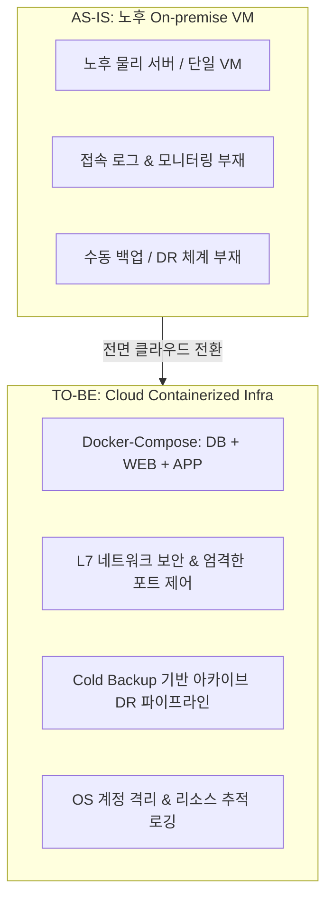

## 목차

- [1. 도입 배경 및 과제 (Background &amp; Problem)](#1-도입-배경-및-과제-background-problem)
- [2. 기술적 구현 (Technical Implementation)](#2-기술적-구현-technical-implementation)
  - [① Docker Compose 기반 원클릭 컨테이너화 배포](#1-docker-compose-기반-원클릭-컨테이너화-배포)
  - [② L7 네트워크 보안 및 접근 제어 고도화](#2-l7-네트워크-보안-및-접근-제어-고도화)
  - [③ 계정 권한 분리 및 리소스 모니터링 체계화](#3-계정-권한-분리-및-리소스-모니터링-체계화)
  - [④ Cold Backup 기반 단계별 재해 복구(DR) 파이프라인](#4-cold-backup-기반-단계별-재해-복구dr-파이프라인)
- [3. 성과 및 비즈니스/재무적 가치 (Result &amp; Benefit)](#3-성과-및-비즈니스재무적-가치-result-benefit)
  - [💡 총평](#총평)

## 1. 도입 배경 및 과제 (Background & Problem)

기존 온프레미스(Private VM) 환경은 물리 하드웨어의 노후화와 더불어 관리 복잡도가 한계에 도달해 있었습니다. 특히 복잡한 사내 보안망(NAT)으로 인한 제한된 IP 체계, 시스템 접근 로그 및 리소스 모니터링 부재, 장애 시 신속한 재해 복구(DR)가 불가능한 구조적 취약점이 존재하여 <strong>퍼블릭 클라우드 인프라로의 전면 이관</strong>을 추진했습니다.

<NotionDivider />

## 2. 기술적 구현 (Technical Implementation)

보안성 강화, 고가용성 백업, 배포 파이프라인 간소화라는 3대 목표를 중심으로 클라우드 인프라를 설계했습니다.

<NotionDivider />

### ① Docker Compose 기반 원클릭 컨테이너화 배포

- VM 내 Docker 엔진을 구성하고 `docker-compose.yml`을 통해 <strong>WEB(Nginx/Reverse Proxy), APP(Java WAS), DB(RDBMS)</strong> 간의 네트워크 의존성을 코드화(IaC).
- 복잡한 환경 설정 없이 단일 명령어로 전체 서비스 스택의 원클릭 배포 및 무중단 재구동 환경 구축.

### ② L7 네트워크 보안 및 접근 제어 고도화

- 동적 IP 환경 지원을 위한 L7 프록시 계층 구성.
- 인바운드/아웃바운드 트래픽에 대한 화이트리스트 IP 대역 고정 및 내·외부 포트 포워딩(Port Forwarding) 통제로 미인가 네트워크 접근 원천 차단.

### ③ 계정 권한 분리 및 리소스 모니터링 체계화

- OS 레벨의 사용자 권한을 직무/역할별로 엄격히 분리.
- 서버 리소스(CPU, Memory, Disk I/O) 사용량 추이 모니터링 및 접근 시도 추적용 로깅 서비스 세팅.

### ④ Cold Backup 기반 단계별 재해 복구(DR) 파이프라인

- 주기적 자동 스냅샷 및 DB 덤프를 생성하는 Cold Backup 스크립트 구축.
- 생성된 백업 데이터를 클라우드 아카이브(Archive) 스토리지로 안전하게 격리 보관하여 데이터 유실 없는 안정적 DR 기반 완성.

<NotionDivider />

## 3. 성과 및 비즈니스/재무적 가치 (Result & Benefit)

<NotionTable>
  <tbody>
    <tr><td>구분</td><td>AS-IS (온프레미스 노후 서버)</td><td>TO-BE (퍼블릭 클라우드 전환)</td><td>비즈니스 개선 효과</td></tr>
    <tr><td><strong>인프라 비용 (CAPEX)</strong></td><td>신규 물리 서버 구매 (대당 약 1,000만 원)</td><td>물리 장비 도입 비용 <strong>0원</strong></td><td>초기 투자 비용(CAPEX) 전면 절감</td></tr>
    <tr><td><strong>운영 비용 (OPEX)</strong></td><td>상주 관리 비용 및 하드웨어 유지보수비</td><td><strong>월 6~8만 원 선</strong>의 클라우드 유지비</td><td>300인 전사 시스템 대비 극단적 저비용 운영</td></tr>
    <tr><td><strong>배포/운영 생산성</strong></td><td>서버별 수동 환경 구성 및 배포 지연</td><td>Docker Compose 원클릭 컨테이너 배포</td><td>배포 소요 시간 80% 이상 단축</td></tr>
    <tr><td><strong>데이터 안정성</strong></td><td>장애 시 수동 복구 (복구 시점 불확실)</td><td>정기 Cold Backup 및 아카이브 이중화</td><td>RPO/RTO 극적 단축 및 데이터 영속성 확보</td></tr>
  </tbody>
</NotionTable>

### 💡 총평

300여 명이 매일 사용하는 핵심 사내 포털을 <strong>월 6~8만 원이라는 극도의 저비용 클라우드 아키텍처</strong>로 완벽하게 안착시켰습니다. 1회성 물리 서버 구매 비용(대당 약 1천만 원)을 전액 절감했을 뿐만 아니라, 향후 10년간 발생할 수 있는 하드웨어 노후화 대응 비용과 유지보수 부담을 클라우드 매니지드 생태계를 통해 구조적으로 해소했습니다.

