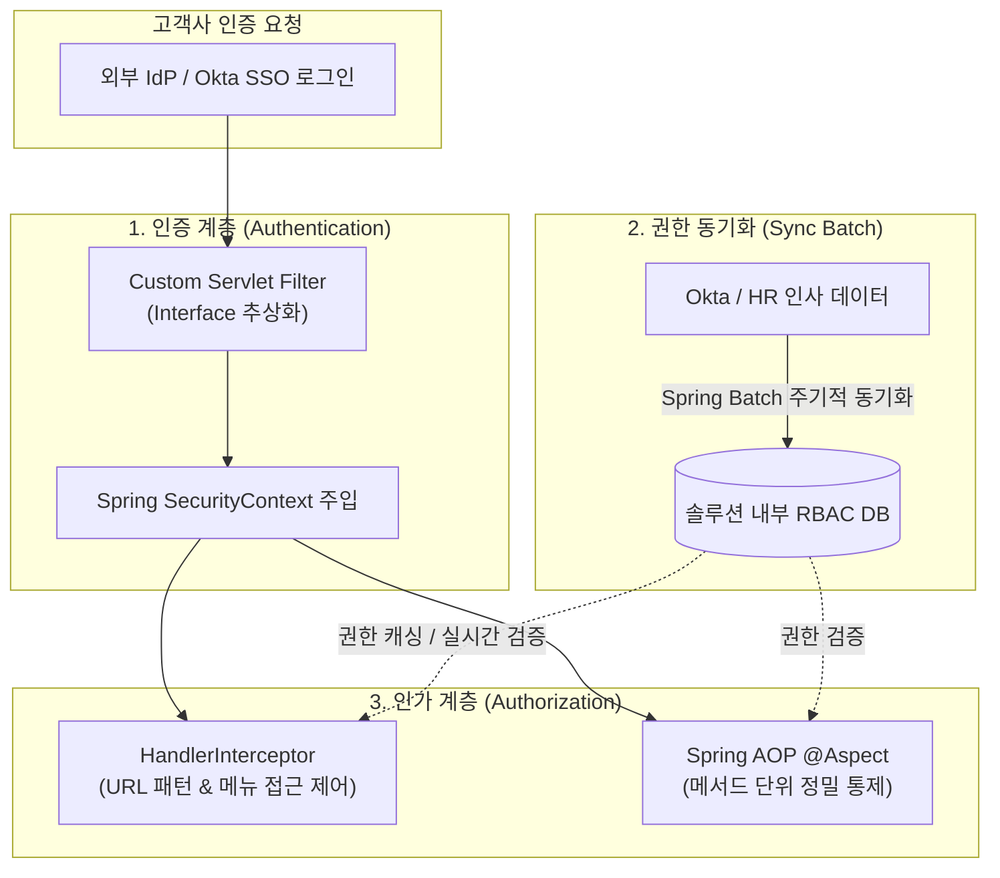

## 목차

- [1. 도입 배경 및 과제 (Background &amp; Problem)](#1-도입-배경-및-과제-background-problem)
  - [🎯 핵심 해결 과제](#핵심-해결-과제)
- [2. Part 1: 커스텀 서블릿 필터와 다중 IdP 인터페이스 추상화](#2-part-1-커스텀-서블릿-필터와-다중-idp-인터페이스-추상화)
  - [① DispatcherServlet 진입 전 조기 인증 (Custom Filter)](#1-dispatcherservlet-진입-전-조기-인증-custom-filter)
  - [② 다중 벤더 대응을 위한 인터페이스 추상화 (Strategy Pattern)](#2-다중-벤더-대응을-위한-인터페이스-추상화-strategy-pattern)
- [3. Part 2: N:M 세분화된 RBAC 권한 모델 및 데이터 동기화](#3-part-2-nm-세분화된-rbac-권한-모델-및-데이터-동기화)
  - [① 1:1 Role에서 N:M Role-Permission 구조로 정규화](#1-11-role에서-nm-role-permission-구조로-정규화)
  - [② Spring Batch 기반 인사/권한 데이터 자동 동기화 (Sync)](#2-spring-batch-기반-인사권한-데이터-자동-동기화-sync)
- [4. Part 3: 다계층 인가 제어의 진화 (@Aspect ➔ URL Interceptor)](#4-part-3-다계층-인가-제어의-진화-aspect-url-interceptor)
  - [① 레거시 과도기: Spring AOP (@Aspect) 기반 메서드 단위 통제](#1-레거시-과도기-spring-aop-aspect-기반-메서드-단위-통제)
  - [② 표준화 완성: HandlerInterceptor 기반 단일 진입점 통합 제어](#2-표준화-완성-handlerinterceptor-기반-단일-진입점-통합-제어)
- [5. 최종 성과 및 비즈니스 가치 (Result &amp; Benefit)](#5-최종-성과-및-비즈니스-가치-result-benefit)

<a id="1-도입-배경-및-과제-background-problem"></a>

## 1. 도입 배경 및 과제 (Background & Problem)

B2B 엔터프라이즈 솔루션을 공급하는 과정에서 고객사별로 상이한 인증 인프라 환경과 엄격한 권한 분리 요구사항이 있었습니다.




<a id="핵심-해결-과제"></a>

### 🎯 핵심 해결 과제

1. **JDK 버전 충돌과 기성 SDK 플러그인 사용 불가**:
- 사내 메시징 솔루션의 레거시 JDK와 최신 Okta 플러그인 간 호환성 충돌 발생.
- 벤더사 공식 SDK에 의존하지 않고 **순수 HTTP 통신 기반의 커스텀 SSO 인증 엔진을 직접 설계**해야 함.

1. **하이브리드 인증/인가 모델 요구**:
- **인증(Authentication)**: 고객사의 통합 IdP(Okta, OAuth 2.0, 자체 SSO Agent 등)를 활용.
- **인가(Authorization)**: 세분화된 메뉴 및 기능 접근 권한(RBAC)은 **솔루션 내부 DB에서 독립적으로 정밀 제어**.

1. **권한 누수 버그 방어 및 점진적 인가 체계 표준화**:
- 레거시 코드의 메뉴 접근 권한 버그를 원천 차단하고, 비표준화된 URL 구조를 가진 엔드포인트를 안전하게 통제할 수 있는 다계층 방어선 구축.


<NotionDivider />

<a id="2-part-1-커스텀-서블릿-필터와-다중-idp-인터페이스-추상화"></a>

## 2. Part 1: 커스텀 서블릿 필터와 다중 IdP 인터페이스 추상화

<a id="1-dispatcherservlet-진입-전-조기-인증-custom-filter"></a>

### ① DispatcherServlet 진입 전 조기 인증 (Custom Filter)

인증 확인 로직을 Controller나 DispatcherServlet 이전인 **서블릿 컨테이너 레벨(Spring Security Filter Chain 직전/선행)**에 배치하여, 미인증 요청이 내부 비즈니스 로직에 접근하지 못하도록 원천 차단했습니다.


```java
// ⭕ Security Filter Chain 선행 커스텀 SSO 필터
public class SsoAuthenticationFilter extends OncePerRequestFilter {
    private final SsoAuthenticationService ssoService;

    public SsoAuthenticationFilter(SsoAuthenticationService ssoService) {
        this.ssoService = ssoService;
    }

    @Override
    protected void doFilterInternal(HttpServletRequest request, HttpServletResponse response, FilterChain filterChain)
            throws ServletException, IOException {

        // 1. 추상화된 SSO 서비스를 통한 인증 결과 획득
        SsoUserPrincipal principal = ssoService.authenticate(request, response);

        if (principal != null) {
            // 2. 내부 RBAC DB 조회를 통해 인가(Authority) 목록 생성
            List<GrantedAuthority> authorities = ssoService.loadUserAuthorities(principal.getUserId());

            // 3. Spring SecurityContextHolder에 인증 토큰 주입 (기존 세션/인가 체계 100% 재활용)
            UsernamePasswordAuthenticationToken authentication =
                    new UsernamePasswordAuthenticationToken(principal, null, authorities);
            SecurityContextHolder.getContext().setAuthentication(authentication);
        }

        filterChain.doFilter(request, response);
    }
}
```


<NotionDivider />

<a id="2-다중-벤더-대응을-위한-인터페이스-추상화-strategy-pattern"></a>

### ② 다중 벤더 대응을 위한 인터페이스 추상화 (Strategy Pattern)

고객사마다 SSO 인증을 전달하는 방식이 상이하므로, 인증 기능을 `SsoAuthenticationService` 인터페이스로 추상화하여 **설정 파일(Property) 기반으로 구현체를 갈아끼울 수 있는 플러그앤플레이(Plug-and-Play) 구조**를 확립했습니다.


```text
[다양한 B2B 연동 방식에 대응하는 3대 전략 구현체]
1. AgentRedirectStrategy: 전용 SSO Agent를 통해 매 요청마다 Redirect 파라미터/헤더로 토큰 전달
2. InternalSocketApiStrategy: 백채널(Back-channel) 소켓 통신 또는 REST API로 인증 티켓 검증
3. ExternalDbAgentStrategy: 자체 에이전트가 외부 IdP/인사 DB를 직접 조회하여 인증 컨텍스트 주입
```


<NotionDivider />

<a id="3-part-2-nm-세분화된-rbac-권한-모델-및-데이터-동기화"></a>

## 3. Part 2: N:M 세분화된 RBAC 권한 모델 및 데이터 동기화

<a id="1-11-role에서-nm-role-permission-구조로-정규화"></a>

### ① 1:1 Role에서 N:M Role-Permission 구조로 정규화

AWS IAM이나 Azure RBAC과 유사하게, **기능 단위의 고유 권한(Permission)**을 정의하고 이를 **역할(Role)** 단위로 그룹핑하여 사용자에게 다중 부여할 수 있는 정규화된 ERD를 설계했다.


```text
[RBAC ERD 구조]
TB_USER (사용자)
  ├── 1:N ── TB_USER_ROLE (사용자-역할 매핑)
                └── N:1 ── TB_ROLE (역할/그룹)
                             └── 1:N ── TB_ROLE_PERMISSION (역할-권한 매핑)
                                           └── N:1 ── TB_PERMISSION (기능/메뉴 권한 단위)
```

- **효과**: "관리자/사용자"라는 단순 2분법을 탈피하여 "메시지 발송 승인권자", "통계 엑셀 다운로더", "정산 관리자" 등 고객사별 커스텀 롤을 무제한 생성/조합 가능.

<NotionDivider />

<a id="2-spring-batch-기반-인사권한-데이터-자동-동기화-sync"></a>

### ② Spring Batch 기반 인사/권한 데이터 자동 동기화 (Sync)

- Okta/외부 IdP의 사용자 상태 변경(입사, 퇴사, 부서 이동)을 솔루션 내부 DB와 일치시키기 위해 **Spring Batch 스케줄러**를 구축.
- 주기적인 델타(Delta) 동기화 파이프라인을 통해 퇴사자 계정의 접근 권한을 실시간 차단하고 권한 누수를 방지.

<NotionDivider />

<a id="4-part-3-다계층-인가-제어의-진화-aspect-url-interceptor"></a>

## 4. Part 3: 다계층 인가 제어의 진화 (@Aspect ➔ URL Interceptor)

<a id="1-레거시-과도기-spring-aop-aspect-기반-메서드-단위-통제"></a>

### ① 레거시 과도기: Spring AOP (`@Aspect`) 기반 메서드 단위 통제

초기 레거시 시스템은 URL 구조가 RESTful하지 않고 비표준화되어 있어 URL 패턴만으로 인가를 통제하기 어려웠다. 따라서 핵심 Controller/Service 메서드에 `@RequirePermission` 커스텀 어노테이션과 `@Aspect`를 적용하여 선제적으로 권한을 검증했다.


```java
@Aspect
@Component
public class AuthorizationAspect {
    @Before("@annotation(requirePermission)")
    public void checkPermission(JoinPoint joinPoint, RequirePermission requirePermission) {
        Authentication auth = SecurityContextHolder.getContext().getAuthentication();
        String requiredRole = requirePermission.value();

        boolean hasAuthority = auth.getAuthorities().stream()
                .anyMatch(a -> a.getAuthority().equals(requiredRole));

        if (!hasAuthority) {
            throw new AccessDeniedCustomException("해당 기능에 대한 실행 권한이 없습니다.");
        }
    }
}
```


<NotionDivider />

<a id="2-표준화-완성-handlerinterceptor-기반-단일-진입점-통합-제어"></a>

### ② 표준화 완성: `HandlerInterceptor` 기반 단일 진입점 통합 제어

URL 체계를 표준화/패턴화한 이후에는 유지보수성과 성능을 위해 **`HandlerInterceptor`로 인가 통제 레이어를 통합**했다.

- **메뉴-URL 캐싱 기반 실시간 조회**: DB의 메뉴 테이블에 매핑된 URL 패턴 목록을 메모리에 캐싱하여 초고속 인가 검증 수행.
- **방어적 라우팅(Defensive Routing)**:
- 정적 리소스(CSS, JS, Image) 및 비동기 Ajax 백그라운드 호출은 `antMatcher`를 통해 인터셉터 로직을 안전하게 우회(`excludePathPatterns`).
- 권한이 없는 메뉴 URL에 직접 접근(Deep Link)을 시도할 경우, 단순 에러가 아닌 **맞춤형 안내 랜딩 페이지 또는 전용 Exception**으로 안전하게 리다이렉트.


```java
@Component
public class MenuAccessInterceptor implements HandlerInterceptor {
    @Autowired
    private MenuAuthorizationCacheService menuCacheService;

    @Override
    public boolean preHandle(HttpServletRequest request, HttpServletResponse response, Object handler) throws Exception {
        String requestUri = request.getRequestURI();

        // 1. 메뉴 DB 기반 접근 가능 여부 캐시 조회
        if (menuCacheService.isProtectedMenu(requestUri)) {
            Authentication auth = SecurityContextHolder.getContext().getAuthentication();

            if (!menuCacheService.hasMenuAccess(auth, requestUri)) {
                // 2. 권한 부족 시 전용 랜딩 페이지로 안전 리다이렉트
                response.sendRedirect("/error/access-denied");
                return false;
            }
        }
        return true;
    }
}
```


<NotionDivider />

<a id="5-최종-성과-및-비즈니스-가치-result-benefit"></a>

## 5. 최종 성과 및 비즈니스 가치 (Result & Benefit)


<NotionTable>
  <tbody>
    <tr><td>구분</td><td>AS-IS (레거시 환경)</td><td>TO-BE (개선 후 아키텍처)</td><td>비즈니스 개선 효과</td></tr>
    <tr><td>**SSO 호환성**</td><td>JDK 버전 충돌로 Okta 공식 플러그인 불가</td><td>HTTP 기반 커스텀 Filter & Strategy 패턴</td><td>인프라 제약 극복 & 3개 고객사 즉시 무수정 확장</td></tr>
    <tr><td>**권한 모델**</td><td>단순 1:1 고정 Role (권한 버그 빈발)</td><td>N:M 정규화된 Role-Permission 구조</td><td>AWS/Azure 수준의 커스텀 롤 생성 및 정밀 통제</td></tr>
    <tr><td>**계정 동기화**</td><td>수기 권한 수정 및 퇴사자 권한 누수 위험</td><td>Spring Batch 기반 Okta-DB 자동 동기화</td><td>보안 감사(Audit) 무결점 통과 및 관리 공수 제로화</td></tr>
    <tr><td>**인가 통제 체계**</td><td>비표준 URL로 인한 통제 누락 위험</td><td>AOP ➔ URL Interceptor 단일 진입점 통합</td><td>사이드 이펙트 없는 방어적 인가 라우팅 완성</td></tr>
  </tbody>
</NotionTable>

