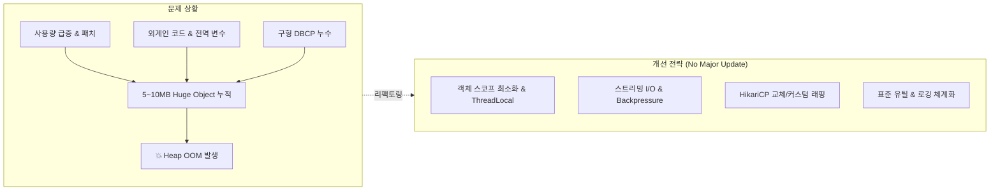

## 목차

- [1. 개요 및 배경 (Background &amp; Problem)](#1-개요-및-배경-background-problem)
  - [직면한 과제](#직면한-과제)
- [2. 근본 원인 분석 (Root Causes)](#2-근본-원인-분석-root-causes)
- [3. 작업 내용 및 상세 해결 방안 (Deep Dive)](#3-작업-내용-및-상세-해결-방안-deep-dive)
  - [\[High\] 1. 객체 스코프 축소 및 ThreadLocal 전환 (메모리 폭탄 제거)](#high-1-객체-스코프-축소-및-threadlocal-전환-메모리-폭탄-제거)
  - [\[High\] 2. 대용량 I/O 스트리밍 처리 및 백프레셔(Backpressure) 인가](#high-2-대용량-io-스트리밍-처리-및-백프레셔backpressure-인가)
  - [\[High\] 3. DB 커넥션 풀 최적화 (HikariCP 전환 &amp; 커스텀 라이프사이클 관리)](#high-3-db-커넥션-풀-최적화-hikaricp-전환-커스텀-라이프사이클-관리)
  - [\[Low\] 4. 표준 라이브러리 전환 및 로깅 체계화](#low-4-표준-라이브러리-전환-및-로깅-체계화)
- [4. 성과 및 결론 (Result &amp; Benefit)](#4-성과-및-결론-result-benefit)
  - [회고](#회고)
  - [1. Thread.sleep() 기반 백프레셔의 휴리스틱(임시방편) 한계](#1-threadsleep-기반-백프레셔의-휴리스틱임시방편-한계)
  - [2. ThreadLocal 도입으로 인한 또 다른 '시한폭탄' 리스크](#2-threadlocal-도입으로-인한-또-다른-시한폭탄-리스크)
  - [3. DBCP 커스텀 라이프사이클 클래스 = '새로운 외계인 코드'](#3-dbcp-커스텀-라이프사이클-클래스-새로운-외계인-코드)
  - [4. 거대 객체(5~10MB)를 단일 JVM 힙에서 통째로 다루는 구조적 한계](#4-거대-객체510mb를-단일-jvm-힙에서-통째로-다루는-구조적-한계)

<a id="1-개요-및-배경-background-problem"></a>

## 1. 개요 및 배경 (Background & Problem)

오랜 기간 서비스된 B2B 솔루션은 비즈니스 환경의 제약으로 인해 최신 인프라나 최신 프레임워크로 즉각적인 전환이 어렵습니다. 이번 프로젝트는 <strong>Java 1.5~1.7 기반의 레거시 코드가 혼재된 환경</strong>에서 발생한 심각한 메모리 병목 및 OOM(Out of Memory) 현상을 해결한 사례입니다.




<a id="직면한-과제"></a>

### 직면한 과제

1. <strong>외계인 코드(Alien Code)와 누락된 리소스 해제</strong>:
- 과거 `StringUtils` 등 공통 라이브러리가 부족하던 시절 작성된 커스텀 유틸리티들이 산재.
- 잦은 B2B 커스텀 개발 과정에서 `finally` 블록의 리소스 `close()` 누락 및 예외 처리 파편화 발생.

1. <strong>트래픽 증가와 EOL/EOS의 괴리</strong>:
- 최신 버전은 AOP, 최신 GoF 디자인 패턴 등으로 개선되었으나, <strong>남은 서비스 계약 기간(Service Term)으로 인해 메이저 버전 업그레이드가 불가능한 EOL 직전 구버전</strong>에서 사용량 증가 및 신규 패치로 인해 잦은 OOM 발생.

1. <strong>제약 조건</strong>:
- DB 스키마 변경 불가, Java 메이저 버전 업그레이드 불가 상태에서 <strong>마이너 패치만으로 안정성을 확보</strong>해야 함.


<NotionDivider />

<a id="2-근본-원인-분석-root-causes"></a>

## 2. 근본 원인 분석 (Root Causes)

- <strong>메모리 폭탄(Memory Bomb)</strong>: 비동기 로직이나 싱글톤이어야 할 서비스/설정 객체가 무분별한 `new()` 및 전역 변수로 관리되어 수거되지 않는 객체 수명주기(Lifecycle) 문제 발생.
- <strong>대용량 객체(Huge Object) 메모리 적재</strong>: 배치 및 대용량 I/O 연계 시 5~10MB 크기의 객체들이 힙 메모리에 한 번에 적재되어 단시간 내 GC 압박 유발.
- <strong>DBCP 커넥션 풀의 비효율</strong>: 구버전 DBCP의 커넥션 반환 누수 및 비효율적인 풀링.
- <strong>동기식 I/O 병목 및 불필요한 String 연산</strong>: `System.out.println` 및 과도한 `.toString()` 호출로 인한 I/O 블로킹과 임시 객체 남발.

<NotionDivider />

<a id="3-작업-내용-및-상세-해결-방안-deep-dive"></a>

## 3. 작업 내용 및 상세 해결 방안 (Deep Dive)

개선 작업은 <strong>영향도와 우선순위(High/Low)</strong>에 따라 단계적으로 진행했습니다.


<NotionDivider />

<a id="high-1-객체-스코프-축소-및-threadlocal-전환-메모리-폭탄-제거"></a>

### [High] 1. 객체 스코프 축소 및 `ThreadLocal` 전환 (메모리 폭탄 제거)

<a id="문제점"></a>

#### 문제점

- 전역 변수나 인스턴스 멤버 변수에 대용량 데이터나 임시 상태를 보관하여, GC의 수거 타이밍이 늦어지고 스레드 간 충돌 위험이 상존했습니다.
<a id="해결-방식"></a>

#### 해결 방식

- <strong>지역 변수 및 메서드 인수로 전환</strong>: 데이터의 라이프사이클을 메서드 실행 단위로 축소시켜, 메서드 종료 즉시 Young Generation GC의 수거 대상이 되도록 유도.
- <strong>`ThreadLocal` 적용</strong>: 동일 스레드 내 분할 작업 시 공유가 필요한 객체는 `ThreadLocal`을 통해 격리하고, 작업 종료 시 반드시 `remove()`를 호출하여 스레드 풀 재사용 시 메모리 누수를 방지.

```java
// ❌ AS-IS: 클래스 멤버/전역 상태로 유지되어 메모리를 계속 점유
public class BatchDataService {
    private Map<String, Object> sharedContext = new HashMap<>(); // Memory Bomb 위험

    public void process(DataChunk chunk) {
        sharedContext.put("data", chunk.getHugePayload()); // 5~10MB 상주
        // ...
    }
}

// ⭕ TO-BE: 지역 변수 전달 또는 ThreadLocal로 스코프 한정
public class BatchDataService {
    private static final ThreadLocal<ExecutionContext> contextHolder = new ThreadLocal<>();

    public void process(DataChunk chunk) {
        try {
            contextHolder.set(new ExecutionContext(chunk.getId()));
            executePipeline(chunk.getHugePayload()); // 메서드 인수로 전달하여 라이프사이클 단축
        } finally {
            contextHolder.remove(); // 풀링된 스레드의 메모리 누수 방지
        }
    }
}
```


<NotionDivider />

<a id="high-2-대용량-io-스트리밍-처리-및-백프레셔backpressure-인가"></a>

### [High] 2. 대용량 I/O 스트리밍 처리 및 백프레셔(Backpressure) 인가

<a id="문제점-2"></a>

#### 문제점

- `File Read → Filtering/Shaping → File Write / DB Insert` 파이프라인에서 전체 데이터를 한꺼번에 컬렉션에 담아 중간 가공을 수행함으로써 힙 메모리 스파이크 발생.
<a id="해결-방식-2"></a>

#### 해결 방식

- <strong>I/O 스트림 및 버퍼링 최적화</strong>: 중간 메모리 적재를 최소화하고 `StringBuffer`/`BufferedReader`를 활용한 단위 버퍼 기반 스트리밍 처리.
- <strong>백프레셔(Backpressure) 메커니즘 도입</strong>: 대량의 거대 객체가 생성되는 구간에 적절한 쓰로틀링(Throttle)과 지연을 인가하여, 이전 청크가 GC에 의해 정리될 수 있는 텀(Grace Period) 부여.

```java
// 파이프라인 스트리밍 및 GC 타이밍 확보
public void processLargeFile(File sourceFile) {
    try (BufferedReader reader = new BufferedReader(new FileReader(sourceFile), 8192)) {
        String line;
        int processedCount = 0;

        while ((line = reader.readLine()) != null) {
            processLineStreaming(line);
            processedCount++;

            // Backpressure: 주기적으로 GC 유예 시간 제공 및 힙 부하 완화
            if (processedCount % CHUNK_SIZE == 0) {
                applyBackpressure();
            }
        }
    }
}

private void applyBackpressure() {
    try {
        Thread.sleep(10); // 일시 딜레이를 통해 큐 적체 및 메모리 스파이크 완화
    } catch (InterruptedException e) {
        Thread.currentThread().interrupt();
    }
}
```


<NotionDivider />

<a id="high-3-db-커넥션-풀-최적화-hikaricp-전환-커스텀-라이프사이클-관리"></a>

### [High] 3. DB 커넥션 풀 최적화 (`HikariCP` 전환 & 커스텀 라이프사이클 관리)

<a id="문제점-3"></a>

#### 문제점

- 구버전 DBCP의 노후화로 인해 트래픽 증가 시 커넥션 반환 지연 및 누수 현상 발생.
<a id="해결-방식-3"></a>

#### 해결 방식

- <strong>HikariCP 전면 도입</strong>: 경량화된 고성능 커넥션 풀로 교체하여 풀 자체의 메모리 오버헤드와 락 경합 감소.
- <strong>구조적 제약 우회 (Custom Wrapper)</strong>: 라이브러리 교체가 어려운 특수 레거시 모듈은 별도의 커스텀 커넥션 매니저 클래스를 구현하여 `Connection` 획득/반환의 생명주기를 강제 제어.

<NotionDivider />

<a id="low-4-표준-라이브러리-전환-및-로깅-체계화"></a>

### [Low] 4. 표준 라이브러리 전환 및 로깅 체계화


<NotionTable>
  <tbody>
    <tr><td>분류</td><td>기존 문제점 (AS-IS)</td><td>개선 사항 (TO-BE)</td><td>기대 효과</td></tr>
    <tr><td><strong>유틸리티</strong></td><td>자체 제작 커스텀 유틸 (`Map ↔ String`, Null Check 등)</td><td>Spring / Java 표준 `StringUtils`, `Objects`로 전면 교체</td><td>버그 유발 가능성 차단, 코드 일관성 및 최적화된 로직 적용</td></tr>
    <tr><td><strong>로깅 I/O</strong></td><td>`System.out.println`, `e.printStackTrace()` 및 무분별한 `.toString()`</td><td>`Log4j` (비동기 로거 및 적절한 로그 레벨 분기) 적용</td><td>동기식 콘솔 I/O 블로킹 해소, 불필요한 String 메모리 할당 제거</td></tr>
  </tbody>
</NotionTable>


<NotionDivider />

<a id="4-성과-및-결론-result-benefit"></a>

## 4. 성과 및 결론 (Result & Benefit)


```text
✅ 시스템 무중단 & 무변경 패치 완료: DB 스키마나 Java 메이저 버전 변경 없이 마이너 패치로 안정화
✅ OOM 이슈 원천 차단: 5~10MB 단위의 메모리 폭탄 및 리소스 누수 포인트 제거
✅ 비용 절감 및 고객 신뢰도 유지: 계약 기간 내 추가 재개발 비용 없이 안정적인 SLA 유지
✅ 레거시 공통 개선 템플릿 확보: 동일 플랫폼 기반 다른 레거시 프로젝트에 표준 레퍼런스로 활용
```

<a id="회고"></a>

### 회고

단순히 하드웨어 스펙을 증설하거나 메이저 버전을 올리기 어려운 비즈니스 제약 속에서도, <strong>코드 레벨의 스코프 축소, I/O 스트리밍, 그리고 적절한 백프레셔 제어</strong>만으로 시스템의 수명을 연장하고 안정성을 확보할 수 있음을 증명한 프로젝트였습니다.


<NotionToggle title="추가로 고민해볼 점" level="2">

<a id="1-threadsleep-기반-백프레셔의-휴리스틱임시방편-한계"></a>

### <strong>1. `Thread.sleep()` 기반 백프레셔의 휴리스틱(임시방편) 한계</strong>

- <strong>현실</strong>: 거대 객체 처리 간격에 `Thread.sleep(10)`을 인가하여 GC가 일할 시간을 벌어주었음.
- <strong>한계</strong>:
- 이는 시스템의 부하나 힙 상태를 동적으로 감지하는 진짜 <strong>리액티브 백프레셔(Reactive Backpressure)</strong>가 아닌, 단순 하드코딩된 딜레이(Heuristic)입니다.
- 데이터 유입량이 폭증하거나 JVM의 Stop-The-World가 길어지면 <strong>여전히 메모리가 버티지 못하거나</strong>, 반대로 유휴 상태에서도 불필요하게 지연되어 <strong>전체 처리량(Throughput)이 심각하게 저하</strong>될 수 있습니다.

<a id="2-threadlocal-도입으로-인한-또-다른-시한폭탄-리스크"></a>

### <strong>2. `ThreadLocal` 도입으로 인한 또 다른 '시한폭탄' 리스크</strong>

- <strong>현실</strong>: 전역 상태를 없애고 `ThreadLocal`로 스레드 격리를 수행함.
- <strong>한계</strong>:
- B2B 커스텀 코드는 분기와 예외 흐름이 복잡합니다. 만약 수많은 개발자가 추가 패치를 진행하다가 단 한 군데라도 `try-finally { remove(); }`를 누락하면, <strong>Tomcat/WAS의 Worker 스레드 풀 재사용 특성상 스레드 풀 메모리 오염(ThreadLocal Leak)</strong>이 발생합니다.
- 결국 근본적으로 상태(Stateful)를 없애는 순수 함수형 구조가 아닌, 스레드 로컬이라는 상태 저장소를 여전히 유지한 것입니다.

<a id="3-dbcp-커스텀-라이프사이클-클래스-새로운-외계인-코드"></a>

### <strong>3. DBCP 커스텀 라이프사이클 클래스 = '새로운 외계인 코드'</strong>

- <strong>현실</strong>: 라이브러리 교체가 불가능한 구버전 모듈에 자체 커스텀 래퍼 클래스를 만들어 커넥션을 강제 관리함.
- <strong>한계</strong>:
- 기존의 외계인 코드를 없애려다 <strong>우리 손으로 또 다른 '새로운 외계인 코드'를 추가</strong>한 셈입니다.
- 추후 다른 개발자가 인수인계를 받았을 때, 표준 DBCP/HikariCP 동작과 달라 유지보수 난이도가 올라가는 기술 부채(Technical Debt)가 됩니다.

<a id="4-거대-객체510mb를-단일-jvm-힙에서-통째로-다루는-구조적-한계"></a>

### <strong>4. 거대 객체(5~10MB)를 단일 JVM 힙에서 통째로 다루는 구조적 한계</strong>

- <strong>현실</strong>: 버퍼링 및 스트리밍을 적용했으나, 여전히 배치/연계 처리가 단일 JVM 인스턴스의 힙 메모리 안에서 실행됨.
- <strong>한계</strong>:
- 근본적인 해결은 <strong>Chunk 지향 배치(Spring Batch Chunk Processing)</strong>나 <strong>메시지 큐(Kafka, RabbitMQ) 기반의 비동기 분산 스트리밍</strong>, 혹은 <strong>DB 커서 페이징(Streaming Fetch)</strong> 구조로 아키텍처를 쪼개는 것입니다.
- 단일 모놀리식 프로세스 안에서 대용량 데이터를 가공하는 구조 자체를 바꾸지 못했습니다.


</NotionToggle>

