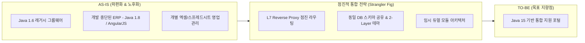

## 목차

- [1. 도입 배경 및 과제 (Background &amp; Problem)](#1-도입-배경-및-과제-background-problem)
  - [직면한 핵심 제약 조건](#직면한-핵심-제약-조건)
- [2. 단계별 기술적 구현 (Technical Implementation)](#2-단계별-기술적-구현-technical-implementation)
  - [① 인프라 &amp; 아키텍처 점진 전환 (Big Plan)](#1-인프라-아키텍처-점진-전환-big-plan)
  - [② 3단계 핵심 비즈니스 로직 모듈화 및 개선](#2-3단계-핵심-비즈니스-로직-모듈화-및-개선)
- [3. 성과 및 한계 (Result &amp; Limitation)](#3-성과-및-한계-result-limitation)
  - [🌟 주요 성과](#주요-성과)
  - [⚠️ 한계 및 잔존 과제 (Technical Debt)](#한계-및-잔존-과제-technical-debt)

<a id="1-도입-배경-및-과제-background-problem"></a>

## 1. 도입 배경 및 과제 (Background & Problem)

기존 사내 그룹웨어는 **Java 1.6 기반의 노후화된 프레임워크**로 구축되어 있어 라이브러리 지원 중단, 유지보수 한계, 기능 확장의 병목이 극에 달해 있었습니다. 또한 과거 개발이 중단되었던 사내 ERP(사업관리 시스템)와의 파편화로 인해 업무 비효율이 누적된 상태였습니다.




<a id="직면한-핵심-제약-조건"></a>

### 직면한 핵심 제약 조건

1. **300여 명 실사용자의 업무 중단 불가 (Zero-Downtime)**:
- 전사 임직원이 매일 사용하는 결재/휴가 시스템이므로 일괄 교체(Big-Bang) 방식의 전면 전환은 막대한 업무 마비 리스크를 수반.

1. **이원화된 기술 스택과 분리된 개발 환경**:
- Java 1.6 기반 레거시와 Java 1.8 + AngularJS 기반 ERP의 개발 환경 차이로 즉각적인 단일 코드베이스 병합 불가.

1. **DB 마이그레이션 리스크 격리**:
- 애플리케이션 전환과 DB 스키마 변경을 동시에 진행할 경우 데이터 정합성 사고 위험이 높아, **기존 DB 스키마를 유지하며 앱 계층을 먼저 현대화**해야 함.


<NotionDivider />

<a id="2-단계별-기술적-구현-technical-implementation"></a>

## 2. 단계별 기술적 구현 (Technical Implementation)

빅뱅 배포의 위험을 회피하고 점진적으로 시스템을 교체하기 위해 **Strangler Fig 패턴(교살자 패턴)**과 **3단계 비즈니스 융합 로드맵**을 수립했습니다.


<NotionDivider />

<a id="1-인프라-아키텍처-점진-전환-big-plan"></a>

### ① 인프라 & 아키텍처 점진 전환 (Big Plan)

- **L7 Reverse Proxy 기반의 점진적 라우팅**:
- 사용자 접근 URL은 단일화하되, L7 프록시를 통해 기능 단위(일정관리 ➔ 휴가관리 ➔ 차량관리 ➔ 전자결재 순)로 신규 엔진으로 트래픽을 단계적 전환.

- **View 현대화 및 백엔드 듀얼 트랙 개발**:
- **1트랙 (레거시 수명 연장)**: 비즈니스 로직은 유지한 채 뷰 템플릿을 `Freemarker`로 교체하고 Java 1.8로 1차 업그레이드.
- **2트랙 (차세대 엔진 구축)**: Java 15 기반의 현대적 아키텍처로 신규 비즈니스 로직 및 마이그레이션 전용 모듈 병행 개발.
- **3트랙 (ERP 모듈 소생)**: 중단되었던 Java 1.8 / AngularJS 기반 자원관리 모듈 개발을 완수하여 플랫폼 간 연계 파이프라인 구성.

- **UX 일관성을 위한 2-Layer 세그먼트 테마 패턴**:
- 서로 다른 3개의 프론트엔드가 혼재되어도 사용자가 이질감을 느끼지 않도록 CSS/HTML 선택자 표준화 및 인라인 스타일 전면 제거.
- 디자인 토큰/스타일시트 분리만으로 백엔드 로직 수정 없이 전사 UI 통일감 부여.


<NotionDivider />

<a id="2-3단계-핵심-비즈니스-로직-모듈화-및-개선"></a>

### ② 3단계 핵심 비즈니스 로직 모듈화 및 개선


```text
1차: HR 기능 지능화 (자동 휴무/승인 파이프라인)
 └─ 개인별 결재선 커스텀 선택제 (팀장 ➔ 부서장 옵션)
 └─ 입사일 기반 연차 자동 생성 및 월차 선지급 플래그 수식화
 └─ 관리자 전용 통계 데이터 엑셀(Excel) 실시간 추출 파이프라인

2차: ERP 재무/사업관리 모듈화
 └─ 분산된 스프레드시트 영업 데이터를 DB 스키마 단위로 일원화
 └─ 복잡한 세금 및 국가별 수수료 자동 계산 알고리즘 (AngularJS 적용)

3차: 임시 듀얼 모듈 아키텍처 배포 및 기술 자산화
 └─ 프론트엔드를 임시 Dual Module로 분리 배포하여 배포 다운타임 제로화
 └─ 향후 단일 체계 완전 병합(Merger)을 위한 컴포넌트 설계 가이드 문서화
```


<NotionDivider />

<a id="3-성과-및-한계-result-limitation"></a>

## 3. 성과 및 한계 (Result & Limitation)

<a id="주요-성과"></a>

### 🌟 주요 성과

1. **무중단 3단계 점진적 통합 달성**: 300여 명의 사용자가 업무 중단 없이 레거시 환경에서 신규 시스템으로 순차 이전 완료 (3개 웹앱 ➔ 2개 웹앱으로 압축).
1. **도입 비용 100% 절감 (CAPEX/OPEX)**: 고가의 3rd Party 상용 ERP/그룹웨어 라이선스를 도입하지 않고 자체 구축하여 예산 절감.
1. **보안 거버넌스 및 업무 자동화**: 대외비 사업 데이터의 사내 격리 보존 및 HR 연차 기입·정산 수기 작업 80% 이상 자동화.
<a id="한계-및-잔존-과제-technical-debt"></a>

### ⚠️ 한계 및 잔존 과제 (Technical Debt)

- **프론트엔드 단일 체계 병합(Merger) 과제 잔존**: 3개 웹앱을 2개로 줄였으나, ERP 모듈과 자원관리 모듈을 완전한 단일 SPA로 통합하는 최종 프론트엔드 통합 작업은 인수인계 및 백로그로 이관.
- **DB 스키마 리팩토링 유예**: 무중단 마이그레이션을 위해 기존 DB 스키마를 그대로 재활용했으므로, 향후 도메인 주도 설계(DDD) 관점의 스키마 정규화/분리 작업이 필수 과제로 남음.

